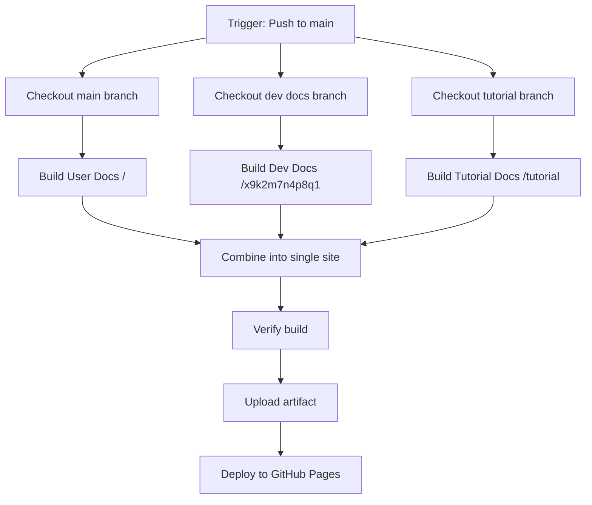

# CI/CD Pipeline Overview - Hei-DataHub

**Last Updated:** 2025-10-28 for v0.60.0-beta

---

## Active Workflows

### 1. 📄 `pages.yml` - Documentation Deployment

**Purpose:** Build and deploy all documentation sites to GitHub Pages

**Trigger:**
- Push to `main` branch
- Manual workflow dispatch

**What it builds:**

| Site Type | Branch | Path | URL |
|-----------|--------|------|-----|
| **User Docs** | `main` | `/` | `https://0xpix.github.io/Hei-DataHub/` |
| **Developer Docs** | `docs/v0.60-beta-update` | `/x9k2m7n4p8q1` | `https://0xpix.github.io/Hei-DataHub/x9k2m7n4p8q1` |
| **Tutorial Docs** | `docs/update-tutorial-doc` | `/tutorial` | `https://0xpix.github.io/Hei-DataHub/tutorial` |

**Build Process:**



**Configuration Files:**
- User docs: `mkdocs.yml` (main branch)
- Dev docs: `mkdocs-dev.yml` (docs/v0.60-beta-update)
- Tutorial docs: `mkdocs-tutorial.yml` (docs/update-tutorial-doc)

---

### 2. ✅ `version-sync.yml` - Version Consistency Check

**Purpose:** Validate version consistency across all files

**Trigger:**
- Pull requests modifying version files
- Push to `main` with version changes

**Checks:**
- ✅ `version.yaml` is valid and has required fields
- ✅ `pyproject.toml` version matches `version.yaml`
- ✅ `README.md` mentions current version
- ✅ `docs/_includes/version.md` has correct version
- ✅ `src/hei_datahub/version.py` loads correctly
- ✅ No legacy `mini_datahub` package files exist

**Scripts Used:**
- `scripts/check_version_consistency.py` - Full validation
- `scripts/test_version.py` - Quick version test

---

### 3. 🔨 `build-binary.yml` - Binary Build

**Purpose:** Build standalone executables

**Trigger:** (Check the file for current triggers)

**Artifacts:** Desktop binaries for Linux/Windows/macOS

---

## Workflow Details

### Documentation Build Pipeline

#### Step 1: Checkout Branches

```yaml
# Main branch (user docs)
- uses: actions/checkout@v4
  with:
    ref: main
    path: main

# Dev docs branch
- uses: actions/checkout@v4
  with:
    ref: docs/v0.60-beta-update
    path: docs-devs

# Tutorial docs branch
- uses: actions/checkout@v4
  with:
    ref: docs/update-tutorial-doc
    path: docs-tutorial
```

#### Step 2: Install Dependencies

```bash
# User docs
pip install -r docs/requirements.txt

# Developer docs
pip install -r dev-docs/requirements.txt

# Tutorial docs
pip install -r tutorial-docs/requirements.txt
```

#### Step 3: Build Sites

```bash
# User docs → combined-site/
mkdocs build --site-dir ../combined-site

# Dev docs → combined-site/x9k2m7n4p8q1/
mkdocs build --config-file mkdocs-dev.yml --site-dir ../combined-site/x9k2m7n4p8q1

# Tutorial docs → combined-site/tutorial/
mkdocs build --config-file mkdocs-tutorial.yml --site-dir ../combined-site/tutorial
```

#### Step 4: Verify & Deploy

```bash
# Verify all index.html files exist
# Upload combined-site/ as artifact
# Deploy to GitHub Pages
```

---

## Branch Strategy

### Documentation Branches

| Branch | Purpose | Auto-Deploy |
|--------|---------|-------------|
| `main` | User documentation | ✅ Yes (to `/`) |
| `docs/v0.60-beta-update` | Developer documentation v0.60 | ✅ Yes (to `/x9k2m7n4p8q1`) |
| `docs/update-tutorial-doc` | Tutorial documentation | ✅ Yes (to `/tutorial`) |

### Development Branches

| Branch | Purpose | CI Triggers |
|--------|---------|-------------|
| `docs/*` | Documentation updates | Version check on PR |
| `feature/*` | Feature development | None |
| `fix/*` | Bug fixes | None |

---

## Local Testing

### Test User Docs

```bash
cd /path/to/Hei-DataHub
mkdocs serve
# Visit http://localhost:8000
```

### Test Developer Docs

```bash
cd /path/to/Hei-DataHub
mkdocs serve -f mkdocs-dev.yml
# Visit http://localhost:8000
```

### Test Tutorial Docs

```bash
cd /path/to/Hei-DataHub
mkdocs serve -f mkdocs-tutorial.yml
# Visit http://localhost:8000
```

### Test Version Scripts

```bash
# Quick test
python scripts/test_version.py

# Full validation
python scripts/check_version_consistency.py
```

---

## Deployment URLs

### Production (After Merge to Main)

- **User Docs:** https://0xpix.github.io/Hei-DataHub/
- **Dev Docs:** https://0xpix.github.io/Hei-DataHub/x9k2m7n4p8q1
- **Tutorial:** https://0xpix.github.io/Hei-DataHub/tutorial

### Local Development

- **User Docs:** http://localhost:8000
- **Dev Docs:** http://localhost:8000 (with `-f mkdocs-dev.yml`)
- **Tutorial:** http://localhost:8000 (with `-f mkdocs-tutorial.yml`)

---

## Troubleshooting

### Build Fails: "index.html not found"

**Cause:** Branch doesn't exist or MkDocs config is missing

**Fix:**
1. Verify branch exists: `git branch -a | grep docs/`
2. Check config file exists in branch
3. Verify `docs_dir` setting in config

---

### Build Fails: "No module named 'mkdocs_material'"

**Cause:** Missing dependencies

**Fix:**
1. Ensure `requirements.txt` exists in docs directory
2. Verify it includes all MkDocs plugins
3. Check if conditional in workflow matches file path

---

### Version Check Fails

**Cause:** Version mismatch between files

**Fix:**
```bash
# Run locally to see specific errors
python scripts/check_version_consistency.py

# Common fixes:
# 1. Update version.yaml
# 2. Remove cached version files
rm -f src/hei_datahub/version.yaml

# 3. Update docs/_includes/version.md
```

---

### Developer Docs Not Appearing

**Cause:** Branch name changed or path incorrect

**Fix:**
1. Update `pages.yml` with correct branch:
   ```yaml
   ref: docs/v0.60-beta-update  # Update this
   ```
2. Verify obfuscated path is consistent:
   ```yaml
   site-dir: ../combined-site/x9k2m7n4p8q1
   ```

---

## Maintenance

### Update Developer Docs Branch

When creating a new dev docs branch:

1. **Update `pages.yml`:**
   ```yaml
   - name: Checkout developer docs branch
     uses: actions/checkout@v4
     with:
       ref: docs/v0.61-beta-update  # New branch
       path: docs-devs
   ```

2. **Test locally first:**
   ```bash
   git checkout docs/v0.61-beta-update
   mkdocs build -f mkdocs-dev.yml
   ```

3. **Commit and push to main:**
   ```bash
   git add .github/workflows/pages.yml
   git commit -m "ci: update dev docs branch to v0.61"
   git push origin main
   ```

---

### Add New Documentation Site

To add a fourth site (e.g., API docs):

1. **Create branch and config:**
   ```bash
   git checkout -b docs/api-docs
   # Add mkdocs-api.yml
   ```

2. **Update `pages.yml`:**
   ```yaml
   # Add checkout step
   - name: Checkout API docs branch
     uses: actions/checkout@v4
     with:
       ref: docs/api-docs
       path: docs-api

   # Add build step
   - name: Build API documentation
     working-directory: docs-api
     run: mkdocs build --config-file mkdocs-api.yml --site-dir ../combined-site/api

   # Add verification
   if [ -d "combined-site/api" ]; then
     echo "✅ API docs built successfully"
   fi
   ```

3. **Test and deploy**

---

## Clean CI/CD (v0.60 Changes)

### What Was Removed

- ❌ `dev-docs.yml` - Duplicate dev docs workflow
- ❌ `dev-doc-branch.yml` - Duplicate dev docs workflow
- ❌ References to `release/main-dev` branch
- ❌ References to `docs/tutorial-path-dev` branch
- ❌ References to `mini_datahub` in CI

### What Remains

- ✅ `pages.yml` - Single unified docs deployment
- ✅ `version-sync.yml` - Version validation
- ✅ `build-binary.yml` - Binary builds

### Benefits

- ✅ Single workflow for all docs
- ✅ No conflicts or race conditions
- ✅ Easier to maintain and debug
- ✅ Consistent deployment process
- ✅ Clear separation of concerns

---

## Summary

**Simple deployment workflow:**

1. **Update docs** in respective branches
2. **Merge to main** (triggers `pages.yml`)
3. **CI builds all sites** automatically
4. **Deploys to GitHub Pages** in one go

**Version updates:**

1. **Edit `version.yaml`**
2. **Create PR** (triggers `version-sync.yml`)
3. **CI validates** consistency
4. **Merge if green** ✅

---

**Everything is automated!** 🎉

No manual steps, no separate deployments, no confusion.

---

*CI/CD setup by: 0xpix*
*Documentation: Hei-DataHub v0.60.0-beta "Clean-up"*
