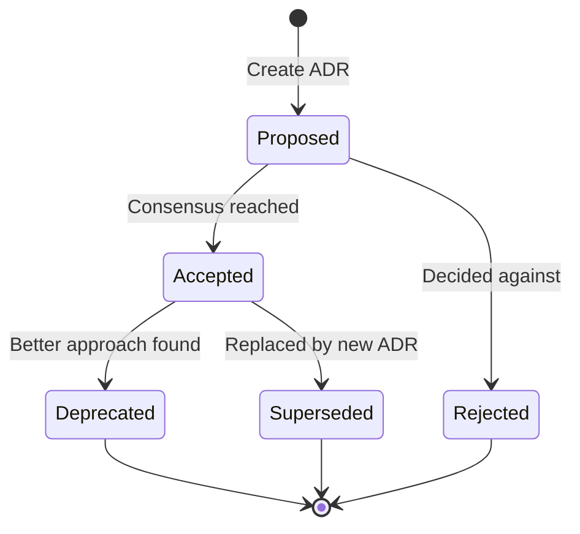

# Architecture Decision Records (ADRs)

## What are ADRs?

**Architecture Decision Records** document significant architectural decisions made during the development of Hei-DataHub. They capture:

- **Context:** What problem are we solving?
- **Decision:** What did we decide?
- **Rationale:** Why did we make this choice?
- **Consequences:** What are the tradeoffs?
- **Alternatives:** What else did we consider?

---

## Why ADRs?

ADRs help us:

- ✅ **Remember why** decisions were made months or years later
- ✅ **Onboard new contributors** by showing the reasoning behind the architecture
- ✅ **Avoid revisiting settled questions** repeatedly
- ✅ **Document tradeoffs** explicitly
- ✅ **Enable better discussions** by providing context

---

## ADR Format

Each ADR follows this template:

```markdown
# ADR-XXX: Title

**Status:** Accepted | Proposed | Deprecated | Superseded

**Date:** YYYY-MM-DD

**Deciders:** [List of people involved]

---

## Context

What is the issue we're facing? What constraints exist?

## Decision

What did we decide to do?

## Rationale

Why did we make this choice?

## Consequences

### Positive
- What benefits do we gain?

### Negative
- What tradeoffs or costs do we accept?

## Alternatives Considered

What other options did we evaluate and why did we reject them?

## Related Decisions

Links to other ADRs that relate to this one.

## Notes

Any additional context or follow-up.
```

---

## Index of ADRs

### Active ADRs

| ADR | Title | Status | Date |
|-----|-------|--------|------|
| [ADR-001](001-docs-split.md) | Split User and Developer Documentation | ✅ Accepted | 2025-10-06 |
| [ADR-002](002-branching-strategy.md) | Branching Strategy for Developer Docs | ✅ Accepted | 2025-10-06 |
| [ADR-003](003-changelog-enforcement.md) | Changelog Enforcement Policy | ✅ Accepted | 2025-10-06 |
| [ADR-004](004-docs-upgrade-and-cleanup.md) | Developer Documentation Upgrade and Cleanup | ✅ Accepted | 2025-10-28 |

### Proposed ADRs

(None currently)

### Deprecated ADRs

(None currently)

---

## Creating a New ADR

### When to Create an ADR

Create an ADR when:

- ✅ Making a significant architectural choice
- ✅ Choosing between multiple viable technical approaches
- ✅ Establishing a new pattern or convention
- ✅ Changing a foundational decision

**Don't create ADRs for:**

- ❌ Minor implementation details
- ❌ Obvious choices with no alternatives
- ❌ Tactical code-level decisions

### Process

1. **Start a discussion:** Open a GitHub Discussion or issue
2. **Draft the ADR:** Copy the template above
3. **Number it:** Use the next sequential number (e.g., ADR-004)
4. **Get feedback:** Share with maintainers and stakeholders
5. **Revise:** Incorporate feedback
6. **Decide:** Achieve consensus or defer to maintainers
7. **Merge:** Update status to "Accepted" and merge to `main`
8. **Update index:** Add to the table above

---

## ADR Lifecycle



---

## Best Practices

### Writing ADRs

- **Be concise:** Aim for 1-2 pages
- **Use plain language:** Avoid jargon when possible
- **Show, don't just tell:** Include examples or diagrams
- **Document tradeoffs:** Every choice has costs; make them explicit
- **Link to context:** Reference issues, PRs, or discussions

### Reviewing ADRs

- **Check completeness:** Are all sections filled out?
- **Validate rationale:** Does the reasoning make sense?
- **Consider alternatives:** Were other options explored?
- **Think long-term:** Will this scale? Will it age well?

---

## Updating ADRs

ADRs are **immutable once accepted**. If a decision changes:

1. **Don't edit the original ADR**
2. **Create a new ADR** that supersedes it
3. **Update the original's status** to "Superseded by ADR-XXX"
4. **Link the two ADRs** together

---

## Examples from Other Projects

**Good ADR examples to study:**

- [GitHub's ADRs](https://github.com/joelparkerhenderson/architecture-decision-record)
- [MADR (Markdown ADR)](https://adr.github.io/madr/)
- [ThoughtWorks Technology Radar](https://www.thoughtworks.com/radar)

---

## Questions?

- **What if we're unsure?** → Draft a "Proposed" ADR and discuss it
- **Too formal?** → ADRs should be lightweight, not bureaucratic
- **Who decides?** → Maintainers have final say, but seek consensus

---

**Next:** Read the active ADRs to understand key architectural decisions.

- [ADR-001: Docs Split](001-docs-split.md)
- [ADR-002: Branching Strategy](002-branching-strategy.md)
- [ADR-003: Changelog Enforcement](003-changelog-enforcement.md)
