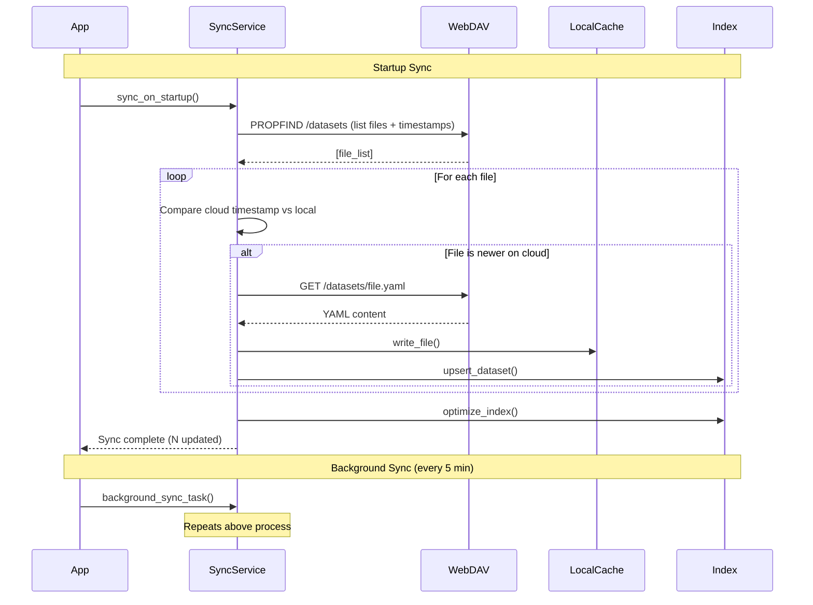

# Authentication & Sync

## Overview

Hei-DataHub uses **WebDAV** to connect to cloud storage (HeiBox/Seafile), enabling team collaboration and dataset sharing without GitHub. This document explains how authentication works, how credentials are stored securely, and how background synchronization keeps local and cloud data in sync.

---

## WebDAV Authentication

### What is WebDAV?

WebDAV (Web Distributed Authoring and Versioning) is an extension of HTTP that allows reading and writing files on remote servers. HeiBox and Seafile both provide WebDAV interfaces for programmatic access to libraries.

**Why WebDAV?**

- ✅ Standard protocol (HTTP-based)
- ✅ Supported by HeiBox/Seafile natively
- ✅ No API keys or OAuth complexity
- ✅ Works with username/password or app tokens
- ✅ Cross-platform (Linux/Windows/macOS)

### Authentication Methods

Hei-DataHub supports two authentication methods:

| Method | Use Case | Security | Credentials |
|--------|----------|----------|-------------|
| **Token** | Recommended for HeiBox | ✅ High | WebDAV app token (no username required) |
| **Password** | Legacy or custom WebDAV | ⚠️ Medium | Username + password |

**Best Practice:** Use **token authentication** when available. HeiBox allows generating app-specific WebDAV tokens that can be revoked without changing your main password.

---

## Credential Storage

### Linux Keyring (Recommended)

On Linux, credentials are stored in the **Secret Service** keyring using the `keyring` Python library.

**How it works:**

```
┌─────────────────────────────────────────┐
│  User enters credentials during setup   │
└──────────────┬──────────────────────────┘
               │
               ▼
┌─────────────────────────────────────────┐
│  hei-datahub auth setup wizard          │
│  - Prompts for WebDAV URL               │
│  - Prompts for username (optional)      │
│  - Prompts for token or password        │
│  - Validates connection                 │
└──────────────┬──────────────────────────┘
               │
               ▼
┌─────────────────────────────────────────┐
│  Credentials saved to keyring           │
│  Service: "hei-datahub"                 │
│  Key ID: "webdav:token:-@heibox..."     │
│  Value: Encrypted by OS                 │
└──────────────┬──────────────────────────┘
               │
               ▼
┌─────────────────────────────────────────┐
│  Config file (~/.config/...)            │
│  Stores ONLY non-sensitive metadata:    │
│  - WebDAV URL                           │
│  - Username (if used)                   │
│  - Auth method (token/password)         │
│  - Storage backend (keyring/env)        │
│  - Key ID reference                     │
└─────────────────────────────────────────┘
```

**Key ID Format:**

```
webdav:{method}:{username_or_dash}@{hostname}
```

Examples:
- Token auth: `webdav:token:-@heibox.uni-heidelberg.de`
- Password auth: `webdav:password:user123@heibox.uni-heidelberg.de`

**Storage Location:**

- **GNOME Keyring:** `~/.local/share/keyrings/`
- **KDE Wallet:** Managed by kwalletd
- **Secret Service API:** Backend-agnostic

### Environment Variables (Fallback)

If keyring is unavailable or the user prefers environment variables:

```bash
export WEBDAV_URL="https://heibox.uni-heidelberg.de/seafdav"
export WEBDAV_USERNAME="your-username"
export WEBDAV_TOKEN="your-webdav-token"
export WEBDAV_LIBRARY="testing-hei-datahub"
```

**⚠️ Warning:** Environment variables are less secure than keyring storage. They:
- Appear in process listings (`ps aux`)
- May be logged by shell history
- Are visible to all processes run by the user

Use keyring storage whenever possible.

---

## Authentication Commands

### `hei-datahub auth setup`

**Purpose:** Interactive wizard to configure WebDAV authentication.

**Usage:**

```bash
# Interactive mode (recommended for first-time setup)
hei-datahub auth setup

# Non-interactive mode (scripting/automation)
hei-datahub auth setup \
  --url "https://heibox.uni-heidelberg.de/seafdav" \
  --token "your-webdav-token" \
  --library "testing-hei-datahub" \
  --store keyring \
  --non-interactive

# With password instead of token
hei-datahub auth setup \
  --url "https://heibox.uni-heidelberg.de/seafdav" \
  --username "your-username" \
  --password "your-password" \
  --library "testing-hei-datahub" \
  --non-interactive
```

**Options:**

| Flag | Description | Required | Default |
|------|-------------|----------|---------|
| `--url` | WebDAV base URL | Yes | Prompted |
| `--username` | Username (for password auth) | No | - |
| `--token` | WebDAV app token | Yes* | Prompted |
| `--password` | WebDAV password | Yes* | Prompted |
| `--library` | Library/folder name | Yes | Prompted |
| `--store` | Storage backend (`keyring` or `env`) | No | `keyring` |
| `--no-validate` | Skip connection validation | No | `false` |
| `--overwrite` | Overwrite existing config | No | `false` |
| `--timeout` | Validation timeout (seconds) | No | `8` |
| `--non-interactive` | Non-interactive mode | No | `false` |

*Either `--token` or `--password` required.

**Interactive Flow:**

```
🔐 Hei-DataHub WebDAV Authentication Setup (Linux)

Found config at ~/.config/hei-datahub/config.toml
  [O]verwrite, [S]kip, [T]est? O

Enter WebDAV URL (default: https://heibox.uni-heidelberg.de/seafdav):
> https://heibox.uni-heidelberg.de/seafdav

Enter library/folder name (e.g., testing-hei-datahub):
> my-datasets

Authentication method:
  [T]oken (recommended) or [P]assword? T

Enter WebDAV token (hidden):
> **********************

Validating connection...
✓ Connection successful
✓ Read permission verified
✓ Write permission verified

Saving configuration...
✓ Config saved to ~/.config/hei-datahub/config.toml
✓ Credentials stored in keyring

Setup complete! Run 'hei-datahub auth status' to verify.
```

**Exit Codes:**

- `0`: Success
- `1`: Validation failed or user aborted
- `2`: Usage error (missing required args in non-interactive mode)

---

### `hei-datahub auth status`

**Purpose:** Display current authentication configuration (non-sensitive info only).

**Usage:**

```bash
hei-datahub auth status
```

**Example Output:**

```
🔐 WebDAV Authentication Status

Method:     token
URL:        https://heibox.uni-heidelberg.de/seafdav
Username:   -
Storage:    keyring
Key ID:     webdav:token:-@heibox.uni-heidelberg.de

Config:     /home/user/.config/hei-datahub/config.toml
```

**Exit Codes:**

- `0`: Config found and valid
- `1`: No config or invalid config

---

### `hei-datahub auth doctor`

**Purpose:** Run comprehensive diagnostics on WebDAV authentication and connectivity.

**Usage:**

```bash
# Full diagnostics (read + write tests)
hei-datahub auth doctor

# Read-only tests (skip write permission checks)
hei-datahub auth doctor --no-write

# JSON output for scripting
hei-datahub auth doctor --json

# Custom timeout
hei-datahub auth doctor --timeout 15
```

**Options:**

| Flag | Description | Default |
|------|-------------|---------|
| `--json` | Output as JSON | `false` |
| `--no-write` | Skip write permission tests | `false` |
| `--timeout` | Network timeout (seconds) | `8` |

**Example Output:**

```
🔍 WebDAV Authentication Diagnostics

[1/7] Config file exists ............................ ✓ PASS
      Path: /home/user/.config/hei-datahub/config.toml

[2/7] Config has [auth] section .................... ✓ PASS

[3/7] Credentials found in keyring ................. ✓ PASS
      Key ID: webdav:token:-@heibox.uni-heidelberg.de

[4/7] WebDAV URL reachable ......................... ✓ PASS
      Response time: 142ms

[5/7] Authentication successful .................... ✓ PASS
      Method: token

[6/7] Read permission verified ..................... ✓ PASS
      Listed 3 files in library

[7/7] Write permission verified .................... ✓ PASS
      Created/deleted test file successfully

━━━━━━━━━━━━━━━━━━━━━━━━━━━━━━━━━━━━━━━━━━━━━━━━━━━
✓ All checks passed! WebDAV authentication is working.
```

**Failure Example:**

```
[4/7] WebDAV URL reachable ......................... ✗ FAIL
      Error: Connection timeout after 8s

[5/7] Authentication successful .................... ⊘ SKIP
[6/7] Read permission verified ..................... ⊘ SKIP
[7/7] Write permission verified .................... ⊘ SKIP

━━━━━━━━━━━━━━━━━━━━━━━━━━━━━━━━━━━━━━━━━━━━━━━━━━━
✗ Diagnostics failed. Check network connection and credentials.

Suggestions:
  • Verify internet connection
  • Check if HeiBox is accessible from your network
  • Try increasing timeout: hei-datahub auth doctor --timeout 15
```

**Exit Codes:**

- `0`: All checks passed
- `1`: One or more checks failed

---

### `hei-datahub auth clear`

**Purpose:** Remove stored credentials and optionally delete search index.

**Usage:**

```bash
# Interactive confirmation
hei-datahub auth clear

# Force without confirmation
hei-datahub auth clear --force

# Also remove cached session files
hei-datahub auth clear --all
```

**Options:**

| Flag | Description | Default |
|------|-------------|---------|
| `--force` | Skip confirmation prompt | `false` |
| `--all` | Also remove cache files | `false` |

**What Gets Removed:**

| Item | Location | Removed by Default | Removed with `--all` |
|------|----------|-------------------|---------------------|
| Config file | `~/.config/hei-datahub/config.toml` | ✅ | ✅ |
| Keyring entry | OS keyring | ✅ | ✅ |
| Search index | `~/.local/share/Hei-DataHub/db.sqlite` | ✅ | ✅ |
| Cached datasets | `~/.cache/hei-datahub/datasets/` | ❌ | ✅ |
| Session cache | `~/.cache/hei-datahub/sessions/` | ❌ | ✅ |

**Example Output:**

```
⚠️  Clear WebDAV Authentication

This will remove:
  • Config file: /home/user/.config/hei-datahub/config.toml
  • Keyring entry: webdav:token:-@heibox.uni-heidelberg.de
  • Search index: /home/user/.local/share/Hei-DataHub/db.sqlite

Continue? [y/N] y

✓ Removed config file
✓ Removed keyring entry
✓ Removed search index

Authentication cleared. Run 'hei-datahub auth setup' to reconfigure.
```

**Exit Codes:**

- `0`: Successfully cleared
- `1`: User aborted or error occurred

---

## Background Synchronization

### How Sync Works

Hei-DataHub maintains a **local cache** of cloud datasets for instant search. Background sync keeps the cache fresh.



### Sync Triggers

| Trigger | When | Frequency | Purpose |
|---------|------|-----------|---------|
| **Startup** | App launch | Once | Ensure fresh data on startup |
| **Background** | While app running | Every 5 min* | Keep cache synchronized |
| **Manual** | User-initiated | On demand | Force immediate sync |
| **After Save** | Dataset created/updated | Immediate | Upload changes to cloud |

*Configurable in settings

### Sync Strategies

#### 1. **Change Detection**

Only download files that have changed since last sync:

```python
def needs_update(cloud_file: FileEntry, local_path: Path) -> bool:
    """Check if cloud file is newer than local cache."""
    if not local_path.exists():
        return True  # New file, download

    local_mtime = local_path.stat().st_mtime
    cloud_mtime = cloud_file.modified.timestamp()

    return cloud_mtime > local_mtime
```

#### 2. **Batch Operations**

WebDAV operations are batched for efficiency:

```python
# Single PROPFIND lists all files with metadata
files = webdav.list_files("/datasets")  # One request

# Download only changed files
for file in files:
    if needs_update(file, local_cache / file.name):
        content = webdav.read_file(file.path)  # Parallel downloads
        save_to_cache(content)
```

#### 3. **Conflict Resolution**

Simple last-write-wins strategy:

- **Cloud timestamp > Local timestamp** → Download from cloud
- **Local timestamp > Cloud timestamp** → Upload to cloud (background task)
- **Timestamps equal** → No action needed

**Note:** Manual conflict resolution UI planned for v0.60+.

### Error Handling

#### Network Failures

- **Temporary failures** (timeouts, 5xx errors): Retry with exponential backoff
- **Permanent failures** (404, 403): Log error, skip file, continue sync
- **Connection failures**: Queue operation in outbox for later retry

#### Sync Failures

```python
try:
    sync_from_cloud()
except NetworkError as e:
    logger.warning(f"Sync failed: {e}. Will retry in 5 minutes.")
    schedule_retry(delay=300)
except AuthError as e:
    logger.error(f"Authentication failed: {e}")
    show_notification("WebDAV authentication error. Run 'auth doctor'.")
    disable_background_sync()
```

### Outbox Pattern

Failed WebDAV operations are queued in the **outbox** for automatic retry:

```json
// ~/.cache/hei-datahub/outbox.json
{
  "pending_uploads": [
    {
      "dataset_id": "dataset-123",
      "path": "/datasets/dataset-123/metadata.yaml",
      "content": "...",
      "timestamp": "2025-10-25T14:30:00Z",
      "retry_count": 2,
      "last_error": "Connection timeout"
    }
  ]
}
```

**Retry Strategy:**

- Initial delay: 30 seconds
- Exponential backoff: 30s → 1m → 2m → 5m → 10m
- Max retries: 10
- After max retries: Show user notification, keep in outbox

---

## Configuration File Structure

### TOML Format

```toml
# ~/.config/hei-datahub/config.toml

[auth]
method = "token"                                    # "token" or "password"
url = "https://heibox.uni-heidelberg.de/seafdav"   # WebDAV base URL
username = "-"                                      # Username (or "-" for token auth)
library = "testing-hei-datahub"                    # Library/folder name
stored_in = "keyring"                              # "keyring" or "env"
key_id = "webdav:token:-@heibox.uni-heidelberg.de" # Keyring key identifier

[sync]
enabled = true                                      # Enable background sync
interval_seconds = 300                              # Sync every 5 minutes
on_startup = true                                   # Sync on app startup
auto_retry = true                                   # Retry failed operations

[cache]
max_age_hours = 24                                  # Cache validity (not yet implemented)
auto_cleanup = true                                 # Clean old cache files
```

### Reading Config

```python
from mini_datahub.infra.config_paths import get_config_path
import tomllib  # Python 3.11+ built-in

config_path = get_config_path()

with open(config_path, "rb") as f:
    config = tomllib.load(f)

auth = config["auth"]
url = auth["url"]
method = auth["method"]
```

---

## Security Considerations

### What is Stored Securely

✅ **In Keyring (Encrypted):**
- WebDAV password or token
- Retrieved only when needed
- Cleared from memory after use

✅ **In Config File (Non-sensitive):**
- WebDAV URL
- Username
- Library name
- Auth method
- Key ID reference

❌ **Never Stored:**
- Credentials in logs
- Credentials in environment variables (unless user explicitly chooses)
- Credentials in code or version control

### Credential Lifecycle

```
1. User enters credentials
   ↓
2. Validated against WebDAV server
   ↓
3. Stored in OS keyring (encrypted)
   ↓
4. Config file references keyring entry (key_id)
   ↓
5. On each WebDAV request:
   - Load credentials from keyring
   - Use for authentication
   - Clear from memory
   ↓
6. User clears auth:
   - Config file deleted
   - Keyring entry removed
   - Search index deleted
```

### Threat Mitigation

| Threat | Mitigation |
|--------|-----------|
| **Credential theft** | Stored in OS keyring, not in files |
| **Man-in-the-middle** | HTTPS required for WebDAV |
| **Credential logging** | Credentials masked in all log output |
| **Process snooping** | Credentials loaded only when needed, cleared after use |
| **Config file exposure** | No sensitive data in config files |

---

## Troubleshooting

### "No keyring backend available"

**Symptom:** Setup fails with keyring error on Linux.

**Solution:**

```bash
# Install GNOME Keyring
sudo apt install gnome-keyring

# Or use environment variables (less secure)
hei-datahub auth setup --store env
```

### "Connection timeout"

**Symptom:** `auth doctor` or sync fails with timeout.

**Solutions:**

1. Check network connectivity: `ping heibox.uni-heidelberg.de`
2. Verify VPN if required
3. Increase timeout: `hei-datahub auth doctor --timeout 15`
4. Check firewall rules

### "Authentication failed (401)"

**Symptom:** WebDAV returns 401 Unauthorized.

**Solutions:**

1. Verify credentials: Re-run `hei-datahub auth setup`
2. Check if token expired (regenerate in HeiBox)
3. Verify library name matches exactly (case-sensitive)

### "Permission denied (403)"

**Symptom:** Can read but not write to WebDAV.

**Solutions:**

1. Check library permissions in HeiBox/Seafile
2. Verify you have write access to the library
3. Contact library owner to grant permissions

### "Search index out of sync"

**Symptom:** Search shows outdated or missing datasets.

**Solutions:**

```bash
# Force full reindex
hei-datahub auth clear --force
hei-datahub auth setup  # Reconfigure
hei-datahub reindex     # Rebuild index
```

---

## Best Practices

### For Users

1. ✅ **Use token auth** instead of password when possible
2. ✅ **Enable keyring storage** (don't use env vars in production)
3. ✅ **Run `auth doctor`** after setup to verify connectivity
4. ✅ **Keep credentials private** (never share tokens)
5. ✅ **Rotate tokens regularly** (regenerate in HeiBox every 6 months)

### For Developers

1. ✅ **Never log credentials** (use `_mask_auth()` for URLs)
2. ✅ **Handle auth errors gracefully** (show helpful error messages)
3. ✅ **Test with invalid credentials** (ensure proper error handling)
4. ✅ **Support both auth methods** (token and password)
5. ✅ **Clear credentials from memory** after use

---

## Related Documentation

- **[Security & Privacy](security-privacy.md)** - Complete security documentation
- **[CLI Commands Reference](../api-reference/cli-commands.md)** - Detailed command docs
- **[Module Walkthrough](../codebase/module-walkthrough.md)** - Code-level details
- **[Architecture Overview](overview.md)** - System architecture

---

## Implementation Details

### Key Source Files

| File | Purpose |
|------|---------|
| `src/mini_datahub/auth/setup.py` | Interactive setup wizard |
| `src/mini_datahub/auth/credentials.py` | Keyring integration |
| `src/mini_datahub/auth/validator.py` | Connection validation |
| `src/mini_datahub/auth/doctor.py` | Diagnostic tool |
| `src/mini_datahub/auth/clear.py` | Clear credentials |
| `src/mini_datahub/services/webdav_storage.py` | WebDAV client |
| `src/mini_datahub/services/sync.py` | Background sync |
| `src/mini_datahub/infra/config_paths.py` | Config path resolution |

### Testing Authentication

```bash
# Run auth-related tests
pytest tests/unit/test_auth.py -v

# Run WebDAV integration tests (requires config)
pytest tests/services/test_webdav_storage.py -v

# Run full doctor check
hei-datahub auth doctor
```

---

**Last Updated:** October 25, 2025 | **Version:** 0.59.0-beta "Privacy"
