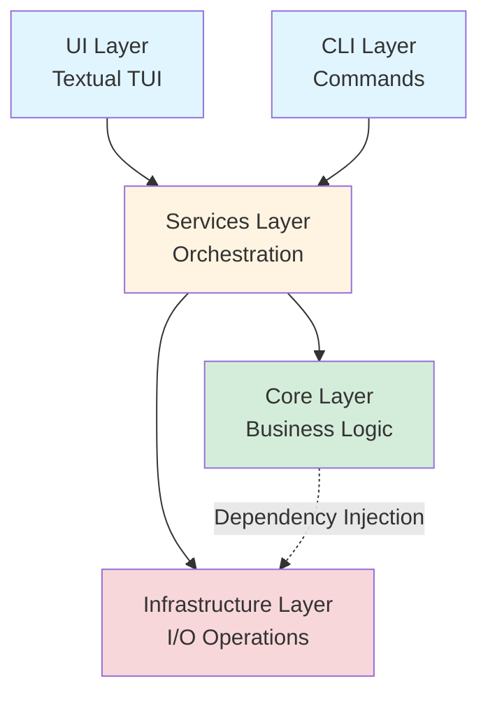
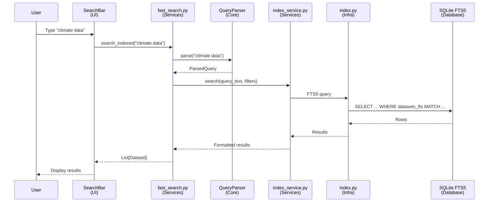
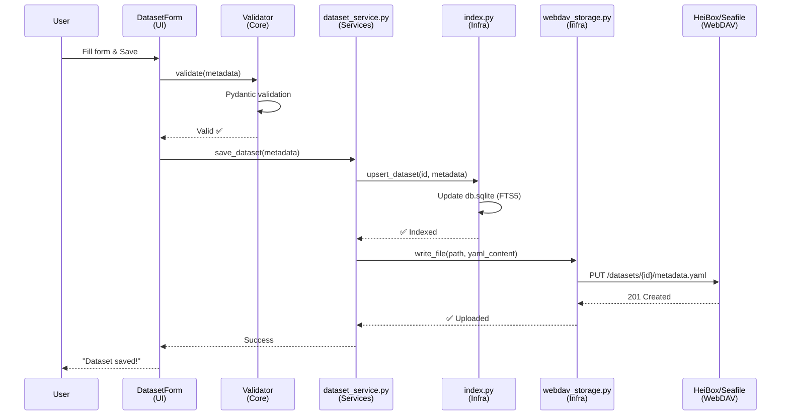
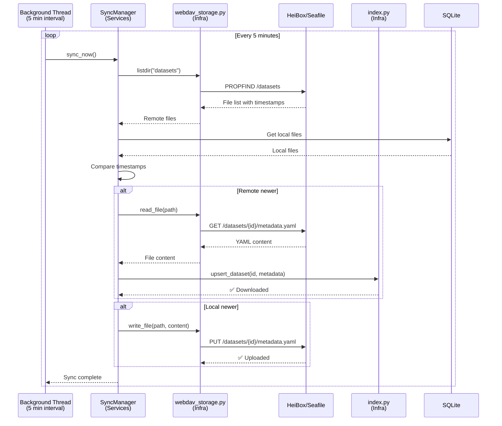
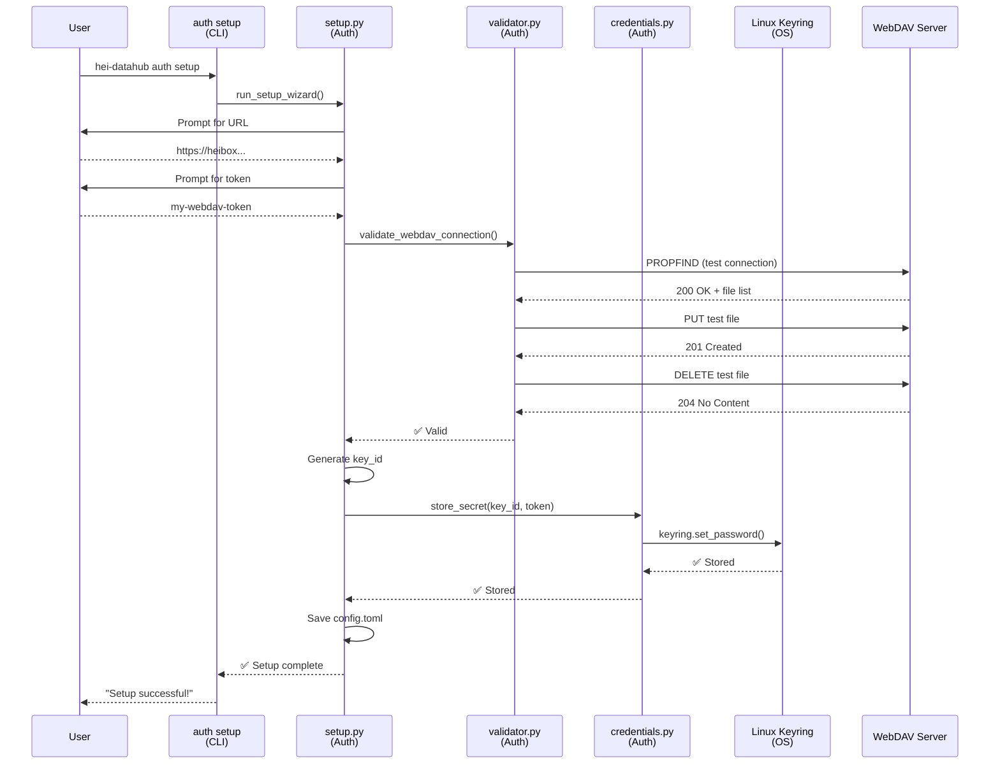
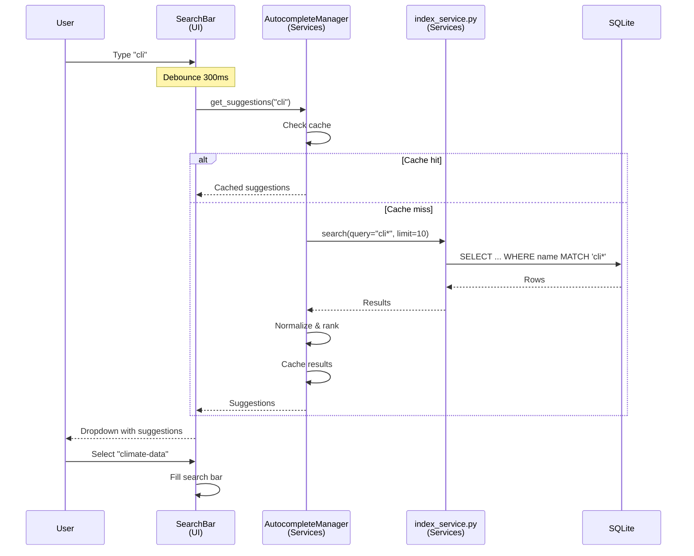
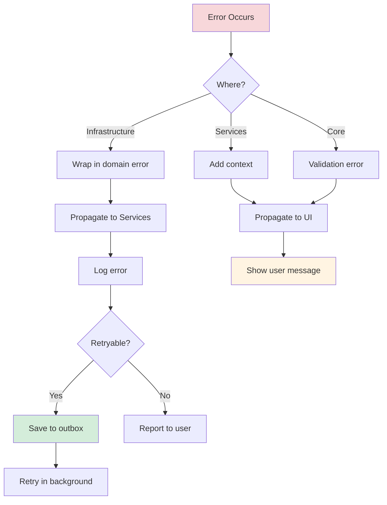

# Data Flow

> **Version:** 0.60.0-beta — "Clean-up"
> This documentation reflects the optimized data flow and performance improvements in v0.60.

!!! info "What this section covers"
    This page explains how data moves through Hei-DataHub's layers, from user interaction to database queries and cloud sync. Essential for understanding performance characteristics and debugging issues.

## Overview

This document explains how data flows through Hei-DataHub's architecture, from user input to storage and back. Understanding data flow is essential for debugging, optimization, and adding new features.

---

## Architecture Layers

Hei-DataHub follows **Clean Architecture** with strict layer boundaries:



**Layer Rules:**

- **Core** → No imports from other layers (pure logic)
- **Services** → Can import Core and Infra (orchestration)
- **Infrastructure** → Can import Core (implements interfaces)
- **UI/CLI** → Can import Services and Core (presentation)

---

## Key Data Flows

### 1. Search Flow

**User searches for datasets → Results displayed**



**Flow Steps:**

1. **User Input (UI)**
   - User types in search bar
   - Debounced (300ms) to avoid excessive queries
   - Triggers autocomplete if < 3 characters

2. **Query Parsing (Core)**
   - `QueryParser.parse()` extracts filters
   - Separates free text from `project:` filters
   - Returns `ParsedQuery` object

3. **Search Execution (Services)**
   - `fast_search.search_indexed()` orchestrates
   - Calls `index_service.search()`
   - Formats results for UI

4. **Database Query (Infrastructure)**
   - `index.py` builds FTS5 SQL query
   - Executes parameterized query
   - Returns raw rows

5. **Result Display (UI)**
   - UI receives formatted results
   - Displays in result list widget
   - Shows snippets and metadata

**Performance:**
- **Target:** <80ms end-to-end
- **Typical:** 50-80ms for simple queries
- **Caching:** Autocomplete results cached

---

### 2. Dataset Save Flow

**User creates/edits dataset → Saved to cloud**



**Flow Steps:**

1. **User Input (UI)**
   - User fills dataset form
   - Clicks "Save" button
   - UI collects form data

2. **Validation (Core)**
   - `DatasetMetadata.model_validate()` runs
   - Checks required fields
   - Validates data types and formats
   - Returns validated model or raises `ValidationError`

3. **Orchestration (Services)**
   - `dataset_service.save_dataset()` coordinates
   - Updates local index first (fast)
   - Then uploads to cloud (slower)

4. **Local Index Update (Infrastructure)**
   - `index.upsert_dataset()` updates SQLite
   - Writes to `datasets_store` (JSON payload)
   - Writes to `datasets_fts` (FTS5 index)
   - Updates `fast_search_index` for autocomplete

5. **Cloud Upload (Infrastructure)**
   - `webdav_storage.write_file()` uploads YAML
   - Converts metadata dict to YAML string
   - HTTP PUT to WebDAV server
   - Handles errors (timeout, auth, network)

6. **Confirmation (UI)**
   - UI shows success message
   - Updates result list if in search view

**Error Handling:**
- Validation fails → Show form errors
- Upload fails → Save to outbox for retry
- Network timeout → User notified, retry later

---

### 3. Background Sync Flow

**Automatic sync between local cache and cloud**



**Flow Steps:**

1. **Trigger (Background Thread)**
   - Runs every 5 minutes
   - Also on startup if enabled
   - Can be triggered manually via CLI

2. **List Remote Files (Infrastructure)**
   - WebDAV PROPFIND request
   - Gets file list with modification times
   - Filters to datasets only

3. **List Local Files (Infrastructure)**
   - Query SQLite for indexed datasets
   - Get modification times from `updated_at`

4. **Compare & Decide (Services)**
   - For each dataset ID:
     - If only remote → Download
     - If only local → Upload
     - If both → Compare timestamps
       - Remote newer → Download (overwrite local)
       - Local newer → Upload (overwrite remote)
       - Same time → Skip

5. **Sync Operations (Infrastructure)**
   - Download: GET from WebDAV, upsert to index
   - Upload: Read from index, PUT to WebDAV
   - Update index timestamps

**Conflict Resolution:**
- **Strategy:** Last-write-wins
- **No user intervention:** Automatic resolution
- **Risk:** Concurrent edits may lose changes
- **Future:** Consider conflict detection UI

---

### 4. Authentication Flow

**User sets up WebDAV credentials**



**Flow Steps:**

1. **Interactive Wizard (CLI)**
   - Prompts for WebDAV URL
   - Prompts for library name
   - Prompts for authentication method
   - Prompts for token/password

2. **Validation (Auth)**
   - Test network reachability
   - Test authentication (401 check)
   - Test read permission (list files)
   - Test write permission (create/delete test file)

3. **Credential Storage (Auth)**
   - Derive key ID from URL and method
   - Store credential in OS keyring (encrypted)
   - Save metadata to `config.toml` (non-sensitive)

4. **Confirmation (CLI)**
   - Show success message
   - Suggest running `auth doctor` to verify

**Security:**
- Credentials **never** written to files
- Only stored in encrypted OS keyring
- Config file has **reference** to keyring key
- Credentials masked in all log output

---

### 5. Autocomplete Flow

**User types → Suggestions appear**



**Flow Steps:**

1. **User Input (UI)**
   - User types in search bar
   - Each keystroke triggers update
   - Debounced to 300ms

2. **Cache Check (Services)**
   - Normalized query used as cache key
   - If cached and fresh → Return immediately

3. **Database Query (if cache miss)**
   - Wildcard query to FTS5
   - Prefix matching on dataset names
   - Also matches project names and tags

4. **Ranking (Services)**
   - Exact matches ranked higher
   - Dataset names > Projects > Tags
   - Recent queries ranked higher

5. **Display (UI)**
   - Show top 10 suggestions
   - Highlight matching portion
   - Keyboard navigation (↑↓)

**Performance:**
- **Target:** <50ms for suggestions
- **Caching:** Aggressive caching (5 min TTL)
- **Debouncing:** Reduces queries by ~70%

---

## Data Models

### Core Data Flow

```
User Input (strings)
    ↓
Pydantic Validation (DatasetMetadata)
    ↓
Services Layer (orchestration)
    ↓
Infrastructure Layer (I/O)
    ↓
Storage (SQLite + WebDAV)
```

### Data Transformations

| Layer | Format | Example |
|-------|--------|---------|
| **UI** | Form fields | `{"name": "Climate Data", ...}` |
| **Core** | Pydantic model | `DatasetMetadata(id="climate-data", ...)` |
| **Services** | Dict | `{"id": "climate-data", "dataset_name": "..."}` |
| **Infra (SQLite)** | JSON string | `'{"id": "climate-data", ...}'` |
| **Infra (WebDAV)** | YAML string | `id: climate-data\ndataset_name: ...` |

---

## Performance Considerations

### Search Performance

- **FTS5 Indexing:** Sub-100ms for 10,000 datasets
- **Autocomplete:** <50ms with caching
- **Debouncing:** Reduces queries by 70%

### Sync Performance

- **Listing:** 200-500ms for 1000 files
- **Download:** ~100ms per dataset (network dependent)
- **Upload:** ~150ms per dataset (network dependent)
- **Batch optimization:** Process in chunks of 50

### Memory Usage

- **Dataset cache:** ~1KB per dataset
- **Search index:** ~2KB per dataset in SQLite
- **UI state:** Minimal, lazy loading

---

## Error Handling

### Error Flow



### Error Types

| Layer | Error Type | Example |
|-------|-----------|---------|
| **Core** | `ValidationError` | Invalid date format |
| **Services** | `SearchError` | Invalid FTS5 syntax |
| **Infra** | `StorageConnectionError` | WebDAV timeout |
| **Auth** | `AuthError` | Invalid credentials |

---

## Related Documentation

- **[Architecture Overview](overview.md)** - System architecture
- **[Module Map](module-map.md)** - Module organization
- **[Search & Autocomplete](search-and-autocomplete.md)** - Search internals
- **[Authentication & Sync](auth-and-sync.md)** - Auth flow details

---

**Last Updated:** October 29, 2025 | **Version:** 0.60.0-beta "Clean-up"
