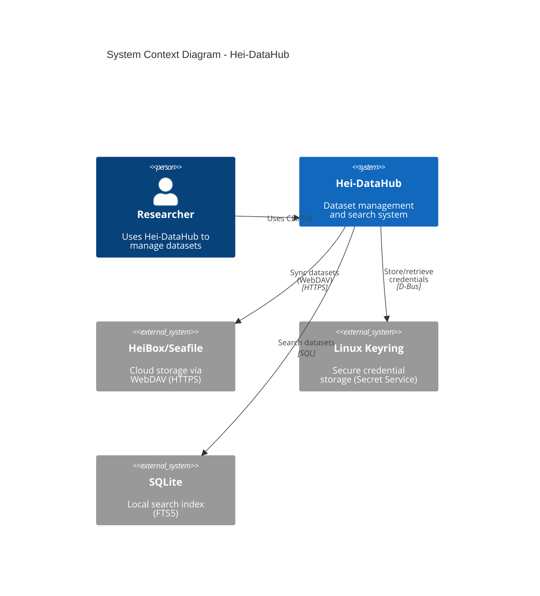
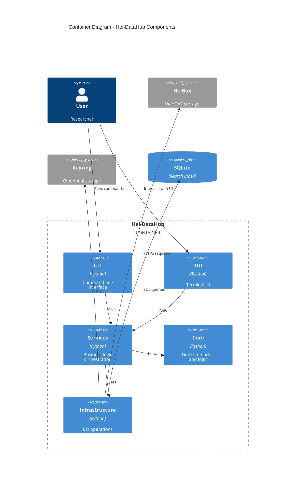
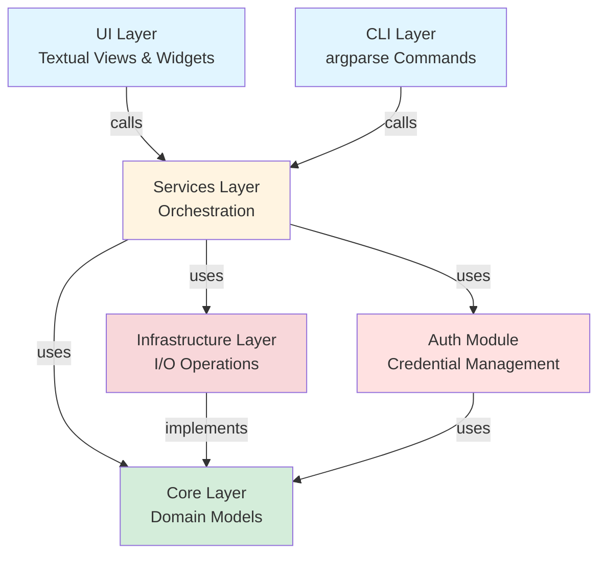
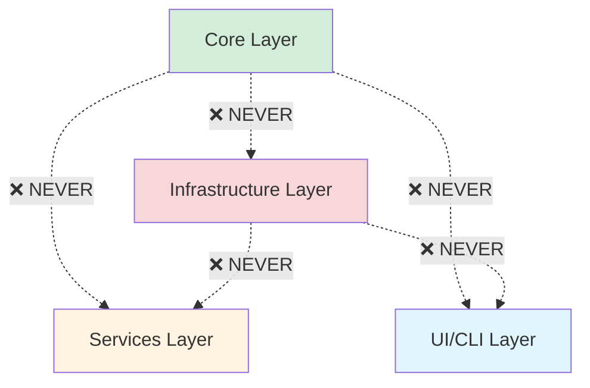
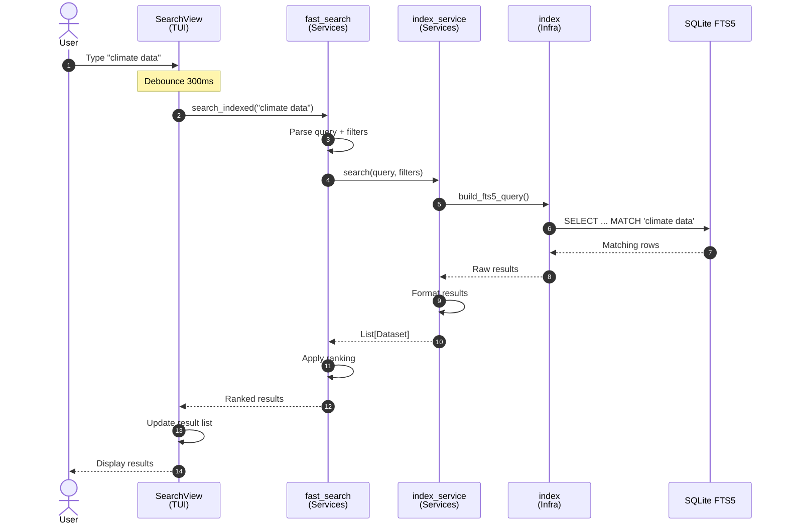
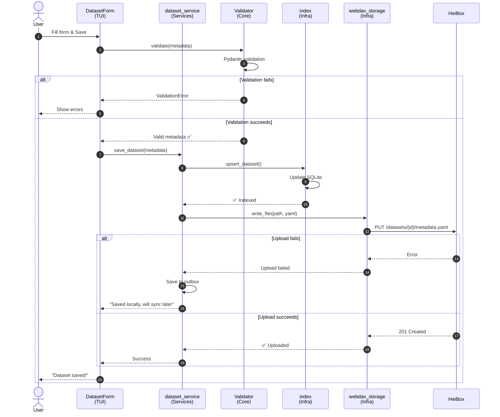
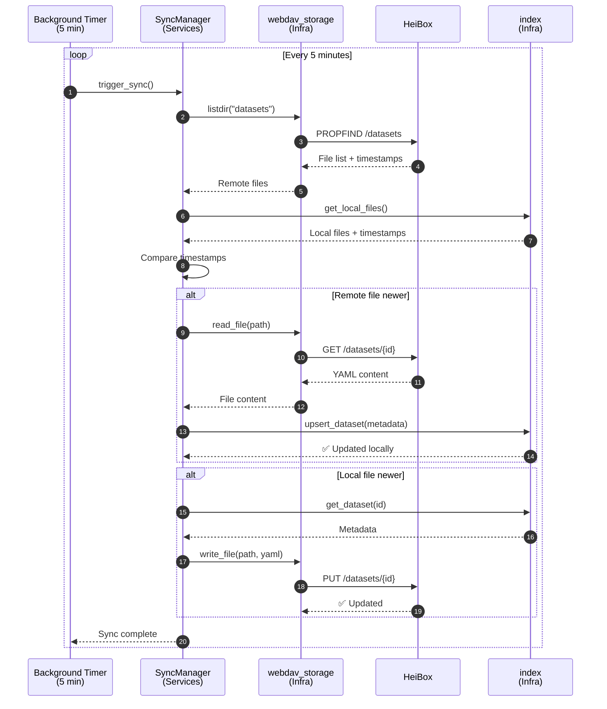
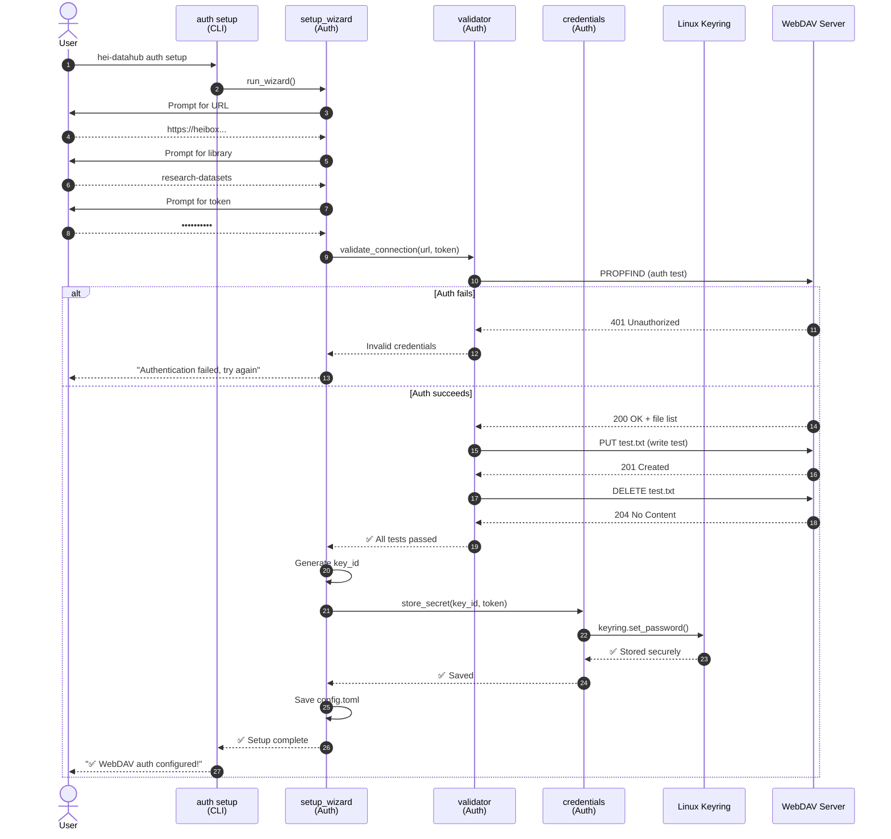
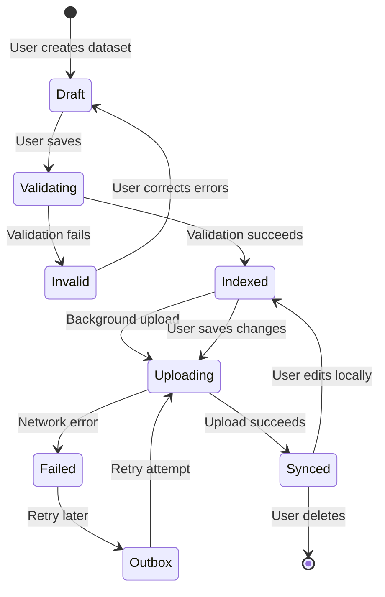
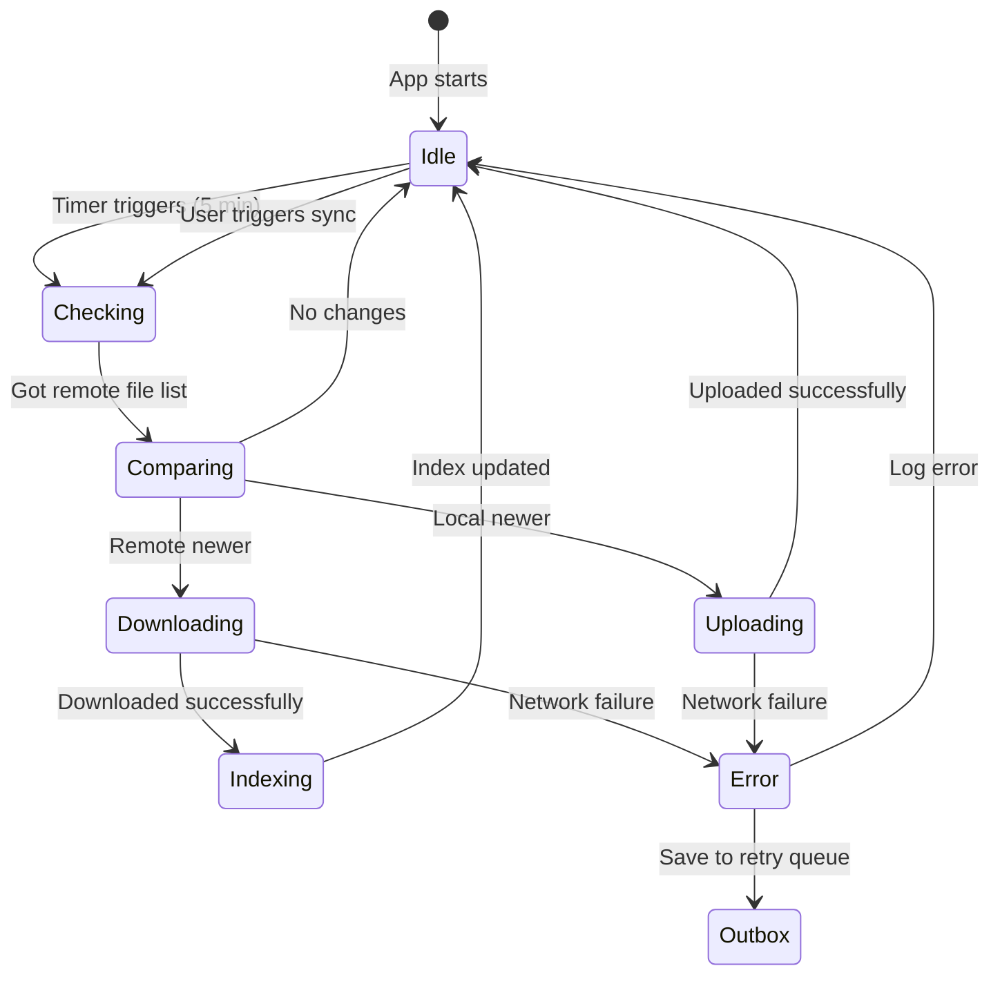

# Architecture Diagrams

## Overview

This document contains visual representations of Hei-DataHub's architecture, including component diagrams, sequence diagrams, deployment views, and data flow illustrations.

---

## System Context Diagram

**High-level view of Hei-DataHub in its environment:**



---

## Container Diagram

**Internal structure of Hei-DataHub:**



---

## Component Diagram

**Detailed view of layer components:**

```
┌──────────────────────────────────────────────────────────────────┐
│                          UI / CLI Layer                          │
├───────────────────────────┬──────────────────────────────────────┤
│   TUI (Textual)           │   CLI (argparse)                     │
│   ├─ HomeView             │   ├─ auth commands                   │
│   ├─ SearchView           │   ├─ sync commands                   │
│   ├─ CloudFilesView       │   ├─ search commands                 │
│   ├─ SettingsView         │   └─ validate commands               │
│   ├─ OutboxView           │                                      │
│   └─ Widgets              │                                      │
│       ├─ Autocomplete     │                                      │
│       ├─ CommandPalette   │                                      │
│       └─ HelpOverlay      │                                      │
└───────────────────────────┴──────────────────────────────────────┘
                                    ↓
┌──────────────────────────────────────────────────────────────────┐
│                         Services Layer                           │
├──────────────────────────────────────────────────────────────────┤
│  ├─ dataset_service.py     - Dataset CRUD operations             │
│  ├─ fast_search.py         - Search orchestration                │
│  ├─ autocomplete.py        - Suggestion generation               │
│  ├─ index_service.py       - FTS5 index management               │
│  ├─ sync_manager.py        - Background sync orchestration       │
│  └─ catalog.py             - Dataset catalog management          │
└──────────────────────────────────────────────────────────────────┘
                                    ↓
┌──────────────────────────────────────────────────────────────────┐
│                          Core Layer                              │
├──────────────────────────────────────────────────────────────────┤
│  ├─ models.py              - Pydantic domain models              │
│  │   ├─ DatasetMetadata   - Main dataset model                  │
│  │   ├─ SearchQuery       - Search parameters                   │
│  │   └─ SyncStatus        - Sync state                          │
│  ├─ interfaces.py          - Abstract base classes               │
│  │   ├─ StorageProvider   - Storage abstraction                 │
│  │   └─ SearchProvider    - Search abstraction                  │
│  └─ validators.py          - Business rule validation            │
└──────────────────────────────────────────────────────────────────┘
                                    ↓
┌──────────────────────────────────────────────────────────────────┐
│                      Infrastructure Layer                        │
├──────────────────────────────────────────────────────────────────┤
│  Storage:                   │  Authentication:                   │
│  ├─ webdav_storage.py       │  ├─ credentials.py                 │
│  └─ local_cache.py          │  ├─ validator.py                   │
│                             │  └─ setup.py                       │
│  Database:                  │                                    │
│  ├─ index.py (FTS5)         │  Utils:                            │
│  ├─ db.py (connections)     │  ├─ paths.py                       │
│  └─ migrations.py           │  ├─ config.py                      │
│                             │  └─ logging.py                     │
└─────────────────────────────┴────────────────────────────────────┘
```

---

## Layer Dependency Graph

**Allowed dependencies between layers:**



**Forbidden dependencies:**



---

## Sequence Diagrams

### 1. Search Flow



### 2. Dataset Save Flow



### 3. Background Sync Flow



### 4. Authentication Setup Flow



---

## Deployment Diagram

**Runtime environment on researcher's machine:**

```
┌───────────────────────────────────────────────────────────────────┐
│                      Researcher's Laptop (Linux)                  │
├───────────────────────────────────────────────────────────────────┤
│                                                                   │
│  ┌─────────────────────────────────────────────────────────┐     │
│  │               Hei-DataHub Process                       │     │
│  │                                                         │     │
│  │  ┌───────────────┐  ┌───────────────┐                  │     │
│  │  │   TUI Thread  │  │  Sync Thread  │                  │     │
│  │  │   (Textual)   │  │  (Background) │                  │     │
│  │  └───────┬───────┘  └───────┬───────┘                  │     │
│  │          │                   │                          │     │
│  │          └─────────┬─────────┘                          │     │
│  │                    │                                    │     │
│  │              ┌─────▼──────┐                             │     │
│  │              │  Services  │                             │     │
│  │              └─────┬──────┘                             │     │
│  │                    │                                    │     │
│  │         ┌──────────┴──────────┐                         │     │
│  │         │                     │                         │     │
│  │    ┌────▼────┐          ┌────▼────┐                    │     │
│  │    │  Core   │          │  Infra  │                    │     │
│  │    └─────────┘          └────┬────┘                    │     │
│  │                              │                          │     │
│  └──────────────────────────────┼──────────────────────────┘     │
│                                 │                                │
│  ┌──────────────────────────────┼──────────────────────────┐     │
│  │       Local Storage          │                          │     │
│  │                              │                          │     │
│  │  ~/.config/hei-datahub/      │                          │     │
│  │  ├─ config.toml (refs)       │                          │     │
│  │  └─ logs/                    │                          │     │
│  │                              │                          │     │
│  │  ~/.local/share/hei-datahub/ │                          │     │
│  │  ├─ db.sqlite (FTS5 index) ◄─┘                          │     │
│  │  └─ outbox/ (failed uploads)                            │     │
│  │                                                          │     │
│  └──────────────────────────────────────────────────────────┘     │
│                                                                   │
│  ┌──────────────────────────────────────────────────────────┐     │
│  │         Linux Keyring (Secret Service API)              │     │
│  │         ├─ webdav-heibox-research: "token123"           │     │
│  │         └─ (encrypted by OS)                            │     │
│  └──────────────────────────────────────────────────────────┘     │
│                                                                   │
└───────────────────────────────────────┬───────────────────────────┘
                                        │
                                        │ HTTPS (443)
                                        │
                    ┌───────────────────▼────────────────────┐
                    │       HeiBox/Seafile Server            │
                    │                                        │
                    │  /research-datasets/                   │
                    │  └─ datasets/                          │
                    │      ├─ climate-data/                  │
                    │      │   └─ metadata.yaml              │
                    │      └─ ocean-temp/                    │
                    │          └─ metadata.yaml              │
                    │                                        │
                    └────────────────────────────────────────┘
```

---

## Data Flow Diagram

**How data moves through the system:**

```
┌─────────────────────────────────────────────────────────────────┐
│                         User Input                              │
└───────────────────────────┬─────────────────────────────────────┘
                            │
                    ┌───────▼────────┐
                    │   Validation   │ (Pydantic)
                    │   (Core)       │
                    └───────┬────────┘
                            │
                    ┌───────▼────────┐
                    │  Orchestration │ (Services)
                    │                │
                    └───┬────────┬───┘
                        │        │
          ┌─────────────┘        └─────────────┐
          │                                    │
    ┌─────▼──────┐                      ┌──────▼─────┐
    │   Local    │                      │   Cloud    │
    │   Index    │                      │  Storage   │
    │  (SQLite)  │                      │  (WebDAV)  │
    └─────┬──────┘                      └──────┬─────┘
          │                                    │
          │         ┌──────────────┐           │
          └────────►│ Background   │◄──────────┘
                    │ Sync (5 min) │
                    └──────────────┘
```

**Data transformations:**

```
User Form Fields (dict)
    ↓
Pydantic Validation (DatasetMetadata)
    ↓
Services Layer (orchestration)
    ↓
    ├─ Local: JSON → SQLite FTS5 index
    └─ Cloud: YAML → WebDAV storage
```

---

## Module Organization

**Directory structure with responsibilities:**

```
src/mini_datahub/
│
├── cli/                    # CLI Layer
│   ├── commands/
│   │   ├── auth.py         - Auth commands
│   │   ├── sync.py         - Sync commands
│   │   └── search.py       - Search commands
│   └── main.py             - CLI entry point
│
├── ui/                     # UI Layer (Textual)
│   ├── views/
│   │   ├── home.py         - Home dashboard
│   │   ├── search.py       - Search interface
│   │   ├── cloud_files.py  - Cloud file browser
│   │   ├── settings.py     - Settings editor
│   │   └── outbox.py       - Failed upload queue
│   ├── widgets/
│   │   ├── autocomplete.py - Search suggestions
│   │   ├── command_palette.py - Quick commands (Ctrl+P)
│   │   └── help_overlay.py - Help screen (F1)
│   └── app.py              - TUI main app
│
├── services/               # Services Layer
│   ├── dataset_service.py  - Dataset CRUD
│   ├── fast_search.py      - Search orchestration
│   ├── autocomplete.py     - Autocomplete logic
│   ├── index_service.py    - Index management
│   ├── sync_manager.py     - Sync orchestration
│   └── catalog.py          - Catalog operations
│
├── core/                   # Core Layer
│   ├── models.py           - Pydantic domain models
│   ├── interfaces.py       - Abstract base classes
│   └── validators.py       - Business rule validation
│
├── infra/                  # Infrastructure Layer
│   ├── db.py               - Database connections
│   ├── index.py            - FTS5 implementation
│   ├── webdav_storage.py   - WebDAV client
│   ├── local_cache.py      - Local file cache
│   ├── paths.py            - Path utilities
│   ├── config.py           - Config file handling
│   └── logging.py          - Logging setup
│
├── auth/                   # Auth Module
│   ├── credentials.py      - Keyring integration
│   ├── validator.py        - Connection validation
│   └── setup.py            - Setup wizard
│
└── utils/                  # Utilities
    ├── formatting.py       - Output formatting
    ├── yaml_utils.py       - YAML parsing
    └── network.py          - Network utilities
```

---

## State Machine Diagrams

### Dataset Lifecycle



### Sync State Machine



---

## Network Communication

**WebDAV protocol usage:**

```
┌──────────────────────────────────────────────────────────────┐
│                      Hei-DataHub                             │
└───────────────────────────┬──────────────────────────────────┘
                            │
                            │ HTTPS (TLS 1.2+)
                            │ Port 443
                            │
                    ┌───────▼────────┐
                    │ WebDAV Methods │
                    ├────────────────┤
                    │ PROPFIND       │ - List files + metadata
                    │ GET            │ - Download file
                    │ PUT            │ - Upload file
                    │ DELETE         │ - Remove file
                    │ MKCOL          │ - Create directory
                    └───────┬────────┘
                            │
                            │
                    ┌───────▼────────────────────────┐
                    │   HeiBox/Seafile WebDAV        │
                    │                                │
                    │   /library-id/datasets/        │
                    │   ├─ dataset-1/                │
                    │   │   └─ metadata.yaml         │
                    │   └─ dataset-2/                │
                    │       └─ metadata.yaml         │
                    └────────────────────────────────┘
```

**Request flow:**

```python
# List files
PROPFIND /library-id/datasets/
Authorization: Bearer token123
Depth: 1

# Download file
GET /library-id/datasets/climate-data/metadata.yaml
Authorization: Bearer token123

# Upload file
PUT /library-id/datasets/climate-data/metadata.yaml
Authorization: Bearer token123
Content-Type: text/yaml

id: climate-data
dataset_name: Climate Model Data
...
```

---

## Threading Model

```
┌─────────────────────────────────────────────────────────────┐
│                       Main Thread                           │
│                                                             │
│  ┌──────────────────────────────────────────────────┐       │
│  │           Textual UI (Event Loop)                │       │
│  │   ├─ Handle user input                           │       │
│  │   ├─ Render views                                │       │
│  │   └─ Update widgets                              │       │
│  └──────────────────────────────────────────────────┘       │
│                                                             │
└──────────────────────┬──────────────────────────────────────┘
                       │
                       │ Async communication
                       │ (queues, signals)
                       │
┌──────────────────────▼──────────────────────────────────────┐
│                  Background Thread                          │
│                                                             │
│  ┌──────────────────────────────────────────────────┐       │
│  │         Sync Manager (Timer Loop)                │       │
│  │   ├─ Check for updates (every 5 min)            │       │
│  │   ├─ Download remote changes                    │       │
│  │   └─ Upload local changes                       │       │
│  └──────────────────────────────────────────────────┘       │
│                                                             │
└─────────────────────────────────────────────────────────────┘

Communication:
- Main → Background: Signal to sync now
- Background → Main: Notify sync complete
- Shared state: Protected by locks
```

---

## Related Documentation

- **[Architecture Overview](overview.md)** - High-level architecture
- **[Data Flow](data-flow.md)** - Detailed data flow explanations
- **[Design Principles](design-principles.md)** - Guiding principles

---

**Last Updated:** October 25, 2025 | **Version:** 0.59.0-beta "Privacy"
