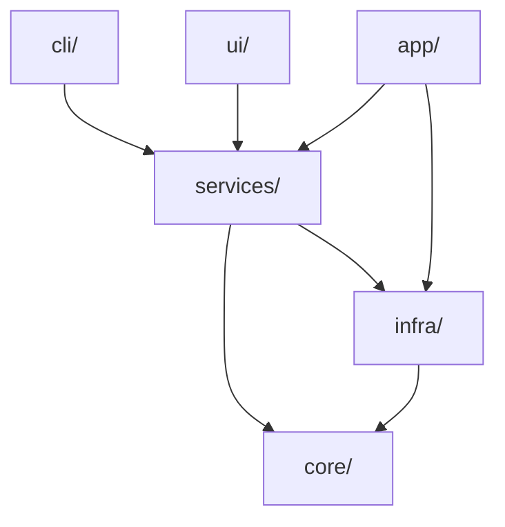

# Module Map

## Overview

This page provides a **comprehensive map of every module** in the Hei-DataHub codebase, explaining:

- **Purpose:** What does this module do?
- **Ownership:** Who maintains it?
- **Key exports:** Main classes/functions
- **Dependencies:** What does it depend on?
- **Extension points:** Can you swap/extend it?

---

## Directory Structure

```
Hei-DataHub/
├── src/hei_datahub/          # Main application package
│   ├── app/                   # Application runtime & settings
│   ├── cli/                   # Command-line interface
│   ├── core/                  # Domain logic (pure, no I/O)
│   ├── infra/                 # Infrastructure (I/O adapters)
│   ├── services/              # Business logic orchestration
│   ├── ui/                    # Terminal user interface (Textual)
│   └── utils/                 # Shared utilities
├── tests/                     # Test suite
├── scripts/                   # Development and ops scripts
├── data/                      # Dataset metadata (YAML files)
├── docs/                      # User documentation
├── dev-docs/                  # Developer documentation (this site)
└── bench/                     # Performance benchmarks
```

---

## Core Package: `src/hei_datahub/`

### `__init__.py`

**Purpose:** Package initialization, version exports

**Exports:**
- `__version__`: Version string (e.g., "0.59.0-beta")
- `__app_name__`: Application name ("Hei-DataHub")
- `UPDATE_CHECK_URL`: URL for checking updates (optional)

**Dependencies:** `version.py`

**Extension Point:** ❌ Not extensible

---

### `version.py` | `_version.py`

**Purpose:** Version management, single source of truth

**Location:** `src/hei_datahub/version.py`

**Exports:**
- `__version__`: Version string from `version.yaml`
- `get_version_info()`: Detailed version metadata

**Dependencies:** Reads `version.yaml` at package root

**Extension Point:** ❌ Not extensible

---

## Application Layer: `app/`

### `app/runtime.py`

**Purpose:** Application bootstrap, dependency injection, lifecycle management

**Responsibilities:**
- Initialize logging
- Wire up dependencies (DB, config, services)
- Handle graceful shutdown
- Set up exception handlers

**Key Functions:**
- `init_app()`: Bootstrap the application
- `setup_logging()`: Configure logging
- `get_db()`: Singleton DB connection
- `shutdown()`: Cleanup on exit

**Dependencies:**
- `infra.db`
- `app.settings`
- `logging` (stdlib)

**Extension Point:** ⚠️ Limited (DI container is internal)

---

### `app/settings.py`

**Purpose:** Load and persist user configuration (non-secrets)

**Responsibilities:**
- Load settings from YAML
- Validate configuration schema
- Persist changes to disk
- Provide defaults

**Key Classes:**
- `Settings`: Pydantic model for configuration
- `SettingsManager`: Load/save operations

**Key Functions:**
- `load_settings()`: Read from `~/.config/hei-datahub/settings.yaml`
- `save_settings()`: Write to disk
- `get_default_settings()`: Fallback values

**Dependencies:**
- `infra.config_paths`
- `pydantic`
- `pyyaml`

**Extension Point:** ✅ Can add custom settings via Pydantic model extension

---

## CLI Layer: `cli/`

### `cli/main.py`

**Purpose:** Command-line entry point, argument parsing

**Responsibilities:**
- Parse command-line arguments
- Dispatch to subcommands (`reindex`, `--version`, etc.)
- Launch TUI or run batch operations

**Key Functions:**
- `main()`: Entry point (registered in `pyproject.toml`)
- `handle_reindex()`: Rebuild search index
- `handle_version()`: Display version info
- `launch_tui()`: Start Textual UI

**Dependencies:**
- `argparse` (stdlib)
- `services.*`
- `ui.views.*`

**Extension Point:** ✅ Can add subcommands by extending argument parser

---

## Domain Layer: `core/`

### `core/models.py`

**Purpose:** Domain models (Pydantic schemas)

**Key Classes:**
- `Dataset`: Core dataset model
  - `name: str` — Unique identifier
  - `title: str` — Human-readable title
  - `description: str` — Long description
  - `tags: List[str]` — Searchable tags
  - `metadata: Dict[str, Any]` — Flexible metadata
- `Metadata`: YAML metadata schema
- `SearchResult`: Search result with relevance score
- `PRInfo`: Pull request information

**Validators:**
- `validate_name()`: Ensure name is lowercase alphanumeric
- `validate_url()`: Ensure URLs are valid
- `validate_date()`: Ensure dates are ISO 8601

**Dependencies:**
- `pydantic`
- `datetime` (stdlib)

**Extension Point:** ✅ Can extend models with custom fields (Pydantic inheritance)

---

### `core/rules.py`

**Purpose:** Business rules and validation logic

**Key Functions:**
- `is_name_unique()`: Check dataset name uniqueness
- `validate_metadata_schema()`: Validate against JSON schema
- `check_dataset_conflicts()`: Detect duplicate datasets
- `apply_default_tags()`: Apply default tags based on rules

**Dependencies:**
- `core.models`
- `jsonschema`

**Extension Point:** ✅ Can add custom validation rules

---

### `core/errors.py`

**Purpose:** Domain exceptions

**Key Exceptions:**
- `DatasetError`: Base exception
- `ValidationError`: Invalid input data
- `DuplicateDatasetError`: Dataset name already exists
- `SearchError`: Query syntax error
- `ConfigError`: Configuration invalid

**Extension Point:** ✅ Can define custom exceptions

---

### `core/queries.py`

**Purpose:** Query DSL parsing and validation

**Responsibilities:**
- Parse search query syntax
- Validate query structure
- Transform to FTS5 SQL

**Key Functions:**
- `parse_query(query: str) -> ParsedQuery`: Parse query string
- `to_fts_query(parsed: ParsedQuery) -> str`: Convert to FTS5 syntax
- `validate_query_syntax()`: Check for errors

**Dependencies:**
- `core.models`
- `core.errors`

**Extension Point:** ✅ Can extend query syntax

---

## Infrastructure Layer: `infra/`

### `infra/db.py`

**Purpose:** SQLite database connection management

**Responsibilities:**
- Lazy connection initialization (singleton)
- Execute schema migrations
- Provide connection object
- Handle connection pooling

**Key Functions:**
- `get_connection()`: Singleton DB connection
- `init_db()`: Create tables if not exist
- `execute_schema()`: Run SQL from `sql/schema.sql`
- `close_connection()`: Cleanup

**Dependencies:**
- `sqlite3` (stdlib)
- `infra/sql/schema.sql`

**Extension Point:** ⚠️ Limited (hardcoded SQLite)

---

### `infra/index.py`

**Purpose:** FTS5 full-text search operations

**Responsibilities:**
- Create FTS5 virtual table
- Index datasets for search
- Execute FTS5 queries
- Rank and sort results

**Key Functions:**
- `create_index()`: Initialize FTS5 table
- `upsert_dataset()`: Index or update a dataset
- `search(query: str)`: Execute search query
- `delete_dataset(name: str)`: Remove from index
- `optimize()`: Rebuild FTS5 index (PRAGMA optimize)

**Dependencies:**
- `infra.db`
- `core.models`

**Extension Point:** ✅ Can swap for different search backend (Elasticsearch, MeiliSearch)

---

### `infra/store.py`

**Purpose:** YAML file I/O for dataset metadata

**Responsibilities:**
- Load datasets from YAML files
- Save datasets to YAML files
- List all datasets in `data/` directory
- Validate YAML structure

**Key Functions:**
- `load_dataset(path: Path) -> Dataset`: Parse YAML to model
- `save_dataset(dataset: Dataset, path: Path)`: Serialize model to YAML
- `list_datasets() -> List[Path]`: Find all `metadata.yaml` files
- `validate_yaml(path: Path)`: Check YAML syntax

**Dependencies:**
- `pyyaml`
- `core.models`
- `pathlib` (stdlib)

**Extension Point:** ✅ Can swap for JSON, TOML, or remote storage

---

### `infra/paths.py`

**Purpose:** Path management (data directory, config directory, etc.)

**Responsibilities:**
- Resolve data directory path
- Handle relative vs. absolute paths
- Provide path constants

**Key Functions:**
- `get_data_dir() -> Path`: Returns `data/` directory
- `get_config_dir() -> Path`: Returns user config directory
- `resolve_dataset_path(name: str) -> Path`: Get path to dataset's metadata.yaml

**Dependencies:**
- `pathlib` (stdlib)

**Extension Point:** ✅ Can configure via environment variables

---

### `infra/config_paths.py`

**Purpose:** Config file path resolution with XDG Base Directory support

**Responsibilities:**
- Follow XDG Base Directory Specification
- Provide platform-specific config paths
- Handle fallbacks

**Key Functions:**
- `get_config_path() -> Path`: User config file
- `get_data_path() -> Path`: User data directory
- `get_cache_path() -> Path`: User cache directory

**Dependencies:**
- `os` (stdlib)
- `pathlib` (stdlib)

**Extension Point:** ✅ Respects `XDG_CONFIG_HOME` environment variable

---

### `infra/git.py`

**Purpose:** Git operations (commit, push, branch, stash)

**Responsibilities:**
- Execute git commands via subprocess
- Auto-stash before dangerous operations
- Create branches and commits
- Push to remote

**Key Functions:**
- `commit(message: str)`: Stage all changes and commit
- `push(remote: str, branch: str)`: Push to remote
- `stash()`: Stash uncommitted changes
- `stash_pop()`: Restore stashed changes
- `create_branch(name: str)`: Create and checkout branch
- `get_current_branch() -> str`: Get active branch name

**Dependencies:**
- `subprocess` (stdlib)
- `pathlib` (stdlib)

**Extension Point:** ⚠️ Limited (hardcoded git commands)

**Note:** Git integration removed in v0.59.0-beta. Use WebDAV sync instead.

---

## Services Layer: `services/`

### `services/search.py`

**Purpose:** Search query policy and execution

**Responsibilities:**
- Parse user queries
- Execute FTS5 search via `infra.index`
- Apply filters (tags, date range, etc.)
- Rank and sort results

**Key Functions:**
- `search_datasets(query: str, filters: Dict) -> List[Dataset]`
- `suggest_completions(partial: str) -> List[str]`

**Dependencies:**
- `core.models`, `core.queries`
- `infra.index`

**Extension Point:** ✅ Can customize ranking algorithm

---

### `services/catalog.py`

**Purpose:** Add, update, delete datasets

**Responsibilities:**
- Validate new datasets
- Save to YAML and index
- Handle conflicts
- Enforce uniqueness

**Key Functions:**
- `add_dataset(dataset: Dataset) -> Result`
- `update_dataset(name: str, updates: Dict) -> Result`
- `delete_dataset(name: str) -> Result`

**Dependencies:**
- `core.models`, `core.rules`
- `infra.store`, `infra.index`

**Extension Point:** ✅ Can add custom validation rules

---

### `services/sync.py`

**Purpose:** Sync datasets with cloud storage via WebDAV

**Responsibilities:**
- Download datasets from WebDAV
- Upload local changes to cloud
- Reindex all YAML files
- Handle merge conflicts

**Key Functions:**
- `sync() -> Result`
- `reindex() -> Result`

**Dependencies:**
- `infra.git`, `infra.store`, `infra.index`

**Extension Point:** ❌ Not extensible (core workflow)

---

### `services/autocomplete.py`

**Purpose:** Provide autocomplete suggestions

**Responsibilities:**
- Suggest dataset names
- Suggest tags
- Suggest field values

**Key Functions:**
- `suggest_names(prefix: str) -> List[str]`
- `suggest_tags(prefix: str) -> List[str]`

**Dependencies:**
- `infra.index`

**Extension Point:** ✅ Can add custom suggestion sources

---

### `services/outbox.py`

**Purpose:** Queue failed PR operations for retry

**Responsibilities:**
- Save failed PR attempts to disk
- Retry queue on demand
- Persist queue across sessions

**Key Functions:**
- `enqueue_pr(dataset: Dataset, message: str)`
- `retry_all() -> List[Result]`
- `list_pending() -> List[Dict]`

**Dependencies:**
- `services.publish`
- `json` (stdlib)

**Extension Point:** ✅ Can customize retry logic

---

### `services/update_check.py`

**Purpose:** Check for new app versions

**Responsibilities:**
- Query for latest release
- Compare with current version
- Notify user if update available

**Key Functions:**
- `check_for_updates() -> Optional[str]`

**Dependencies:**
- `requests`
- `version.py`

**Extension Point:** ❌ Not extensible

```

---

## UI Layer: `ui/`

### `ui/theme.py`

**Purpose:** Styling and theming for Textual UI

**Exports:**
- Color schemes
- CSS classes
- Theme loader

**Extension Point:** ✅ Can add custom themes

---

### `ui/views/`

**Purpose:** Full-screen views (screens)

**Key Views:**
- `home.py`: Main search and browse view
- `details.py`: Dataset detail view
- `settings.py`: Settings editor
- `outbox.py`: Failed PR queue view

**Extension Point:** ✅ Can add new views

---

### `ui/widgets/`

**Purpose:** Reusable UI components

**Key Widgets:**
- Search bar
- Result list
- Data table
- Modal dialogs

**Extension Point:** ✅ Can create custom widgets

---

## Tests: `tests/`

See [Testing Strategy](../qa/testing-strategy.md) for details.

---

## Scripts: `scripts/`

See [Codebase Tour: Scripts](../codebase/scripts.md) for details.

---

## Dependency Graph



---


## Next Steps

- Explore [API Reference](../api-reference/overview.md) for function-level details
- See [Codebase Overview](../codebase/overview.md) for file-by-file breakdown
- Check [Data Flow](../architecture/data-flow.md) to understand interactions
