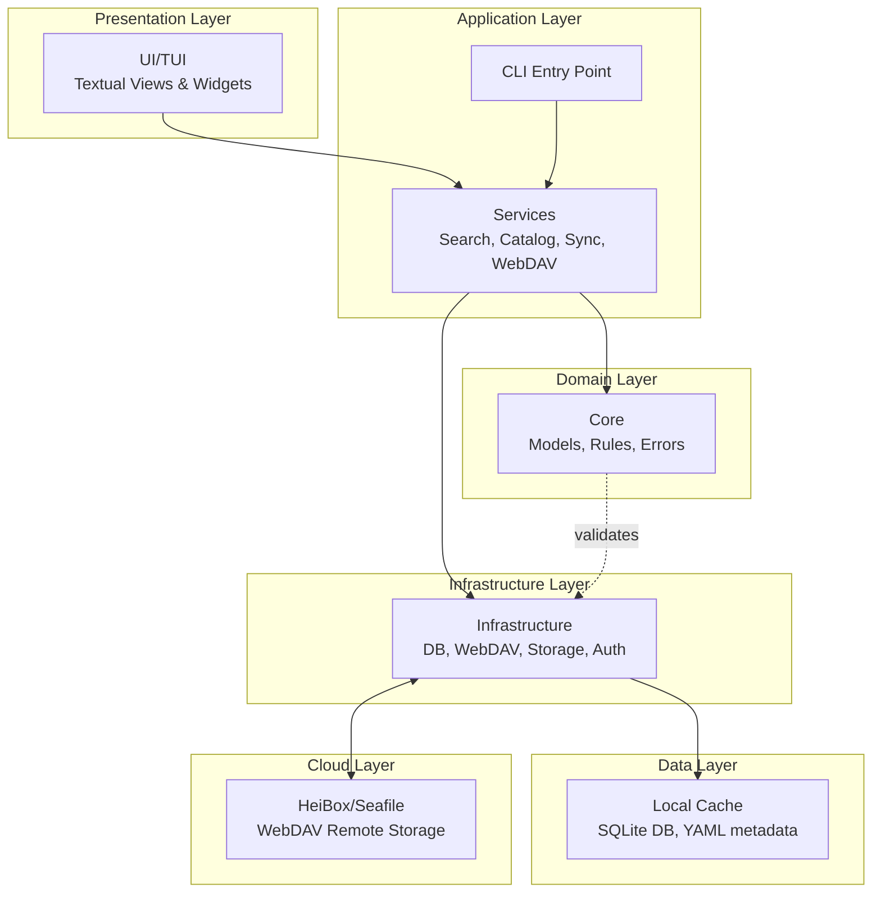
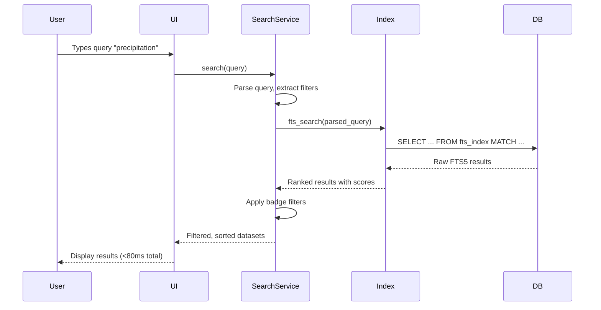
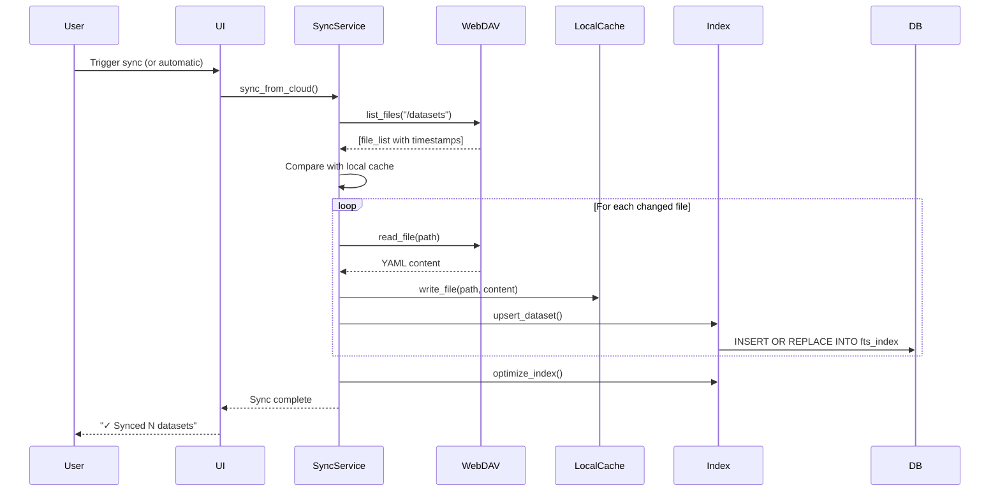
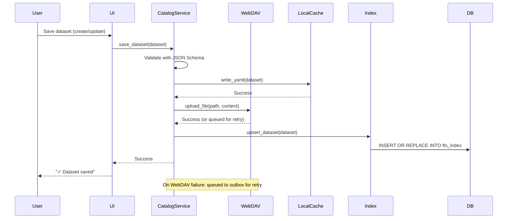
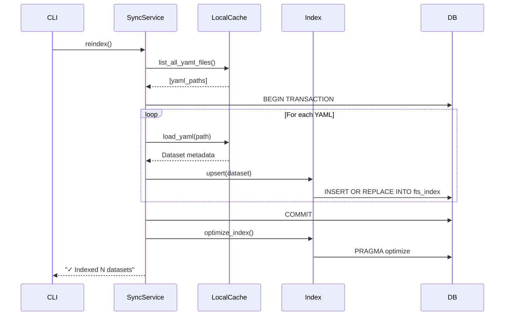
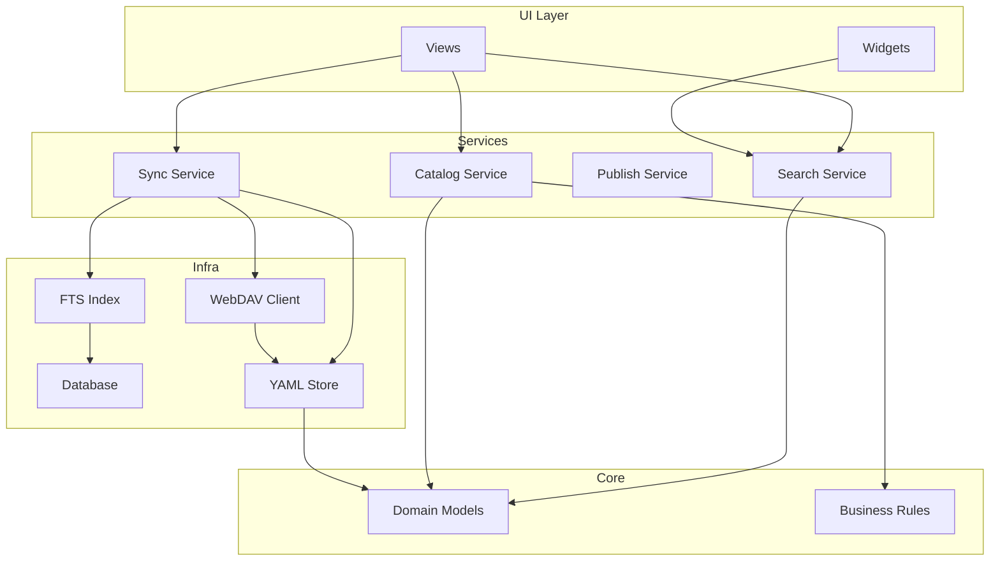

# System Architecture Overview

## Big Picture

Hei-DataHub is a **cloud-first TUI application** for managing dataset metadata with these core capabilities:

- **Search:** Lightning-fast full-text search using SQLite FTS5 (<80ms typical)
- **Cloud Storage:** Seamless WebDAV integration with HeiBox/Seafile
- **Authentication:** Secure credential management via Linux keyring
- **Catalog:** Add/edit/delete dataset metadata with JSON Schema validation
- **Sync:** Background synchronization between local cache and cloud storage
- **Team Collaboration:** Instant dataset sharing via cloud, no GitHub required

---

## Architectural Layers



---

## Core Design Principles

### 1. **Cloud-First with Local Performance**

- Primary storage on HeiBox/Seafile via WebDAV
- Local SQLite cache for instant search (<80ms)
- Background sync keeps cache fresh
- Works offline with cached data (search continues, sync paused)
- Automatic conflict detection and resolution

### 2. **Clean Architecture / Hexagonal Ports & Adapters**

```
┌─────────────────────────────────────┐
│         UI / CLI (Adapters)         │
├─────────────────────────────────────┤
│        Services (Use Cases)         │
├─────────────────────────────────────┤
│    Core (Domain Logic - Pure)       │
├─────────────────────────────────────┤
│   Infrastructure (I/O Adapters)     │
├─────────────────────────────────────┤
│   WebDAV / Keyring / Filesystem     │
└─────────────────────────────────────┘
```

**Key Rules:**

- **Core** has zero I/O dependencies (pure Python, Pydantic models)
- **Services** orchestrate use cases, coordinate infrastructure + core
- **Infrastructure** handles all I/O (DB, WebDAV, filesystem, keyring)
- **UI/CLI** are thin adapters, minimal logic
- **Storage backends** are swappable (WebDAV, filesystem, future: S3, etc.)

### 3. **Dependency Inversion**

- Core and Services define **interfaces** (abstract protocols)
- Infrastructure **implements** those interfaces
- Services depend on abstractions, not concrete implementations
- Enables testing with mocks and easy component swapping
- Example: `StorageBackend` protocol implemented by `WebDAVStorage` and `FilesystemStorage`

### 4. **Security by Design**

- Credentials stored in OS keyring (Linux: Secret Service, Windows: Credential Manager, macOS: Keychain)
- Never log or display sensitive data
- TOML config files contain only non-sensitive metadata (URL, username, storage method)
- No credentials in environment variables (except for advanced use cases)
- All WebDAV communication over HTTPS

---

## Module Breakdown

### **`app/`** - Application Runtime

**Purpose:** Bootstrap the application, manage lifecycle, dependency injection.

**Key Files:**

- `runtime.py`: Application startup, logging setup, workspace initialization
- `settings.py`: Load/save user configuration (non-secrets)

**Responsibilities:**

- Initialize logging with proper levels
- Ensure workspace directories exist (`~/.config`, `~/.cache`, `~/.local/share`)
- Handle graceful shutdown and cleanup

---

### **`auth/`** - Authentication Management

**Purpose:** WebDAV authentication, credential storage, and validation.

**Key Files:**

- `setup.py`: Interactive setup wizard for WebDAV configuration
- `credentials.py`: Keyring integration for secure credential storage/retrieval
- `validator.py`: WebDAV connection validation and permission checks
- `doctor.py`: Diagnostic tool for troubleshooting auth issues
- `clear.py`: Remove stored credentials and reset authentication

**Responsibilities:**

- Guide users through WebDAV setup with interactive prompts
- Store credentials securely in Linux keyring (Secret Service)
- Validate WebDAV connectivity and permissions
- Diagnose connection failures with detailed error reporting
- Clean up authentication state when needed

**See also:** [Authentication & Sync](auth-and-sync.md) for detailed documentation.

---

### **`cli/`** - Command-Line Interface

**Purpose:** Entry point for the application with comprehensive subcommands.

**Key Files:**

- `main.py`: Argument parsing, subcommands, CLI routing
- `doctor.py`: System diagnostics and health checks
- `linux_update.py`: Linux-specific update logic
- `windows_update.py`: Windows-specific update logic
- `macos_update.py`: macOS-specific update logic

**Available Commands:**

| Command | Purpose |
|---------|---------|
| `hei-datahub` | Launch TUI (default) |
| `hei-datahub auth setup` | Configure WebDAV authentication |
| `hei-datahub auth status` | Display current auth configuration |
| `hei-datahub auth doctor` | Run WebDAV diagnostics |
| `hei-datahub auth clear` | Remove credentials and search index |
| `hei-datahub reindex` | Rebuild search index from datasets |
| `hei-datahub doctor` | Run system health checks |
| `hei-datahub update` | Check and install updates |
| `hei-datahub desktop install` | Install desktop integration |
| `hei-datahub keymap export/import` | Manage keybinding profiles |

**Flow:**

```
User runs `hei-datahub [command]`
  ↓
CLI parses arguments
  ↓
Initialize workspace (create dirs, copy assets)
  ↓
Route to appropriate handler function
  ↓
Handler invokes Services or launches TUI
```

**See also:** [CLI Commands Reference](../api-reference/cli-commands.md) for complete documentation.

---

### **`core/`** - Domain Logic (Pure)

**Purpose:** Business rules, domain models, validation logic. **No I/O.**

**Key Files:**

- `models.py`: Pydantic models (`Dataset`, `Metadata`, etc.)
- `rules.py`: Business rules (e.g., "title must be unique")
- `errors.py`: Domain exceptions (`ValidationError`, `DuplicateDatasetError`)
- `queries.py`: Query DSL parsing and validation

**Design:**

- **Pure functions** and **immutable models**
- All logic testable without I/O mocks
- Pydantic for schema validation and serialization

**Example:**

```python
# core/models.py
class Dataset(BaseModel):
    name: str
    title: str
    description: str
    tags: List[str] = []

    @validator('name')
    def validate_name(cls, v):
        if not re.match(r'^[a-z0-9-]+$', v):
            raise ValueError('Name must be lowercase alphanumeric')
        return v
```

---

### **`infra/`** - Infrastructure (I/O)

**Purpose:** Handle all interactions with external systems (filesystem, DB, WebDAV, keyring).

**Key Files:**

| File | Purpose |
|------|---------|
| `paths.py` | Path management (data dir, config dir, cache dir) |
| `config_paths.py` | Config file path resolution with XDG Base Directory support |
| `platform_paths.py` | Cross-platform path handling (Linux/Windows/macOS) |
| `db.py` | SQLite connection management (singleton pattern) |
| `index.py` | FTS5 full-text search operations and index management |
| `store.py` | YAML/JSON file I/O (load/save metadata) |

**Design:**

- All functions return `Result[T, Error]` or raise custom exceptions
- Singleton pattern for DB connection (thread-safe)
- Retry logic for network calls with exponential backoff
- Path operations use `pathlib.Path` for cross-platform compatibility
- XDG Base Directory Specification support on Linux

---

### **`services/`** - Business Logic Orchestration

**Purpose:** Coordinate core + infrastructure to implement use cases.

**Key Files:**

| Service | Responsibility |
|---------|----------------|
| `search.py` | Query parsing, FTS5 search execution, result ranking |
| `fast_search.py` | Optimized search with caching and performance tuning |
| `autocomplete.py` | Tag/field suggestions with ranking algorithm |
| `suggestion_service.py` | Context-aware autocomplete for search queries |
| `catalog.py` | Add/update/delete datasets with validation |
| `sync.py` | Background synchronization between local and cloud |
| `webdav_storage.py` | WebDAV storage backend implementation |
| `filesystem_storage.py` | Local filesystem storage backend |
| `storage_backend.py` | Abstract storage interface (Protocol) |
| `storage_manager.py` | Manages multiple storage backends |
| `indexer.py` | Background indexing service for FTS5 |
| `index_service.py` | Index management and optimization |
| `outbox.py` | Queue for failed operations (retry mechanism) |
| `update_check.py` | Check for new app versions |
| `actions.py` | Orchestrate complex user workflows |
| `config.py` | Configuration management and TOML parsing |
| `state.py` | Application state management |
| `storage.py` | Atomic file writes, backup/restore operations |
| `performance.py` | Performance monitoring and profiling |

**Design:**

- **Stateless** where possible (functional style)
- **Transactional:** Operations rollback on failure
- **Idempotent:** Safe to retry operations without side effects
- Error handling with custom exceptions and Result types
- Background tasks use async/await where appropriate

**Storage Backend Pattern:**

```python
class StorageBackend(Protocol):
    """Abstract interface for storage backends."""
    def list_files(self, path: str) -> List[FileEntry]: ...
    def read_file(self, path: str) -> bytes: ...
    def write_file(self, path: str, content: bytes) -> None: ...
    def delete_file(self, path: str) -> None: ...
```

Implementations:
- `WebDAVStorage`: HeiBox/Seafile via WebDAV protocol
- `FilesystemStorage`: Local filesystem (fallback/development)

**See also:** [Module Walkthrough](../codebase/module-walkthrough.md) for function-level details.

---

### **`ui/`** - Terminal User Interface

**Purpose:** Textual-based TUI for interactive use.

**Key Components:**

```
ui/
├── views/          # Full-screen views
│   ├── home.py     # Main search/browse view
│   ├── details.py  # Dataset detail view
│   ├── settings.py # Settings editor
│   └── outbox.py   # Failed PR queue
├── widgets/        # Reusable components
│   ├── search_bar.py
│   ├── result_list.py
│   └── ...
└── theme.py        # Styling and colors
```

**Design:**

- Built on [Textual](https://textual.textualize.io/) framework
- **Reactive state management** (Textual reactives)
- **Keybinding system** with conflict detection
- **Debounced search** to avoid DB hammering

**Data Flow in UI:**

```
User Input (keypress)
  ↓
View handles event
  ↓
View calls Service method
  ↓
Service updates state
  ↓
Reactive triggers re-render
  ↓
Widget updates display
```

---

## Data Flow

### **Search Flow**



### **Cloud Sync Flow**



### **Save Dataset Flow**



### **Reindex Flow**



---

## Component Interactions

### High-Level Component Diagram



---

## Technology Stack

| Layer | Technologies |
|-------|-------------|
| **UI** | Textual (TUI framework), Rich (terminal rendering) |
| **Language** | Python 3.10+ |
| **Cloud Storage** | WebDAV (HeiBox/Seafile) |
| **Local Storage** | SQLite (FTS5 extension), YAML files (cache) |
| **Authentication** | Linux keyring (Secret Service), Windows Credential Manager, macOS Keychain |
| **Validation** | Pydantic v2, JSON Schema |
| **Config** | TOML files, XDG Base Directory Specification |
| **HTTP Client** | `requests` library with retry logic |
| **Package Management** | uv (fast, reproducible installs) |
| **Testing** | pytest, pytest-cov, pytest-asyncio |
| **Linting/Formatting** | ruff, mypy (type checking) |
| **Docs** | MkDocs + Material theme |
| **Version Control** | Git (optional, for development) |

---

## State Management

### Application State

- **User settings:** Stored in `~/.config/hei-datahub/settings.yaml`
- **Search index:** SQLite DB at `db.sqlite` (gitignored)
- **Dataset metadata:** YAML files in `data/*/metadata.yaml` (version controlled)
- **Outbox (failed PRs):** `~/.local/share/hei-datahub/outbox.json`

### Runtime State

- **DB connection:** Singleton, lazily initialized
- **Config:** Loaded once at startup, cached
- **UI state:** Managed by Textual reactives (mutable, scoped to session)

---

## Concurrency Model

**Single-threaded with async I/O:**

- Textual handles async event loop
- Long-running operations (git, network) run in background workers
- No threading (Python GIL constraints)
- No multiprocessing (simple, predictable state)

**Implications:**

- ✅ Simple reasoning about state
- ✅ No race conditions
- ⚠️ Blocking operations must be avoided (use async or background tasks)

---

## Persistence Strategy

### What Gets Persisted Where

| Data Type | Primary Location | Format | Cloud Backup | Purpose |
|-----------|------------------|--------|--------------|---------|
| Dataset metadata | HeiBox (WebDAV) | YAML | ✅ Primary | Source of truth, team-shared |
| Search index | `~/.local/share/Hei-DataHub/db.sqlite` | SQLite FTS5 | ❌ No | Fast search, derived data |
| Local cache | `~/.cache/hei-datahub/datasets/` | YAML | ✅ Synced | Offline access |
| User settings | `~/.config/hei-datahub/config.toml` | TOML | ❌ No | User-specific preferences |
| Auth config | `~/.config/hei-datahub/config.toml` | TOML | ❌ No | WebDAV URL, username, method |
| Auth credentials | OS keyring | Encrypted | ❌ No | WebDAV password/token |
| Failed operations | `~/.cache/hei-datahub/outbox.json` | JSON | ❌ No | Retry queue |

### Why This Architecture?

- **Cloud Primary:** HeiBox is the authoritative source, enables team collaboration
- **Local Cache:** Instant search without network latency, offline mode support
- **SQLite FTS5:** Optimized for full-text search, rebuilt from cache as needed
- **Config Local:** User-specific settings don't sync (keybindings, theme, etc.)
- **Secrets in Keyring:** Secure, encrypted, OS-managed (never in files or code)
- **Outbox Pattern:** Failed WebDAV operations queued for automatic retry

### Cache Invalidation Strategy

- **Sync on startup:** Check for cloud changes
- **Background sync:** Every N minutes (configurable)
- **Manual sync:** User-triggered via UI or `hei-datahub sync`
- **Change detection:** Compare timestamps/ETags to avoid redundant downloads
- **Conflict resolution:** Last-write-wins (cloud timestamp preferred)

---

## Extension Points (Preview)

**Official extension points for plugins/integrations:**

1. **Storage backends:** Swap WebDAV for S3, Azure Blob, or other cloud storage
2. **Search backends:** Replace FTS5 with Elasticsearch, MeiliSearch, or Typesense
3. **Authentication:** Support OAuth, SAML, or custom auth providers
4. **UI themes:** Custom color schemes and visual layouts
5. **Validators:** Add custom metadata validation rules beyond JSON Schema
6. **Export formats:** Support JSON, CSV, or custom dataset formats

See [Module Walkthrough](../codebase/module-walkthrough.md) for implementation details.

---

## Performance Characteristics

| Operation | Typical Performance | Target SLA | Notes |
|-----------|---------------------|------------|-------|
| **Startup** | <300ms | <500ms | Includes DB connection, config load |
| **Search (FTS5)** | <80ms | <100ms | For 1000s of datasets, indexed |
| **Autocomplete** | <50ms | <100ms | Cached suggestions, ranked |
| **Load YAML** | ~1ms per file | <5ms | From local cache |
| **Reindex** | ~100ms per 100 datasets | Variable | Batched inserts, optimized |
| **WebDAV Sync** | ~200ms + network | Variable | Depends on connection, file count |
| **UI render** | 60 FPS | 60 FPS | Textual async rendering |

**Performance Optimizations:**

- FTS5 indexes rebuilt incrementally (only changed datasets)
- WebDAV requests batched where possible (PROPFIND for listings)
- Search queries debounced (300ms) to avoid DB hammering
- Results cached for repeated identical queries
- Background sync uses exponential backoff on failures

See [Performance](performance.md) for detailed benchmarks and optimization strategies.

---

## Security Boundaries

- **Credentials:** Never stored in code, config files, or logs → Linux keyring only
- **HTTPS Required:** WebDAV connections must use HTTPS (enforced)
- **Data Privacy:** All metadata stays local or in user's cloud storage (no telemetry)
- **Input Validation:** All user inputs validated via Pydantic before persistence
- **SQL Injection:** Parameterized queries only, no string concatenation
- **Path Traversal:** All file paths validated and sanitized
- **Secrets in Memory:** Credentials loaded only when needed, never logged

**Threat Model:**

- ✅ Protects against: Credential theft, SQL injection, XSS in metadata
- ⚠️ Trusts: OS keyring security, WebDAV server TLS certificates
- ❌ Does not protect: Against malicious cloud storage provider, compromised OS

See [Security & Privacy](security-privacy.md) for complete security documentation.

---

## Deployment Model

**Local installation only:**

- No server to deploy or manage
- No database server required (SQLite embedded)
- No containers or orchestration needed
- Cloud storage configured per-user (HeiBox account required)

**Installation methods:**

```bash
# Method 1: Direct UV install (recommended)
uv tool install "git+ssh://git@github.com/0xpix/Hei-DataHub.git@main"

# Method 2: Clone and install
git clone https://github.com/0xpix/Hei-DataHub.git
cd Hei-DataHub
uv sync
source .venv/bin/activate
hei-datahub

# Method 3: System package (future)
# apt install hei-datahub  # Planned for v1.0
```

**Configuration:**

```bash
# First run: setup WebDAV auth
hei-datahub auth setup

# Check configuration
hei-datahub auth status

# Run diagnostics
hei-datahub auth doctor
```

---

## Next Steps

- **Authentication setup:** [Authentication & Sync](auth-and-sync.md)
- **Search internals:** [Search & Autocomplete](search-and-autocomplete.md)
- **Security details:** [Security & Privacy](security-privacy.md)
- **Module deep dive:** [Module Walkthrough](../codebase/module-walkthrough.md)
- **CLI commands:** [CLI Reference](../api-reference/cli-commands.md)
- **Codebase tour:** [Codebase Overview](../codebase/overview.md)

---

**Related:**

- [Contributing Workflow](../contributing/workflow.md)
- [Module Map](module-map.md)
- [Performance Tuning](performance.md)
