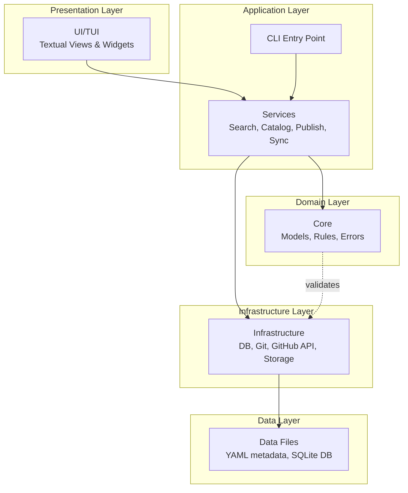
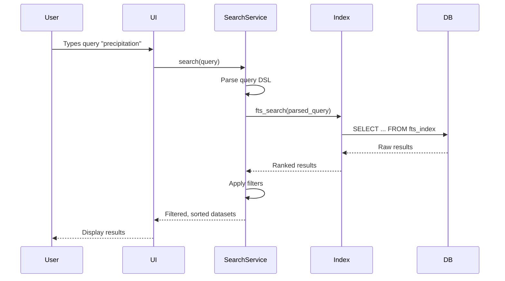
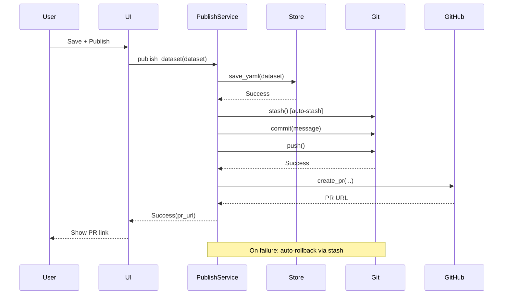
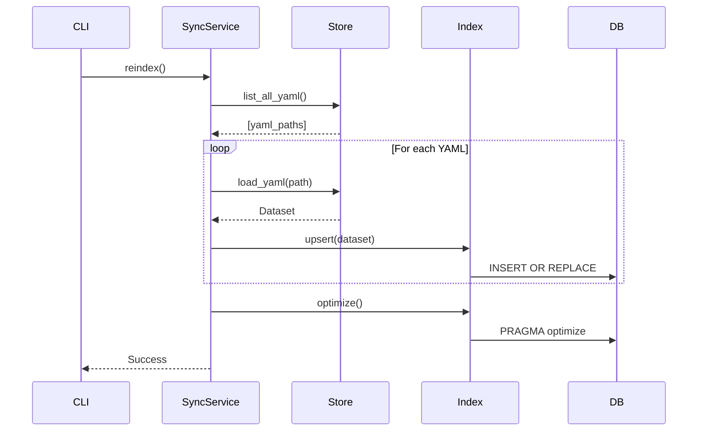
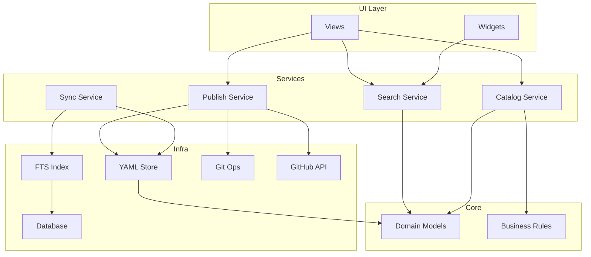

# System Architecture Overview

## Big Picture

Hei-DataHub is a **local-first TUI application** for managing dataset metadata with these core capabilities:

- **Search:** Fast full-text search over datasets using SQLite FTS5
- **Catalog:** Add/edit dataset metadata with validation
- **Publish:** Create GitHub PRs with automated git operations
- **Sync:** Pull changes and reindex from YAML files

---

## Architectural Layers



---

## Core Design Principles

### 1. **Local-First Architecture**

- All data stored locally (YAML + SQLite)
- No server required for core functionality
- Network only for GitHub PR operations
- Works offline (except PR publishing)

### 2. **Clean Architecture / Hexagonal Ports & Adapters**

```
┌─────────────────────────────────────┐
│         UI / CLI (Adapters)         │
├─────────────────────────────────────┤
│        Services (Use Cases)         │
├─────────────────────────────────────┤
│    Core (Domain Logic - Pure)       │
├─────────────────────────────────────┤
│   Infrastructure (I/O Adapters)     │
└─────────────────────────────────────┘
```

**Key Rules:**

- **Core** has zero I/O dependencies (pure Python, Pydantic models)
- **Services** orchestrate use cases, coordinate infra + core
- **Infrastructure** handles all I/O (files, DB, git, network)
- **UI/CLI** are thin adapters, minimal logic

### 3. **Dependency Inversion**

- Core and Services define **interfaces** (abstract protocols)
- Infrastructure **implements** those interfaces
- Services depend on abstractions, not concrete implementations
- Enables testing with mocks and easy component swapping

---

## Module Breakdown

### **`app/`** - Application Runtime

**Purpose:** Bootstrap the application, manage lifecycle, dependency injection.

**Key Files:**

- `runtime.py`: Application startup, logging setup, DI container wiring
- `settings.py`: Load/save user configuration (non-secrets)

**Responsibilities:**

- Initialize logging
- Wire up dependencies (singleton pattern for DB, config, etc.)
- Handle graceful shutdown

---

### **`cli/`** - Command-Line Interface

**Purpose:** Entry point for the application.

**Key Files:**

- `main.py`: Argument parsing, subcommands (`reindex`, `--version`, etc.)

**Flow:**

```
User runs `hei-datahub` 
  ↓
CLI parses args
  ↓
CLI invokes Services or launches TUI
```

---

### **`core/`** - Domain Logic (Pure)

**Purpose:** Business rules, domain models, validation logic. **No I/O.**

**Key Files:**

- `models.py`: Pydantic models (`Dataset`, `Metadata`, etc.)
- `rules.py`: Business rules (e.g., "title must be unique")
- `errors.py`: Domain exceptions (`ValidationError`, `DuplicateDatasetError`)
- `queries.py`: Query DSL parsing and validation

**Design:**

- **Pure functions** and **immutable models**
- All logic testable without I/O mocks
- Pydantic for schema validation and serialization

**Example:**

```python
# core/models.py
class Dataset(BaseModel):
    name: str
    title: str
    description: str
    tags: List[str] = []
    
    @validator('name')
    def validate_name(cls, v):
        if not re.match(r'^[a-z0-9-]+$', v):
            raise ValueError('Name must be lowercase alphanumeric')
        return v
```

---

### **`infra/`** - Infrastructure (I/O)

**Purpose:** Handle all interactions with external systems (filesystem, DB, git, network).

**Key Files:**

| File | Purpose |
|------|---------|
| `paths.py` | Path management (data dir, config dir, etc.) |
| `config_paths.py` | Config file path resolution with XDG support |
| `db.py` | SQLite connection management (singleton) |
| `index.py` | FTS5 full-text search operations |
| `store.py` | YAML file I/O (load/save metadata) |
| `git.py` | Git operations (commit, branch, push, auto-stash) |
| `github_api.py` | GitHub API client (create PRs) |

**Design:**

- All functions return `Result[T, Error]` or raise exceptions
- Singleton pattern for DB connection
- Auto-stash in git operations prevents data loss
- Retry logic for network calls

---

### **`services/`** - Business Logic Orchestration

**Purpose:** Coordinate core + infrastructure to implement use cases.

**Key Files:**

| Service | Responsibility |
|---------|----------------|
| `search.py` | Query parsing, search execution, result ranking |
| `catalog.py` | Add/update/delete datasets, validation |
| `sync.py` | Pull from remote, reindex from YAML |
| `publish.py` | Save changes → commit → push → create PR |
| `autocomplete.py` | Provide tag/field suggestions |
| `outbox.py` | Queue failed PRs for retry |
| `update_check.py` | Check for new app versions |
| `actions.py` | Orchestrate complex workflows |
| `config.py` | Configuration management service |
| `state.py` | Application state management |
| `storage.py` | Atomic file writes, backup/restore |

**Design:**

- **Stateless** where possible
- **Transactional:** Rollback on failure
- **Idempotent:** Safe to retry operations
- Error handling with Result types or exceptions

**Example:**

```python
# services/publish.py
def publish_dataset(dataset: Dataset, message: str) -> Result[PR, Error]:
    """
    Save dataset → Commit → Push → Create PR
    Rolls back on failure (auto-stash)
    """
    try:
        store.save(dataset)              # Infra: YAML write
        git.commit(message)              # Infra: Git commit
        git.push()                       # Infra: Git push
        pr = github_api.create_pr(...)   # Infra: GitHub API
        return Ok(pr)
    except Exception as e:
        git.stash()                      # Rollback
        return Err(e)
```

---

### **`ui/`** - Terminal User Interface

**Purpose:** Textual-based TUI for interactive use.

**Key Components:**

```
ui/
├── views/          # Full-screen views
│   ├── home.py     # Main search/browse view
│   ├── details.py  # Dataset detail view
│   ├── settings.py # Settings editor
│   └── outbox.py   # Failed PR queue
├── widgets/        # Reusable components
│   ├── search_bar.py
│   ├── result_list.py
│   └── ...
└── theme.py        # Styling and colors
```

**Design:**

- Built on [Textual](https://textual.textualize.io/) framework
- **Reactive state management** (Textual reactives)
- **Keybinding system** with conflict detection
- **Debounced search** to avoid DB hammering

**Data Flow in UI:**

```
User Input (keypress)
  ↓
View handles event
  ↓
View calls Service method
  ↓
Service updates state
  ↓
Reactive triggers re-render
  ↓
Widget updates display
```

---

## Data Flow

### **Search Flow**



### **Publish Flow**



### **Reindex Flow**



---

## Component Interactions

### High-Level Component Diagram



---

## Technology Stack

| Layer | Technologies |
|-------|-------------|
| **UI** | Textual (TUI framework), Rich (terminal rendering) |
| **Language** | Python 3.9+ |
| **Data Storage** | SQLite (FTS5 extension), YAML files |
| **Version Control** | Git (via `subprocess`), GitHub API (via `requests`) |
| **Validation** | Pydantic v2 |
| **Config** | YAML files, XDG Base Directory Specification |
| **Secrets** | Keyring (OS-level credential storage) |
| **Package Management** | uv (fast, reproducible) |
| **Testing** | pytest, pytest-cov |
| **Linting/Formatting** | ruff, black, mypy |
| **Docs** | MkDocs + Material theme |
| **CI/CD** | GitHub Actions |

---

## State Management

### Application State

- **User settings:** Stored in `~/.config/hei-datahub/settings.yaml`
- **Search index:** SQLite DB at `db.sqlite` (gitignored)
- **Dataset metadata:** YAML files in `data/*/metadata.yaml` (version controlled)
- **Outbox (failed PRs):** `~/.local/share/hei-datahub/outbox.json`

### Runtime State

- **DB connection:** Singleton, lazily initialized
- **Config:** Loaded once at startup, cached
- **UI state:** Managed by Textual reactives (mutable, scoped to session)

---

## Concurrency Model

**Single-threaded with async I/O:**

- Textual handles async event loop
- Long-running operations (git, network) run in background workers
- No threading (Python GIL constraints)
- No multiprocessing (simple, predictable state)

**Implications:**

- ✅ Simple reasoning about state
- ✅ No race conditions
- ⚠️ Blocking operations must be avoided (use async or background tasks)

---

## Persistence Strategy

### What Gets Persisted Where

| Data Type | Location | Format | Version Controlled |
|-----------|----------|--------|-------------------|
| Dataset metadata | `data/*/metadata.yaml` | YAML | ✅ Yes (git) |
| Search index | `db.sqlite` | SQLite FTS5 | ❌ No (regenerated) |
| User settings | `~/.config/hei-datahub/` | YAML | ❌ No |
| Auth tokens | OS keyring | Encrypted | ❌ No |
| Failed PR queue | `~/.local/share/hei-datahub/outbox.json` | JSON | ❌ No |

### Why This Split?

- **Version control YAML:** Human-readable, reviewable, collaborative
- **SQLite for search:** Fast, queryable, derived data (can be rebuilt)
- **Config local:** User-specific, not shared
- **Secrets in keyring:** Secure, encrypted, OS-managed

---

## Extension Points (Preview)

**Official extension points for plugins/integrations:**

1. **Storage backends:** Swap YAML for JSON, TOML, or remote storage
2. **Search backends:** Replace FTS5 with Elasticsearch, MeiliSearch
3. **Git providers:** Support GitLab, Bitbucket instead of GitHub
4. **UI themes:** Custom color schemes and layouts
5. **Validators:** Add custom metadata validation rules

See [Extensibility](../extensibility/extension-points.md) for details.

---

## Performance Characteristics

| Operation | Typical Performance | Notes |
|-----------|---------------------|-------|
| **Search (FTS5)** | <10ms for 1000s of datasets | Indexed full-text |
| **Load YAML** | ~1ms per file | Cached in memory |
| **Reindex** | ~100ms per 100 datasets | Batched inserts |
| **Git commit** | ~50-200ms | Subprocess overhead |
| **GitHub PR** | ~500-1000ms | Network latency |
| **UI render** | 60 FPS | Textual async rendering |

See [Performance](../performance/overview.md) for optimization strategies.

---

## Security Boundaries

- **Secrets:** Never stored in code or config files → Keyring only
- **Data privacy:** All data local by default (no telemetry)
- **Supply chain:** Dependencies pinned in `uv.lock`
- **Git operations:** Auto-stash prevents data loss
- **Validation:** All inputs validated via Pydantic before persistence

See [Security](../security/secrets.md) for details.

---

## Deployment Model

**Local installation only:**

- No server to deploy
- No database to provision
- No containers to manage

**User runs:**

```bash
uv sync
source .venv/bin/activate
hei-datahub
```

---

## Next Steps

- **Detailed module tour:** [Module Map](module-map.md)
- **Trace data flow:** [Data Flow](data-flow.md)
- **Understand dependencies:** [Dependency Graph](dependencies.md)
- **API details:** [API Reference](../api-reference/overview.md)

---

**Related:**

- [Core Concepts](../core-concepts/what-is-core.md)
- [Codebase Tour](../codebase/navigation.md)
- [Data Layer](../data/storage.md)
