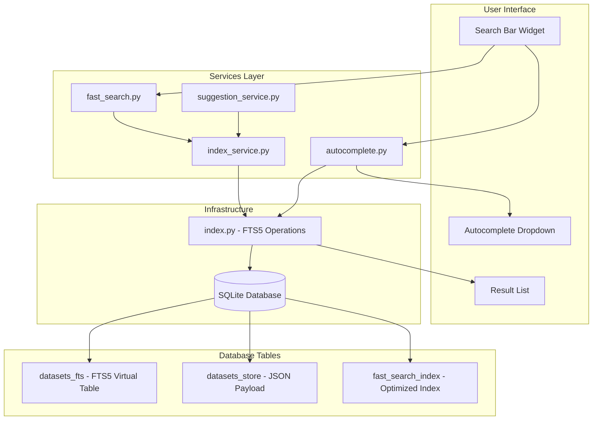
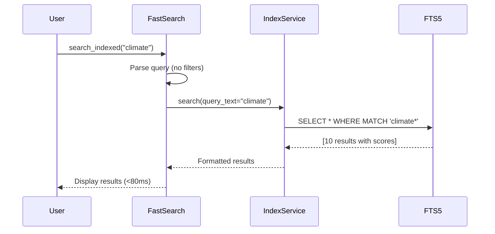
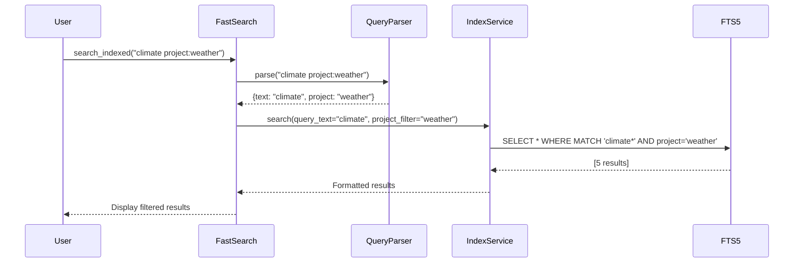

# Search & Autocomplete

> **Version:** 0.60.0-beta — "Clean-up"
> This documentation reflects the enhanced search filters and performance optimizations in v0.60.

!!! info "What this section covers"
    This page explains Hei-DataHub's lightning-fast search engine built on SQLite FTS5, including autocomplete, filter badges, and performance tuning. Essential for understanding how sub-100ms search is achieved.

## Overview

Hei-DataHub provides **lightning-fast search** with sub-100ms response times for thousands of datasets using **SQLite FTS5** (Full-Text Search). The search system includes smart autocomplete, filter badges, and context-aware suggestions to help users find datasets quickly.

**Key Features:**

- ⚡ **<80ms search latency** for typical queries
- 🔍 **Full-text search** across all metadata fields
- 🏷️ **Enhanced filter badges** - new in v0.60: `source:`, `format:`, `tags:`
- 💡 **Smart autocomplete** with ranking and fuzzy matching
- 🎯 **Context-aware suggestions** based on query history
- 📊 **Relevance scoring** with BM25 algorithm
- 🔄 **Incremental indexing** for instant updates
- 🎨 **Hash-based badge coloring** - consistent visual identity for filters (v0.60)

---

## Search Architecture

### Component Overview



---

## SQLite FTS5 Search Engine

### What is FTS5?

FTS5 (Full-Text Search version 5) is SQLite's built-in full-text search extension. It provides:

- **Fast prefix matching** (e.g., "clim" matches "climate")
- **BM25 ranking algorithm** for relevance scoring
- **Multiple column search** across all metadata fields
- **Boolean operators** (AND, OR, NOT)
- **Phrase matching** with quotes

### Database Schema

#### 1. **datasets_fts** (FTS5 Virtual Table)

```sql
CREATE VIRTUAL TABLE datasets_fts USING fts5(
    id,
    name,
    description,
    used_in_projects,
    data_types,
    source,
    file_format,
    tokenize='porter unicode61'
);
```

**Fields:**

| Column | Description | Example |
|--------|-------------|---------|
| `id` | Dataset identifier (path) | `"dataset-climate-2024"` |
| `name` | Dataset display name | `"Global Temperature Records"` |
| `description` | Full description text | `"Historical climate data..."` |
| `used_in_projects` | Space-separated project list | `"ProjectA ProjectB"` |
| `data_types` | Space-separated data types | `"time-series tabular"` |
| `source` | Data source URL or name | `"NOAA Climate Database"` |
| `file_format` | File format | `"csv"` |

**Tokenizer:** `porter unicode61`
- **Porter stemming:** "running" → "run" (improves recall)
- **Unicode61:** Full Unicode support for international text

#### 2. **datasets_store** (JSON Payload)

```sql
CREATE TABLE datasets_store (
    id TEXT PRIMARY KEY,
    payload TEXT NOT NULL,     -- Full JSON metadata
    created_at TEXT NOT NULL,
    updated_at TEXT NOT NULL
);
```

Stores complete dataset metadata as JSON for retrieval.

#### 3. **fast_search_index** (Optimized Index)

```sql
CREATE TABLE fast_search_index (
    path TEXT PRIMARY KEY,
    name TEXT NOT NULL,
    project TEXT,
    tags TEXT,
    description TEXT,
    format TEXT,
    source TEXT,
    size TEXT,
    is_remote INTEGER DEFAULT 0
);
```

Denormalized index for ultra-fast searches without JSON parsing.

---

## Search Query Flow

### Simple Text Search

**User Query:** `"climate"`



**SQL Query:**

```sql
SELECT
    path, name, description, project, tags, format, source,
    bm25(fast_search_index) as score
FROM fast_search_index
WHERE fast_search_index MATCH 'climate*'
ORDER BY score
LIMIT 50;
```

### Filtered Search

**User Query:** `"climate project:weather"`



**SQL Query:**

```sql
SELECT
    path, name, description, project, tags, format, source,
    bm25(fast_search_index) as score
FROM fast_search_index
WHERE fast_search_index MATCH 'climate*'
  AND project = 'weather'
ORDER BY score
LIMIT 50;
```

---

## Query Syntax

### Supported Query Patterns

| Query | Meaning | Example Results |
|-------|---------|-----------------|
| `climate` | Simple text match | Datasets containing "climate" |
| `climate change` | Multiple terms (AND) | Datasets with both "climate" AND "change" |
| `"global warming"` | Phrase match | Exact phrase "global warming" |
| `clim*` | Prefix wildcard | "climate", "climatic", "climatology" |
| `project:weather` | Project filter | Only datasets in "weather" project |
| `format:csv` | Format filter | Only CSV datasets |
| `climate project:weather` | Combined | "climate" in "weather" project |

### Query Parser

**Implementation:** `src/hei_datahub/core/queries.py`

```python
class QueryParser:
    """Parse search queries into structured filters."""

    def parse(self, query: str) -> ParsedQuery:
        """
        Parse query into free text and filters.

        Examples:
            "climate" → {free_text: "climate", filters: {}}
            "climate project:weather" → {free_text: "climate", filters: {project: "weather"}}
        """
        terms = []
        filters = {}

        # Regex to match field:value patterns
        pattern = r'(\w+):("[^"]+"|[^\s]+)'

        for match in re.finditer(pattern, query):
            field = match.group(1)
            value = match.group(2).strip('"')
            filters[field] = value

        # Remove filters from query to get free text
        free_text = re.sub(pattern, '', query).strip()

        return ParsedQuery(free_text=free_text, filters=filters)
```

---

## Autocomplete System

### Architecture

The autocomplete system provides real-time suggestions as users type, with ranking based on:

1. **Frequency:** How often a value appears
2. **Recency:** Recently used values ranked higher
3. **Fuzzy matching:** Partial matches supported
4. **Context:** Suggestions based on current query state

### Autocomplete Manager

**Implementation:** `src/hei_datahub/services/autocomplete.py`

```python
class AutocompleteManager:
    """Manage autocomplete suggestions for form fields."""

    def __init__(self):
        self.projects: Set[str] = set()
        self.data_types: Set[str] = set()
        self.file_formats: Set[str] = set()
        self.sources: Set[str] = set()

    def load_from_catalog(self) -> int:
        """
        Load suggestions from database.

        Returns:
            Number of datasets processed
        """
        datasets = list_all_datasets()

        for dataset in datasets:
            # Extract projects
            if 'used_in_projects' in dataset:
                projects = dataset['used_in_projects']
                if isinstance(projects, list):
                    self.projects.update(projects)

            # Extract formats
            if 'file_format' in dataset:
                fmt = self.normalize_format(dataset['file_format'])
                self.file_formats.add(fmt)

            # Extract data types
            if 'data_types' in dataset:
                types = dataset['data_types']
                if isinstance(types, list):
                    self.data_types.update(self.normalize_data_type(t) for t in types)

        return len(datasets)
```

### Normalization

To ensure consistent suggestions, values are normalized to canonical forms:

**File Formats:**

```python
canonical_formats = {
    'csv': 'csv',
    'json': 'json',
    'parquet': 'parquet',
    'excel': 'xlsx',
    'xlsx': 'xlsx',
    'netcdf': 'netcdf',
    'hdf5': 'hdf5',
    'zarr': 'zarr',
}
```

**Data Types:**

```python
canonical_types = {
    'tabular': 'tabular',
    'timeseries': 'time-series',
    'time-series': 'time-series',
    'geospatial': 'geospatial',
    'image': 'image',
    'text': 'text',
    'audio': 'audio',
    'video': 'video',
}
```

### Suggestion Ranking

Suggestions are ranked by a composite score:

```python
def rank_suggestions(suggestions: List[str], query: str) -> List[str]:
    """
    Rank suggestions by relevance to query.

    Scoring:
    - Exact prefix match: +100
    - Contains query: +50
    - Frequency: +count
    - Length penalty: -len(suggestion) * 0.1
    """
    scores = []

    query_lower = query.lower()

    for suggestion in suggestions:
        suggestion_lower = suggestion.lower()
        score = 0

        # Exact prefix match (highest priority)
        if suggestion_lower.startswith(query_lower):
            score += 100

        # Contains query
        elif query_lower in suggestion_lower:
            score += 50

        # Frequency (from Counter)
        score += suggestion_frequency.get(suggestion, 0)

        # Length penalty (prefer shorter suggestions)
        score -= len(suggestion) * 0.1

        scores.append((score, suggestion))

    # Sort by score (descending)
    scores.sort(reverse=True, key=lambda x: x[0])

    return [s[1] for s in scores]
```

---

## Filter Badges (v0.59+)

### What are Filter Badges?

Filter badges are visual indicators showing active filters in the search query. They provide:

- **Visual clarity:** See active filters at a glance
- **Quick removal:** Click to remove a filter
- **Query building:** Add filters via UI instead of typing

### Badge Types

| Badge | Query Pattern | Example |
|-------|---------------|---------|
| Project | `project:X` | `project:weather` |
| Format | `format:X` | `format:csv` |
| Type | `type:X` | `type:time-series` |
| Tag | `tag:X` | `tag:climate` |

### Badge Rendering

```
Search: [climate                    ] 🔍

Filters: [×] project:weather  [×] format:csv  [×] tag:temperature

Results: 23 datasets found
```

### Implementation

**Badge Extraction:**

```python
def extract_badges(query: str) -> List[Badge]:
    """Extract filter badges from query string."""
    badges = []
    pattern = r'(\w+):("[^"]+"|[^\s]+)'

    for match in re.finditer(pattern, query):
        field = match.group(1)
        value = match.group(2).strip('"')
        badges.append(Badge(field=field, value=value))

    return badges
```

**Badge Removal:**

```python
def remove_badge(query: str, badge: Badge) -> str:
    """Remove a badge from query string."""
    pattern = rf'{badge.field}:"{badge.value}"'
    query = query.replace(pattern, '')

    # Fallback: try without quotes
    pattern = rf'{badge.field}:{badge.value}'
    query = query.replace(pattern, '')

    return query.strip()
```

---

## Performance Optimization

### Indexing Strategy

#### Incremental Updates

Only changed datasets are reindexed:

```python
def upsert_dataset(dataset_id: str, metadata: dict) -> None:
    """
    Upsert dataset (INSERT or UPDATE).

    Performance:
    - Single transaction for store + FTS update
    - Batched updates for bulk imports
    - Auto-optimize after large batches
    """
    conn = get_connection()

    try:
        # Update store (JSON payload)
        cursor.execute("""
            INSERT INTO datasets_store (id, payload, updated_at)
            VALUES (?, ?, datetime('now'))
            ON CONFLICT(id) DO UPDATE SET
                payload = excluded.payload,
                updated_at = datetime('now')
        """, (dataset_id, json.dumps(metadata)))

        # Update FTS5 index
        cursor.execute("DELETE FROM datasets_fts WHERE id = ?", (dataset_id,))
        cursor.execute("""
            INSERT INTO datasets_fts (id, name, description, ...)
            VALUES (?, ?, ?, ...)
        """, (dataset_id, metadata['dataset_name'], ...))

        conn.commit()
    finally:
        conn.close()
```

#### Batch Optimization

After bulk updates, optimize the index:

```python
def optimize_index() -> None:
    """
    Optimize FTS5 index for better search performance.

    Run after:
    - Bulk imports (>100 datasets)
    - Full reindex
    - Large deletions
    """
    conn = get_connection()

    try:
        conn.execute("INSERT INTO datasets_fts(datasets_fts) VALUES('optimize')")
        conn.commit()
    finally:
        conn.close()
```

### Search Optimization

#### Query Caching

Recent queries are cached to avoid redundant DB hits:

```python
class SearchCache:
    """LRU cache for search results."""

    def __init__(self, max_size: int = 100):
        self.cache: OrderedDict = OrderedDict()
        self.max_size = max_size

    def get(self, query: str) -> Optional[List[Dict]]:
        """Get cached results."""
        if query in self.cache:
            # Move to end (LRU)
            self.cache.move_to_end(query)
            return self.cache[query]
        return None

    def set(self, query: str, results: List[Dict]) -> None:
        """Cache results."""
        self.cache[query] = results
        self.cache.move_to_end(query)

        # Evict oldest if over limit
        if len(self.cache) > self.max_size:
            self.cache.popitem(last=False)
```

#### Debouncing

User input is debounced to reduce DB queries:

```python
class DebouncedSearch:
    """Debounce search requests to avoid hammering DB."""

    def __init__(self, delay_ms: int = 300):
        self.delay_ms = delay_ms
        self.timer = None

    def on_input(self, query: str, callback: Callable):
        """Trigger search after delay."""
        if self.timer:
            self.timer.cancel()

        self.timer = Timer(self.delay_ms / 1000, lambda: callback(query))
        self.timer.start()
```

### Performance Metrics

| Operation | Target | Typical | Notes |
|-----------|--------|---------|-------|
| **Simple search** | <100ms | ~50-80ms | For 1000s of datasets |
| **Filtered search** | <150ms | ~80-120ms | With 1-2 filters |
| **Autocomplete** | <50ms | ~20-30ms | Cached suggestions |
| **Index update** | <10ms | ~5ms | Single dataset |
| **Bulk reindex** | <5s | ~2-3s | 1000 datasets |
| **Index optimize** | <1s | ~300ms | After bulk operations |

---

## Context-Aware Suggestions

### Suggestion Service

**Implementation:** `src/hei_datahub/services/suggestion_service.py`

The suggestion service provides context-aware autocomplete based on:

1. **Current query state:** What the user has typed so far
2. **Previous searches:** Query history for personalization
3. **Popular queries:** Most frequent searches
4. **Related datasets:** Similar datasets based on tags/projects

### Suggestion Types

#### 1. **Field Completion**

When user types `"project:"`, suggest project names:

```python
def get_field_suggestions(field: str, prefix: str) -> List[str]:
    """
    Get suggestions for a specific field.

    Args:
        field: Field name (e.g., "project")
        prefix: Current input prefix (e.g., "wea")

    Returns:
        Ranked suggestions (e.g., ["weather", "weather-analysis"])
    """
    if field == "project":
        candidates = autocomplete_manager.projects
    elif field == "format":
        candidates = autocomplete_manager.file_formats
    elif field == "type":
        candidates = autocomplete_manager.data_types
    else:
        return []

    # Filter by prefix
    matches = [c for c in candidates if c.lower().startswith(prefix.lower())]

    # Rank by frequency
    return rank_suggestions(matches, prefix)
```

#### 2. **Query Completion**

Suggest complete queries based on history:

```python
def get_query_suggestions(prefix: str) -> List[str]:
    """
    Suggest complete queries from history.

    Args:
        prefix: Current query prefix

    Returns:
        Recent matching queries
    """
    # Load query history from cache
    history = load_query_history()

    # Filter by prefix
    matches = [q for q in history if q.startswith(prefix)]

    # Sort by recency and frequency
    matches.sort(key=lambda q: (query_frequency[q], query_timestamp[q]), reverse=True)

    return matches[:10]
```

#### 3. **Related Datasets**

Suggest datasets similar to current results:

```python
def get_related_datasets(dataset_id: str, limit: int = 5) -> List[Dict]:
    """
    Find datasets related to a given dataset.

    Similarity based on:
    - Shared projects
    - Shared tags
    - Similar data types
    """
    dataset = get_dataset_from_store(dataset_id)

    # Extract features
    projects = set(dataset.get('used_in_projects', []))
    tags = set(dataset.get('keywords', []))
    data_types = set(dataset.get('data_types', []))

    # Find similar datasets
    all_datasets = list_all_datasets()
    scores = []

    for other in all_datasets:
        if other['id'] == dataset_id:
            continue

        other_projects = set(other.get('used_in_projects', []))
        other_tags = set(other.get('keywords', []))
        other_types = set(other.get('data_types', []))

        # Calculate similarity score
        score = 0
        score += len(projects & other_projects) * 3  # Shared projects (high weight)
        score += len(tags & other_tags) * 2           # Shared tags
        score += len(data_types & other_types)        # Shared types

        scores.append((score, other))

    # Sort by score
    scores.sort(reverse=True, key=lambda x: x[0])

    return [s[1] for s in scores[:limit]]
```

---

## Search Index Maintenance

### Reindexing

**Full Reindex:**

```bash
# CLI command
hei-datahub reindex
```

**Implementation:**

```python
def reindex_all() -> Tuple[int, List[str]]:
    """
    Rebuild entire search index from scratch.

    Returns:
        (count, errors) - Number of indexed datasets and list of errors
    """
    from hei_datahub.infra.store import list_datasets, read_dataset
    from hei_datahub.infra.index import upsert_dataset, optimize_index

    dataset_ids = list_datasets()
    count = 0
    errors = []

    for dataset_id in dataset_ids:
        try:
            metadata = read_dataset(dataset_id)
            if metadata:
                upsert_dataset(dataset_id, metadata)
                count += 1
        except Exception as e:
            errors.append(f"{dataset_id}: {str(e)}")

    # Optimize after bulk insert
    optimize_index()

    return count, errors
```

### Index Health Checks

```python
def check_index_health() -> Dict[str, Any]:
    """
    Check search index health.

    Returns:
        Health status and metrics
    """
    conn = get_connection()

    # Count datasets in store vs FTS
    store_count = conn.execute("SELECT COUNT(*) FROM datasets_store").fetchone()[0]
    fts_count = conn.execute("SELECT COUNT(*) FROM datasets_fts").fetchone()[0]

    # Check for orphaned entries
    orphans = conn.execute("""
        SELECT id FROM datasets_fts
        WHERE id NOT IN (SELECT id FROM datasets_store)
    """).fetchall()

    # Check index size
    index_size = conn.execute("""
        SELECT page_count * page_size as size
        FROM pragma_page_count('datasets_fts'), pragma_page_size()
    """).fetchone()[0]

    return {
        'store_count': store_count,
        'fts_count': fts_count,
        'orphaned_entries': len(orphans),
        'index_size_bytes': index_size,
        'needs_reindex': store_count != fts_count or len(orphans) > 0,
    }
```

---

## Best Practices

### For Users

1. ✅ **Use filters** to narrow results: `project:weather format:csv`
2. ✅ **Use quotes** for exact phrases: `"global warming"`
3. ✅ **Use wildcards** for prefix search: `clim*`
4. ✅ **Check autocomplete** for available filter values
5. ✅ **Remove badges** to broaden search

### For Developers

1. ✅ **Index incrementally** (don't rebuild entire index unnecessarily)
2. ✅ **Optimize after bulk operations** (>100 datasets)
3. ✅ **Normalize values** before indexing (use canonical forms)
4. ✅ **Cache frequent queries** (LRU cache with max 100 entries)
5. ✅ **Debounce user input** (300ms delay for search)
6. ✅ **Use transactions** for atomic updates
7. ✅ **Monitor index health** (check store vs FTS count)

---

## Troubleshooting

### "No results found" but datasets exist

**Cause:** Index out of sync with dataset files.

**Solution:**

```bash
# Rebuild search index
hei-datahub reindex
```

### Slow search performance (>500ms)

**Causes:**

1. Index not optimized
2. Very long queries
3. Database file fragmentation

**Solutions:**

```bash
# 1. Optimize index
hei-datahub reindex  # Automatically optimizes

# 2. Check index health
hei-datahub doctor --check-index

# 3. Vacuum database (compact)
sqlite3 ~/.local/share/Hei-DataHub/db.sqlite "VACUUM;"
```

### Autocomplete suggestions missing

**Cause:** Autocomplete cache not loaded.

**Solution:**

```python
# Force reload autocomplete data
from hei_datahub.services.autocomplete import AutocompleteManager

manager = AutocompleteManager()
count = manager.load_from_catalog()
print(f"Loaded {count} datasets")
```

### Search returns too many results

**Solution:** Use filters to narrow results:

```
# Instead of:
climate

# Use:
climate project:weather format:csv type:time-series
```

---

## Related Documentation

- **[Architecture Overview](overview.md)** - System architecture
- **[Authentication & Sync](auth-and-sync.md)** - WebDAV sync for search index updates
- **[Security & Privacy](security-privacy.md)** - Search data privacy
- **[Module Walkthrough](../codebase/module-walkthrough.md)** - Code-level details
- **[Performance](../performance/overview.md)** - Search performance tuning

---

## Implementation Details

### Key Source Files

| File | Purpose |
|------|---------|
| `src/hei_datahub/services/fast_search.py` | Main search interface |
| `src/hei_datahub/services/index_service.py` | Index management service |
| `src/hei_datahub/services/autocomplete.py` | Autocomplete manager |
| `src/hei_datahub/services/suggestion_service.py` | Context-aware suggestions |
| `src/hei_datahub/infra/index.py` | FTS5 operations |
| `src/hei_datahub/infra/db.py` | Database connection |
| `src/hei_datahub/core/queries.py` | Query parser |
| `src/hei_datahub/ui/widgets/autocomplete.py` | Autocomplete UI widget |

### Testing Search

```bash
# Run search tests
pytest tests/unit/test_search.py -v

# Run FTS5 tests
pytest tests/unit/test_index.py -v

# Run autocomplete tests
pytest tests/unit/test_autocomplete.py -v

# Benchmark search performance
pytest bench/search_performance_bench.py -v
```

---

**Last Updated:** October 29, 2025 | **Version:** 0.60.0-beta "Clean-up"
