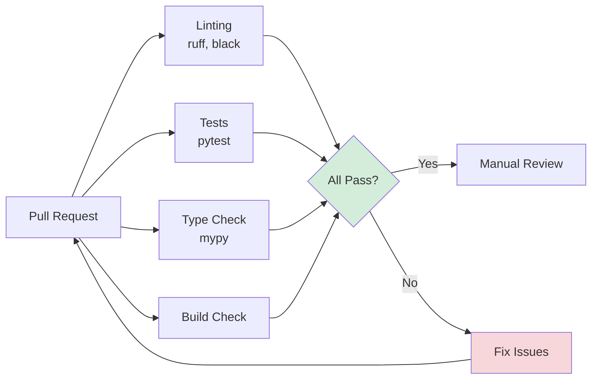

# Code Review Guide

## Overview

This guide explains Hei-DataHub's code review process for **all contribution types**: features, bug fixes, documentation, tests, refactoring, performance improvements, and security fixes.

**Goals:**
- ✅ Maintain code quality and consistency
- ✅ Catch bugs and security issues early
- ✅ Share knowledge across the team
- ✅ Ensure architectural coherence
- ✅ Improve contributor skills

**Who reviews:**
- Maintainers review all PRs
- Contributors can review each other's work
- Anyone can leave feedback (non-binding)

---

## Review Process

### 1. Automated Checks (CI)

Before manual review, automated checks must pass:



**Automated Checks:**
- Linting (ruff, black)
- Type checking (mypy)
- Unit tests (pytest)
- Integration tests
- Build verification

### 2. Manual Review

Reviewers evaluate:

1. **Correctness** - Does it work as intended?
2. **Code Quality** - Is it readable and maintainable?
3. **Architecture** - Does it fit the design?
4. **Tests** - Are tests comprehensive?
5. **Documentation** - Are changes documented?

### 3. Approval & Merge

- At least **1 approval** required
- All discussions resolved
- CI checks passing
- No merge conflicts

---

## Review Checklist

### Functionality ✅

- [ ] **Change addresses the issue** - Does it solve the stated problem?
- [ ] **No regressions** - Existing functionality still works
- [ ] **Edge cases handled** - Considers boundary conditions
- [ ] **Error handling** - Failures handled gracefully
- [ ] **Performance acceptable** - No obvious bottlenecks

### Code Quality ✅

- [ ] **Follows style guide** - Consistent with existing code
- [ ] **Type hints present** - All functions annotated
- [ ] **No code duplication** - DRY principle followed
- [ ] **Clear naming** - Variables/functions self-documenting
- [ ] **Appropriate abstraction** - Not over-engineered or under-engineered
- [ ] **Comments where needed** - Complex logic explained

### Architecture ✅

- [ ] **Follows Clean Architecture** - Correct layer boundaries
- [ ] **No circular dependencies** - Imports flow correctly
- [ ] **Single responsibility** - Functions/classes do one thing
- [ ] **Testable design** - Easy to unit test
- [ ] **WebDAV security** - Credentials handled properly

### Tests ✅

- [ ] **Unit tests added** - Pure logic tested
- [ ] **Integration tests added** - I/O interactions tested
- [ ] **Tests are meaningful** - Not just for coverage
- [ ] **Test names descriptive** - Clear what is being tested
- [ ] **Edge cases tested** - Boundary conditions covered
- [ ] **Mocks used appropriately** - External dependencies isolated

### Security ✅

- [ ] **No credentials in code** - Secrets in keyring only
- [ ] **Input validation** - User input sanitized
- [ ] **SQL injection safe** - Parameterized queries only
- [ ] **Path traversal safe** - Paths validated
- [ ] **Logging secure** - No sensitive data in logs

### Documentation ✅

- [ ] **Docstrings added** - Public functions documented
- [ ] **README updated** - If user-facing change
- [ ] **Dev docs updated** - If architecture change
- [ ] **CHANGELOG entry** - For user-visible changes
- [ ] **Comments explain why** - Not just what

---

## Review Criteria by Contribution Type

### Bug Fixes 🐛

Focus on:
- [ ] **Bug is actually fixed** - Can no longer reproduce the issue
- [ ] **Root cause identified** - Fix addresses cause, not symptoms
- [ ] **Regression test added** - Prevents bug from returning
- [ ] **No new bugs introduced** - Fix doesn't break other features
- [ ] **Error handling improved** - Related error cases considered

### New Features ✨

Focus on:
- [ ] **Feature complete** - Matches issue requirements
- [ ] **User experience** - Intuitive to use
- [ ] **Backwards compatible** - Or migration path provided
- [ ] **Performance acceptable** - No significant slowdowns
- [ ] **Documentation complete** - How to use the feature
- [ ] **Tests comprehensive** - Happy path + edge cases

### Documentation 📚

Focus on:
- [ ] **Accuracy** - Information is correct
- [ ] **Completeness** - No missing sections
- [ ] **Clarity** - Easy to understand for target audience
- [ ] **Examples** - Code samples where helpful
- [ ] **Links work** - All references valid
- [ ] **Consistent style** - Matches existing docs

### Refactoring ♻️

Focus on:
- [ ] **No behavior change** - Functionality identical
- [ ] **Improvement clear** - Readability/maintainability/performance
- [ ] **Tests unchanged** - Or only test structure improved
- [ ] **No new dependencies** - Uses existing libraries
- [ ] **Commit history clean** - Easy to review step-by-step

### Tests 🧪

Focus on:
- [ ] **Tests meaningful** - Not just for coverage percentage
- [ ] **Edge cases** - Boundary conditions tested
- [ ] **Test names clear** - Describes what is being tested
- [ ] **No flaky tests** - Pass consistently
- [ ] **Fast execution** - Unit tests < 100ms

### Performance ⚡

Focus on:
- [ ] **Benchmarks provided** - Before/after measurements
- [ ] **Profiling done** - Actual bottleneck identified
- [ ] **No regressions** - Other features not slower
- [ ] **Trade-offs documented** - Memory, complexity, readability
- [ ] **Tests still pass** - Optimization doesn't break functionality

### Security 🔒

Focus on:
- [ ] **Vulnerability fixed** - Security issue resolved
- [ ] **No new vulnerabilities** - Fix doesn't introduce new issues
- [ ] **Input validation** - User input sanitized
- [ ] **Credentials safe** - No leaks in logs/errors
- [ ] **Tests verify security** - Regression test for vulnerability

### UI/UX 🎨

Focus on:
- [ ] **Keyboard accessible** - All actions have keybindings
- [ ] **Consistent with existing UI** - Follows established patterns
- [ ] **Responsive** - Doesn't freeze during operations
- [ ] **Error messages clear** - Users understand what went wrong
- [ ] **Help documented** - Keybindings in help screen

---

## Review Comments

### Types of Comments

| Type | When to Use | Example |
|------|-------------|---------|
| **Blocking** | Must be fixed before merge | "🚨 This will cause data loss" |
| **Non-blocking** | Should fix but not critical | "💡 Consider extracting this to a function" |
| **Question** | Seeking clarification | "❓ Why did you choose this approach?" |
| **Nit** | Minor style preference | "🔹 Nit: Add trailing comma" |
| **Praise** | Acknowledge good work | "✅ Nice refactoring!" |

### How to Write Good Comments

**DO ✅**

```markdown
**Blocking:** This could cause a race condition if two
users sync simultaneously. Consider adding a lock
mechanism here.

Suggested approach:
```python
with sync_lock:
    upload_dataset(...)
```
```

**DON'T ❌**

```markdown
This is wrong.
```

### Giving Feedback

**Constructive:**
- Explain the **why**: "This could lead to X because Y"
- Suggest alternatives: "Consider using Z instead"
- Ask questions: "Have you thought about edge case A?"
- Be specific: Point to exact lines/code

**Tone:**
- Be kind and respectful
- Assume good intent
- Focus on code, not person
- Use "we" not "you": "We should consider..." vs "You forgot..."

---

## Common Review Patterns

### 1. Missing Error Handling

**❌ Problem:**

```python
def load_config():
    with open("config.toml") as f:
        return toml.load(f)
```

**✅ Suggestion:**

```python
def load_config():
    """Load configuration from TOML file.

    Raises:
        ConfigError: If file not found or invalid format
    """
    try:
        with open("config.toml") as f:
            return toml.load(f)
    except FileNotFoundError:
        raise ConfigError("Config file not found")
    except toml.TOMLDecodeError as e:
        raise ConfigError(f"Invalid config format: {e}")
```

### 2. Missing Type Hints

**❌ Problem:**

```python
def search_datasets(query, limit=50):
    results = index_service.search(query, limit)
    return results
```

**✅ Suggestion:**

```python
def search_datasets(
    query: str,
    limit: int = 50
) -> list[dict[str, Any]]:
    """Search datasets using FTS5.

    Args:
        query: Search query string
        limit: Maximum results to return

    Returns:
        List of matching datasets
    """
    results = index_service.search(query, limit)
    return results
```

### 3. Security: Credentials in Logs

**❌ Problem:**

```python
logger.info(f"Connecting to {url} with token {token}")
```

**✅ Suggestion:**

```python
from hei_datahub.auth.credentials import redact

logger.info(f"Connecting to {url} with token {redact(token)}")
# Logs: "Connecting to ... with token my***23"
```

### 4. Not Following Clean Architecture

**❌ Problem (Core importing Infrastructure):**

```python
# core/models.py
from hei_datahub.infra.db import get_connection  # ❌ Wrong layer

class Dataset:
    def save(self):
        conn = get_connection()  # Core shouldn't do I/O
```

**✅ Suggestion:**

```python
# core/models.py
class Dataset:
    """Pure data model - no I/O"""
    pass

# services/dataset_service.py
from hei_datahub.core.models import Dataset
from hei_datahub.infra import index

def save_dataset(dataset: Dataset):
    """Service handles orchestration and I/O"""
    index.upsert_dataset(dataset.id, dataset.to_dict())
```

### 5. Missing Tests

**❌ Problem:**

PR adds feature but no tests.

**✅ Suggestion:**

```markdown
Great feature! Could you add tests covering:

1. Happy path: Valid input returns expected result
2. Edge case: Empty query returns empty list
3. Error case: Invalid syntax raises SearchError

Example:
```python
def test_search_with_valid_query():
    results = search_datasets("climate")
    assert len(results) > 0
    assert "climate" in results[0]["name"].lower()
```
```

---

## Responding to Reviews

### As a Contributor

**DO ✅**

- Respond to every comment (even if just "✅ Fixed")
- Ask for clarification if confused
- Push new commits addressing feedback
- Mark conversations as resolved after fixing
- Thank reviewers for their time

**DON'T ❌**

- Get defensive
- Ignore comments
- Force-push and lose review history
- Resolve conversations without fixing
- Take feedback personally

**Example Response:**

```markdown
> Consider extracting this validation logic to a separate function.

Good call! I extracted it to `validate_webdav_url()` in commit abc123.
The function is now reusable in both setup.py and validator.py.
```

### Handling Disagreements

1. **Understand the concern**: Ask clarifying questions
2. **Explain your reasoning**: Share your perspective
3. **Seek compromise**: Is there a middle ground?
4. **Escalate if needed**: Tag a maintainer for input

**Example:**

```markdown
I see your point about performance. My concern is readability -
the optimized version is harder to understand.

How about we keep the readable version but add a comment explaining
the performance tradeoff? If profiling shows this is a bottleneck,
we can optimize in a future PR with proper benchmarks.

@maintainer - thoughts?
```

---

## For Reviewers

### Prioritization

Review PRs in this order:

1. **🔥 Urgent fixes** - Security, critical bugs
2. **🚀 Blocked work** - PR blocking other contributors
3. **✨ Features** - New functionality
4. **♻️ Refactors** - Code improvements
5. **📝 Docs** - Documentation updates

### Time Commitment

- **Small PR (< 100 lines)**: 15-30 minutes
- **Medium PR (100-500 lines)**: 30-60 minutes
- **Large PR (> 500 lines)**: 1-2 hours

**Tip:** Ask contributor to split large PRs into smaller chunks.

### Review Stages

**First Pass (5-10 min):**
- Read PR description
- Check CI status
- Skim changed files
- Identify major concerns

**Deep Review (20-40 min):**
- Read code line-by-line
- Check tests
- Verify documentation
- Leave detailed comments

**Follow-up (5-10 min):**
- Review updates
- Verify fixes
- Approve or request changes

---

## Approval Criteria

### ✅ Approve

When:
- All blocking issues resolved
- Tests pass
- Follows conventions
- Documentation updated
- Ready to merge

Comment:
```markdown
✅ **Approved!**

Great work on the WebDAV integration. The error handling
is robust and tests are comprehensive.

Minor nits addressed inline but nothing blocking.
```

### 🔄 Request Changes

When:
- Critical issues found
- Tests missing/failing
- Breaking changes without migration
- Security concerns

Comment:
```markdown
**Requesting changes:**

Overall approach looks good! A few blocking issues to address:

1. 🚨 Line 45: This could cause data loss (see comment)
2. ⚠️ Missing error handling for network failures
3. 📝 Add docstring to `validate_token()` function

Once these are fixed, I'll re-review quickly.
```

### 💬 Comment (No Approval)

When:
- Unsure about approach
- Need clarification
- Not ready to approve/reject

Comment:
```markdown
**Questions before approving:**

1. Have you considered the race condition scenario?
2. How does this interact with the existing sync logic?
3. Is there a performance impact for large datasets?

Not requesting changes yet - want to understand the
design better first.
```

---

## Review Examples

### Example 1: Feature Review

**PR:** Add date range filters to search

**Review Comment:**

```markdown
**Overall:** Nice feature! Code quality is good.

**Blocking Issues:**

Line 67:
```python
date_after = datetime.strptime(filters["date_after"], "%Y-%m-%d")
```
This will crash if format is invalid. Add try/except:
```python
try:
    date_after = datetime.strptime(filters["date_after"], "%Y-%m-%d")
except ValueError:
    raise SearchError(f"Invalid date format: {filters['date_after']}")
```

**Tests:**
- ✅ Happy path tested
- ❌ Missing edge case: invalid date format
- ❌ Missing edge case: date_after > date_before

**Documentation:**
Could you add an example to the docstring showing date filter usage?

**Nits (non-blocking):**
- Line 42: Consider using ISO 8601 format instead of custom
- Line 89: This variable name could be more descriptive

Once blocking issues are fixed, I'll approve!
```

### Example 2: Bug Fix Review

**PR:** Fix keyring timeout on slow unlock

**Review Comment:**

```markdown
✅ **Approved**

Excellent bug fix!

**What I liked:**
- Good root cause analysis in the PR description
- Increased timeout is configurable via --timeout flag
- Tests verify both fast and slow scenarios
- Clear error message when timeout occurs

**Minor suggestion (non-blocking):**
Consider adding a retry mechanism for transient keyring failures?
Could file a follow-up issue if you think it's worth exploring.

Great work! 🎉
```

---

## Related Documentation

- **[Workflow](workflow.md)** - Contribution workflow
- **[Commit Conventions](commits.md)** - Commit message format
- **[Architecture Overview](../architecture/overview.md)** - System design
- **[Module Walkthrough](../codebase/module-walkthrough.md)** - Code structure

---

**Last Updated:** October 29, 2025 | **Version:** 0.60.0-beta "Clean-up"
