# Contributor Workflow

## Overview

This guide covers **code contributions** to Hei-DataHub. There are two types of contributions:

1. **Code Contributions** (this guide) — Bug fixes, features, documentation via GitHub PRs
2. **Dataset Contributions** (see below) — Adding/editing datasets via WebDAV cloud storage

---

## Two Contribution Paths

### Visual Overview

```mermaid
graph TB
    Start["🤝 Want to Contribute?"]
    
    Start --> CodeQ{"Code or Datasets?"}
    
    CodeQ -->|"Code: Bugs, Features, Docs"| CodePath["📝 Code Contribution"]
    CodeQ -->|"Datasets: Add/Edit Data"| DataPath["☁️ Dataset Contribution"]
    
    CodePath --> Fork["Fork Repository"]
    Fork --> Branch["Create Feature Branch"]
    Branch --> Code["Write Code + Tests"]
    Code --> PR["Open Pull Request"]
    PR --> Review["Code Review"]
    Review --> Merge["Merge to Main"]
    
    DataPath --> Auth["Authenticate WebDAV<br/>(hei-datahub auth setup)"]
    Auth --> TUI["Launch TUI<br/>(hei-datahub)"]
    TUI --> Edit["Create/Edit Datasets"]
    Edit --> AutoSync["Auto-Sync to Cloud"]
    AutoSync --> Done["✓ Available to Others"]
    
    style CodePath fill:#e1f5ff
    style DataPath fill:#fff4e1
    style Merge fill:#d4edda
    style Done fill:#d4edda
```



### Path 1: Code Contributions (GitHub)

**For:** Bug fixes, new features, tests, documentation improvements

**Process:** Fork → Branch → Code → Test → PR → Review → Merge

**Tools:** Git, GitHub, Python, uv, pytest

**See:** This document (full workflow below)

### Path 2: Dataset Contributions (WebDAV)

**For:** Adding or editing datasets in the cloud library

**Process:** Authenticate → Edit YAML → Save → Auto-sync

**Tools:** Hei-DataHub TUI, WebDAV, HeiBox

**How it works:**

1. Configure WebDAV authentication: `hei-datahub auth setup`
2. Launch TUI: `hei-datahub`
3. Create/edit datasets in the interface
4. Changes auto-sync to cloud (HeiBox/Seafile)
5. Other users see changes after sync

**No GitHub required** — Dataset changes sync directly to cloud storage.

**See:** [Authentication & Sync Guide](../architecture/auth-and-sync.md)

---

## Code Contribution Prerequisites

Before contributing code:

- ✅ Read [System Overview](../architecture/overview.md) to understand the architecture
- ✅ Read [Codebase Overview](../codebase/overview.md) to know where code lives
- ✅ Have Python 3.10+ installed
- ✅ Have `uv` installed: `curl -LsSf https://astral.sh/uv/install.sh | sh`
- ✅ Have Git configured with your name and email

---

## Code Contribution Workflow

The following steps apply to **code contributions only** (bug fixes, features, documentation). Dataset contributions follow a different workflow via WebDAV (see above).

---

## Step 1: Find or Create an Issue

### Browse Existing Issues

Visit [GitHub Issues](https://github.com/0xpix/Hei-DataHub/issues)

**Good first issues:**
- Filter by label: `good first issue`
- Look for: Small bug fixes, documentation improvements, test additions

**Before starting work:**
- Comment on the issue: "I'd like to work on this"
- Wait for maintainer confirmation (avoid duplicate work)

### Create a New Issue

If you found a bug or want to propose a feature:

1. Search existing issues first (avoid duplicates)
2. Use issue template (bug report or feature request)
3. Provide context: What? Why? How?
4. Wait for triage and feedback

---

## Step 2: Fork and Clone

### Fork the Repository

1. Go to [github.com/0xpix/Hei-DataHub](https://github.com/0xpix/Hei-DataHub)
2. Click **Fork** button (top-right)
3. Wait for fork to complete

### Clone Your Fork

```bash
# Clone your fork
git clone https://github.com/YOUR_USERNAME/Hei-DataHub.git
cd Hei-DataHub

# Add upstream remote
git remote add upstream https://github.com/0xpix/Hei-DataHub.git

# Verify remotes
git remote -v
# origin    https://github.com/YOUR_USERNAME/Hei-DataHub.git (fetch)
# upstream  https://github.com/0xpix/Hei-DataHub.git (fetch)
```

---

## Step 3: Set Up Development Environment

### Install Dependencies

```bash
# Install dependencies using uv (fast and reproducible)
uv sync --dev

# Activate virtual environment
source .venv/bin/activate

# Verify installation
hei-datahub --version
```

### Alternative: Traditional pip

```bash
python -m venv .venv
source .venv/bin/activate
pip install -e ".[dev]"
```

### Verify Setup

```bash
# Run tests to ensure everything works
make test

# Run linters
make lint

# Try the TUI
hei-datahub
```

---

## Step 4: Create a Feature Branch

**Never work directly on `main` or `docs/devs`.**

### Branch Naming Convention

```bash
# Format: <type>/<short-description>
git checkout -b feature/add-csv-export
git checkout -b fix/search-crash-on-empty-query
git checkout -b docs/update-auth-guide
git checkout -b refactor/extract-webdav-client
git checkout -b test/add-sync-tests
```

**Branch prefixes:**
- `feature/` — New features
- `fix/` — Bug fixes
- `docs/` — Documentation only
- `refactor/` — Code refactoring (no behavior change)
- `test/` — Adding/fixing tests
- `chore/` — Maintenance (dependencies, tooling, CI/CD)
- `security/` — Security fixes
- `perf/` — Performance improvements

**Examples:**
- `feature/webdav-connection-pooling`
- `fix/keyring-timeout-on-slow-unlock`
- `docs/auth-troubleshooting-section`
- `refactor/split-sync-service`
- `security/sanitize-log-credentials`

---

## Step 5: Make Your Changes

### Understand the Module

Before coding:

1. **Find the relevant module:** Check [Codebase Overview](../codebase/overview.md)
2. **Read the architecture:** See [Architecture Overview](../architecture/overview.md)
3. **Check existing implementations:** Look for similar code in the module
4. **Review related documentation:**
   - [Authentication & Sync](../architecture/auth-and-sync.md) — WebDAV integration
   - [Search & Autocomplete](../architecture/search-and-autocomplete.md) — FTS5 search
   - [Security & Privacy](../architecture/security-privacy.md) — Security best practices
5. **Check tests:** Look at existing tests in `tests/`

### Write Code

**Follow these principles:**

- ✅ **Follow Clean Architecture:** Core has no I/O, Services orchestrate, Infrastructure handles I/O
- ✅ **Type hints:** Use type annotations for all functions (Python 3.10+ syntax)
- ✅ **Docstrings:** Document public functions (Google style)
- ✅ **Error handling:** Use explicit exceptions or Result types
- ✅ **Immutability:** Prefer immutable data structures (Pydantic models)
- ✅ **Security first:** Follow [Security & Privacy](../architecture/security-privacy.md) guidelines
- ✅ **Test coverage:** Aim for 80%+ code coverage

**Example:**

```python
# Good
from typing import Optional
from mini_datahub.core.models import Dataset

def search_datasets(
    query: str,
    filters: Optional[dict[str, Any]] = None
) -> list[Dataset]:
    """
    Search datasets using SQLite FTS5 full-text search.

    Args:
        query: Search query string (FTS5 syntax supported)
        filters: Optional filters (tags, date range, etc.)

    Returns:
        List of matching datasets, sorted by BM25 relevance

    Raises:
        SearchError: If query syntax is invalid
        DatabaseError: If database connection fails
    
    Example:
        >>> results = search_datasets("climate precipitation")
        >>> results = search_datasets("tag:weather", {"date_after": "2024-01-01"})
    """
    # Implementation...
```

### Write Tests

**Every code change must include tests.**

#### Test Strategy

| Layer | Test Type | Example |
|-------|-----------|---------|
| Core | Unit tests (pure functions) | `test_validate_dataset_schema()` |
| Services | Integration tests (with mocks) | `test_search_service_with_filters()` |
| Infrastructure | Integration tests (with fixtures) | `test_webdav_sync()`, `test_db_connection()` |
| Auth | Integration tests (keyring mocked) | `test_credential_storage()` |
| UI | Integration tests (Textual pilot) | `test_home_view_navigation()` |

#### Running Tests

```bash
# Run all tests
make test

# Run specific test file
pytest tests/services/test_search.py -v

# Run with coverage
make test-coverage

# Run only fast tests (skip integration)
pytest -m "not integration"
```

#### Writing Tests

```python
# tests/services/test_search.py
import pytest
from mini_datahub.services import fast_search
from mini_datahub.core.models import Dataset

def test_search_with_query_returns_matching_datasets():
    """Test that search returns datasets matching the query."""
    # Arrange
    query = "precipitation"

    # Act
    results = fast_search.search_datasets(query)

    # Assert
    assert len(results) > 0
    assert all("precipitation" in d.title.lower() for d in results)

def test_search_with_invalid_fts5_syntax_raises_error():
    """Test that invalid FTS5 query syntax raises SearchError."""
    with pytest.raises(fast_search.SearchError):
        fast_search.search_datasets("NEAR(invalid 999999)")
```

---

## Step 6: Run Quality Checks

Before committing:

```bash
# Format code (auto-fix)
make format

# Run linters
make lint

# Run tests
make test

# Check test coverage (aim for 80%+)
make test-coverage
```

**Fix all issues before proceeding.**

---

## Step 7: Commit Your Changes

### Commit Message Convention

We use **Conventional Commits**:

```
<type>(<scope>): <subject>

<body>

<footer>
```

**Types:**
- `feat`: New feature
- `fix`: Bug fix
- `docs`: Documentation only
- `style`: Formatting (no code change)
- `refactor`: Code refactoring
- `test`: Adding/fixing tests
- `chore`: Maintenance (dependencies, tooling, CI/CD)
- `security`: Security fixes
- `perf`: Performance improvements

**Scopes (optional but recommended):**
- `auth` — Authentication/WebDAV
- `search` — Search/FTS5/autocomplete
- `sync` — Background sync
- `ui` — TUI/interface
- `db` — Database/persistence
- `cli` — Command-line interface
- `config` — Configuration

**Examples:**

```bash
# Good commits
git commit -m "feat(search): add date range filters for FTS5 queries"
git commit -m "fix(auth): prevent keyring timeout on slow unlock"
git commit -m "docs(cli): add examples for auth doctor command"
git commit -m "refactor(sync): extract WebDAV client to separate module"
git commit -m "security(logging): mask credentials in error messages"

# With body and footer
git commit -m "feat(ui): add dataset export to CSV

- Add export_to_csv method in services
- Add 'Export' button in details view
- Add keybinding Ctrl+E for export

Closes #123"
```

### Commit Best Practices

- ✅ **Atomic commits:** One logical change per commit
- ✅ **Test before committing:** All tests pass
- ✅ **Write descriptive messages:** Explain *what* and *why*, not *how*
- ✅ **Reference issues:** Use `Closes #123` or `Fixes #456`

---

## Step 8: Push to Your Fork

```bash
# Push your branch
git push origin feature/add-csv-export

# If you've already pushed and need to update
git push origin feature/add-csv-export --force-with-lease
```

---

## Step 9: Open a Pull Request

### Create the PR

1. Go to [github.com/0xpix/Hei-DataHub/pulls](https://github.com/0xpix/Hei-DataHub/pulls)
2. Click **New Pull Request**
3. Click **compare across forks**
4. Select:
   - **Base repository:** `0xpix/Hei-DataHub`
   - **Base branch:** `main` (or appropriate branch)
   - **Head repository:** `YOUR_USERNAME/Hei-DataHub`
   - **Compare branch:** `feature/add-csv-export`
5. Click **Create Pull Request**

### PR Title and Description

**Title format:** Same as commit convention

```
feat(search): add date range filters for FTS5 queries
```

**Description template:**

```markdown
## What
Brief summary of what this PR does.

## Why
Explain the motivation (reference issue if applicable).

## How
High-level overview of implementation approach.

## Testing
- [ ] Added unit tests
- [ ] Added integration tests
- [ ] Manual testing done
- [ ] All tests pass

## Checklist
- [ ] Code follows style guidelines
- [ ] Docstrings added for new functions
- [ ] Updated relevant documentation
- [ ] Changelog updated (if applicable)

## Screenshots (if UI change)
(Optional)

## Related Issues
Closes #123
```

---

## Step 10: Code Review

### What to Expect

- **Maintainers will review** within 1-3 business days
- **CI checks will run:** Tests, linting, build verification
- **Feedback:** Suggestions for improvements

### Responding to Feedback

```bash
# Make requested changes
git checkout feature/add-csv-export

# Edit code
# Run tests
make test

# Commit changes
git commit -m "refactor: extract date parsing logic"

# Push updates
git push origin feature/add-csv-export
```

**PR will auto-update with new commits.**

### Review Checklist (Maintainers Check)

See [Code Review Guide](code-review.md) for full checklist.

---

## Step 11: Merge

Once approved:

1. **Maintainer merges** your PR (squash or merge commit)
2. **Your contribution is live!** 🎉
3. **Delete your branch:**
   ```bash
   git branch -d feature/add-csv-export
   git push origin --delete feature/add-csv-export
   ```

---

## Step 12: Stay Synced

### Keep Your Fork Updated

```bash
# Fetch upstream changes
git checkout main
git fetch upstream
git merge upstream/main

# Push to your fork
git push origin main
```

### Rebasing Your Branch (If Needed)

If `main` has moved forward while you were working:

```bash
git checkout feature/add-csv-export
git rebase main

# Resolve conflicts if any
# Then force-push (safe because it's your branch)
git push origin feature/add-csv-export --force-with-lease
```

---

## Common Scenarios

### Scenario 1: I Want to Work on Multiple Issues

Create separate branches:

```bash
git checkout main
git pull upstream main
git checkout -b fix/issue-123

# Work, commit, push, open PR

# Start second issue
git checkout main
git checkout -b feature/issue-456
```

### Scenario 2: My PR Has Merge Conflicts

```bash
git checkout feature/my-branch
git fetch upstream
git rebase upstream/main

# Resolve conflicts
# Edit conflicting files
git add <resolved-files>
git rebase --continue

# Force-push
git push origin feature/my-branch --force-with-lease
```

### Scenario 3: I Want to Update My PR After Review

Just commit and push to the same branch:

```bash
git checkout feature/my-branch
# Make changes
git commit -m "address review feedback"
git push origin feature/my-branch
```

---

## Getting Help

### Code Contributions

- **Stuck on setup?** → [Installation Guide](../../docs/installation/index.md)
- **Confused about architecture?** → [Architecture Overview](../architecture/overview.md)
- **Not sure where code goes?** → [Codebase Overview](../codebase/overview.md)
- **Need API reference?** → [CLI Commands Reference](../api-reference/cli-commands.md)
- **Questions?** → [GitHub Discussions](https://github.com/0xpix/Hei-DataHub/discussions)

### Dataset Contributions

- **Authentication issues?** → [Authentication & Sync](../architecture/auth-and-sync.md)
- **WebDAV connection problems?** → Run `hei-datahub auth doctor`
- **Sync not working?** → Check [Troubleshooting](../architecture/auth-and-sync.md#troubleshooting)
- **Security questions?** → [Security & Privacy](../architecture/security-privacy.md)

---

## Next Steps

### For Code Contributors

- Read [Codebase Overview](../codebase/overview.md) to understand module structure
- Review [Architecture Overview](../architecture/overview.md) for system design
- Check [Security & Privacy](../architecture/security-privacy.md) for security best practices

### For Dataset Contributors

- Read [Authentication & Sync](../architecture/auth-and-sync.md) for WebDAV setup
- Learn [Search & Autocomplete](../architecture/search-and-autocomplete.md) to optimize discoverability
- Review dataset schema in user documentation

---

**Thank you for contributing!** 🙏
