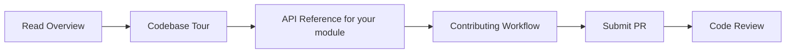

# Hei-DataHub Developer Documentation

!!! warning "Developer Documentation Site"
    **You are viewing the developer documentation.** This site is for contributors, maintainers, and integrators.
    Looking for user documentation? → [**User Manual**](https://0xpix.github.io/Hei-DataHub)

!!! info "Version Compatibility"
    **Developer Docs for v0.56.0-beta "Precision"**
    Compatible with app releases v0.56.x
    Branch: `docs/devs` | Released: October 5, 2025

---

## Welcome, Developer! 👩‍💻👨‍💻

This is the **comprehensive technical reference** for Hei-DataHub internals. Whether you're:

- 🔧 **Contributing code** to the project
- 🏗️ **Understanding the architecture** before diving in
- 🐛 **Debugging an issue** deep in the stack
- 🚀 **Extending functionality** with plugins or adapters
- 📦 **Building releases** and managing CI/CD
- 📚 **Maintaining this docs site** itself

...you're in the right place.

---

## Site Navigation Quick Start

<div class="grid cards" markdown>

-   **[Architecture Overview](architecture/overview.md)**

    Start here! System design, module map, data flow, and component diagrams.

-   **[Codebase Tour](codebase/navigation.md)**

    Every file and directory explained: purpose, ownership, extension points.

-   **[API Reference](api-reference/overview.md)**

    Function-by-function documentation with signatures, errors, and performance notes.

-   **[Configuration](config/overview.md)**

    All config files, environment variables, defaults, and precedence rules.

-   **[Data Layer](data/storage.md)**

    Schemas, migrations, indexing strategy, and adding new datasets.

-   **[UI/TUI Layer](ui/architecture.md)**

    View architecture, state management, keybindings, and theming.

-   **[Extensibility](extensibility/extension-points.md)**

    Official extension points, plugin architecture, and adapter patterns.

-   **[Build & Release](build/pipeline.md)**

    CI/CD jobs, release process, SemVer, and changelog policy.

-   **[Quality Assurance](qa/testing-strategy.md)**

    Testing strategy, fixtures, logging, metrics, and coverage.

-   **[Performance](performance/overview.md)**

    Profiling, hotspots, optimization playbooks, and SLAs.

-   **[Security](security/secrets.md)**

    Secrets management, data privacy, and supply chain security.

-   **[Contributing](contributing/workflow.md)**

    End-to-end contributor workflow, commit conventions, and code review.

-   **[ADRs & Roadmap](adr/index.md)**

    Architecture decision records, roadmap, and deprecation policy.

-   **[Known Issues](known-issues.md)**

    Issues specific to this dev docs site and cross-links to project issues.

-   **[Maintenance](maintenance/health-checklist.md)**

    Docs health checklist, coverage tracker, and update procedures.

-   *[Glossary & Appendices](appendices/glossary.md)**

    Terminology, file index, function index, and quick reference cards.

</div>

---

## What Makes This Site Different?

| **User Docs** (main branch)                      | **Developer Docs** (this site)                    |
|--------------------------------------------------|---------------------------------------------------|
| How to install and use Hei-DataHub               | How Hei-DataHub works internally                  |
| Features, tutorials, UI navigation               | Architecture, APIs, data flows, extension points  |
| "What can I do with this tool?"                  | "How do I change/extend/debug this tool?"         |
| Published from `main` branch                     | Published from `docs/devs` branch                 |
| MkDocs config: `mkdocs.yml`                      | MkDocs config: `mkdocs-dev.yml`                   |
| Audience: end users, data analysts, admins       | Audience: contributors, maintainers, integrators  |

---

## Quick Wins for New Contributors

1. **Understand the big picture in 15 minutes:**
   Read → [System Overview](architecture/overview.md) + [Data Flow](architecture/data-flow.md)

2. **Trace a feature from UI to data:**
   Follow → [UI Architecture](ui/architecture.md) → [Services](api-reference/services/search.md) → [Data Layer](data/storage.md)

3. **Add a new dataset with confidence:**
   Guide → [Adding Datasets](data/adding-datasets.md) + [Schema Definition](data/schema.md)

4. **Add a new UI panel without breaking keybindings:**
   Guide → [Adding New Views](ui/adding-views.md) + [Keybindings](ui/keybindings.md)

5. **Run tests and interpret failures:**
   Reference → [Testing Strategy](qa/testing-strategy.md) + [Test Data](qa/test-data.md)

---

## How to Use This Documentation

### For Contributors (First Time)



### For Maintainers

- **Before merging a PR:** Check [Definition of Done](contributing/definition-of-done.md)
- **Release process:** Follow [Release Process](build/releases.md) + update **both** changelogs
- **Adding new features:** Update [Module Map](architecture/module-map.md), [API Reference](api-reference/overview.md), and [Changelog](build/changelog.md)

### For Integrators

- **Extension points:** See [Extensibility](extensibility/extension-points.md)
- **Plugin architecture:** Read [Plugin Architecture](extensibility/plugins.md)
- **Adapters:** Guide at [Creating Adapters](extensibility/adapters.md)

---

## Contributing to This Docs Site

Found a gap? Want to improve an explanation? Awesome!

1. **Edit directly on GitHub:**
   Every page has an "Edit" icon (✏️) in the top-right corner.

2. **Local development:**
   ```bash
   git checkout docs/devs
   pip install -r dev-docs/requirements.txt
   mkdocs serve -f mkdocs-dev.yml
   # Open http://localhost:8000
   ```

3. **Submit a PR:**
   Target branch: `docs/devs`
   Follow [Contributing to Docs](overview/contributing-docs.md)

---

## Docs Health & Coverage

- **Last Updated:** {{ git_revision_date_localized }}
- **Docs Health:** See [Health Checklist](maintenance/health-checklist.md)
- **Coverage Tracker:** [Coverage Tracker](maintenance/coverage-tracker.md)
- **Known Gaps:** [Known Issues](known-issues.md)

---

## Compatibility Matrix

| **Developer Docs Version** | **App Version** | **Branch**    | **Status** |
|----------------------------|-----------------|---------------|------------|
| **0.56.0-beta**            | v0.56.x         | `docs/devs`   | ✅ Current |
| 0.55.2-beta                | v0.55.x         | (archived)    | 📦 Stable  |

---

## Site Switcher

<div class="site-switcher" markdown>

**You are on:** 🔧 **Developer Docs** (branch: `docs/devs`)

Switch to:
→ [📖 **User Manual**](https://0xpix.github.io/Hei-DataHub) (main branch)

</div>

---

## Get Help

- **Questions?** → [Open a Discussion](https://github.com/0xpix/Hei-DataHub/discussions)
- **Bug in the app?** → [Report an Issue](https://github.com/0xpix/Hei-DataHub/issues)
- **Bug in these docs?** → [Flag it here](known-issues.md)

---

**Happy hacking!** 🚀
