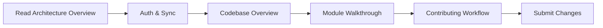

# Hei-DataHub Developer Documentation

> **Version:** 0.60.0-beta — "Clean-up"
> This documentation reflects the refactored architecture, improved UI polish, and codebase cleanup for Hei-DataHub.

!!! warning "Developer Documentation Site"
    **You are viewing the developer documentation.** This site is for contributors, maintainers, and integrators.
    Looking for user documentation? → [**User Manual**](https://0xpix.github.io/Hei-DataHub)

!!! info "Version Compatibility"
    **Developer Docs for v0.60.0-beta "Clean-up"**
    Compatible with app releases v0.60.x
    Branch: `docs/v0.60-beta-update` | Updated: October 28, 2025

---

## Welcome, Developer! 👩‍💻👨‍💻

This is the **comprehensive technical reference** for Hei-DataHub internals. Whether you're:

- 🔧 **Contributing code** to the project
- 🏗️ **Understanding the architecture** before diving in
- 🐛 **Debugging an issue** deep in the stack
- 🚀 **Extending functionality** with plugins or adapters
- 📦 **Building releases** and managing CI/CD
- 📚 **Maintaining this docs site** itself

...you're in the right place.

---

## What Makes This Site Different?

| **User Docs** (main branch)                      | **Developer Docs** (this site)                    |
|--------------------------------------------------|---------------------------------------------------|
| How to install and use Hei-DataHub               | How Hei-DataHub works internally                  |
| Features, tutorials, UI navigation               | Architecture, APIs, data flows, WebDAV integration |
| "What can I do with this tool?"                  | "How do I change/extend/debug this tool?"         |
| MkDocs config: `mkdocs.yml`                      | MkDocs config: `mkdocs-dev.yml`                   |
| Audience: end users, data analysts, admins       | Audience: contributors, maintainers, integrators  |

---

## Quick Wins for New Contributors

1. **Understand the big picture in 15 minutes:**
   Read → [Architecture Overview](architecture/overview.md) + [Auth & Sync](architecture/auth-and-sync.md)

2. **Trace a feature from UI to data:**
   Follow → [Codebase Overview](codebase/overview.md) → [Search & Autocomplete](architecture/search-and-autocomplete.md) → [Data Layer](data/storage.md)

3. **Understand cloud authentication:**
   Guide → [Auth & Sync](architecture/auth-and-sync.md) + [Security & Privacy](architecture/security-privacy.md)

4. **Add a new UI feature:**
   Guide → [UI Architecture](ui/architecture.md) + [Module Walkthrough](codebase/module-walkthrough.md)

5. **Run tests and diagnostics:**
   Reference → [Testing](codebase/tests.md) + [CLI Commands](api-reference/cli-commands.md) (`hei-datahub doctor`)

---

## How to Use This Documentation

### For Contributors (First Time)



### For Maintainers

- **Before merging changes:** Check [Contributing Workflow](contributing/workflow.md)
- **Release process:** Follow [Release Process](build/releases.md) + update changelog
- **Adding new features:** Update [Module Map](architecture/module-map.md) and relevant docs

### For Integration & Extension

- **CLI integration:** See [CLI Commands](api-reference/cli-commands.md)
- **Storage backends:** Read [Module Walkthrough](codebase/module-walkthrough.md#authcredentialspy)
- **Custom views:** Guide at [UI Architecture](ui/architecture.md)

---

## Contributing to This Docs Site

Found a gap? Want to improve an explanation? Awesome!

1. **Clone, make a branch and edit:**
```bash
    git clone git@github.com:0xpix/Hei-DataHub.git
    git checkout -b 'branch_name'
```
2. **Submit a PR:**
   Target branch: `main`
   Follow [Contributing to Docs](overview/contributing-docs.md)

---

## Docs Health & Coverage

- **Last Updated:** {{ git_revision_date_localized }}
- **Docs Health:** See [Health Checklist](maintenance/health-checklist.md)
- **Coverage Tracker:** [Coverage Tracker](maintenance/coverage-tracker.md)
- **Known Gaps:** [Known Issues](known-issues.md)

---

## Compatibility Matrix

| **Developer Docs Version** | **App Version** | **Branch**                         | **Status** |
|----------------------------|-----------------|-------------------------------------|------------|
| **0.60.0-beta**            | v0.60.x         | `docs/v0.60-beta-update`            | ✅ Current |
| 0.59.0-beta                | v0.59.x         | `renovation/dev-docs-0.57-beta`     | 📦 Archived|
| 0.56.0-beta                | v0.56.x         | `docs/devs`                         | 📦 Archived|

---

## Site Switcher

<div class="site-switcher" markdown>

**You are on:** 🔧 **Developer Docs**

Switch to:
→ [📖 **User Manual**](https://0xpix.github.io/Hei-DataHub) (main branch)

</div>

---

## Get Help

- **Questions?** → [Open a Discussion](https://github.com/0xpix/Hei-DataHub/discussions)
- **Bug in the app?** → [Report an Issue](https://github.com/0xpix/Hei-DataHub/issues)
- **Bug in these docs?** → [Flag it here](known-issues.md)

---

**Happy hacking!** 🚀
