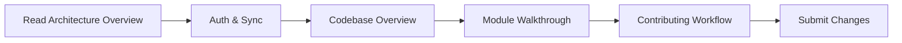

# Hei-DataHub Developer Documentation

!!! tip "🎓 New Learning Guide Available!"
    **Want to understand how to build Hei-DataHub from scratch?** Check out our new [**Step-by-Step Learning Guide**](learn/README.md) — a comprehensive tutorial that teaches you the TUI, architecture, and how every piece works. Perfect for new contributors!

!!! warning "Developer Documentation Site"
    **You are viewing the developer documentation.** This site is for contributors, maintainers, and integrators.
    Looking for user documentation? → [**User Manual**](https://0xpix.github.io/Hei-DataHub)

!!! info "Version Compatibility"
    **Developer Docs for v0.59.0-beta "Privacy"**
    Compatible with app releases v0.59.x
    Branch: `renovation/dev-docs-0.57-beta` | Updated: October 25, 2025

---

## Welcome, Developer! 👩‍💻👨‍💻

This is the **comprehensive technical reference** for Hei-DataHub internals. Whether you're:

- 🎓 **Learning how to build** a TUI app with Textual → [**Start the Learning Guide**](learn/README.md)
- 🔧 **Contributing code** to the project
- 🏗️ **Understanding the architecture** before diving in
- 🐛 **Debugging an issue** deep in the stack
- 🚀 **Extending functionality** with plugins or adapters
- 📦 **Building releases** and managing CI/CD
- 📚 **Maintaining this docs site** itself

...you're in the right place.

---

## 🎓 New to the Project?

**Start with the Learning Guide** — a step-by-step tutorial that teaches you how to build Hei-DataHub from scratch:

- [**Learning Guide Home**](learn/README.md) — Master index and roadmap
- [**What is Hei-DataHub?**](learn/01-what-is-hei-datahub.md) — Problem, solution, and overview
- [**How It Works (Architecture)**](learn/01-architecture.md) — System design deep dive
- [**Installing & Running Locally**](learn/02-setup.md) — Get it running in 5 minutes
- [**Building the TUI**](learn/tui/01-layout-basics.md) — Create beautiful terminal interfaces
- [**Adding Functionality**](learn/logic/01-ui-actions.md) — Connect UI to backend logic

**Estimated time:** 2-3 hours for core concepts, 12-16 hours for full mastery.

---

## Site Navigation Quick Start

<div class="grid cards" markdown>

-   **[🎓 Learning Guide](learn/README.md)**

    **NEW!** Step-by-step tutorials teaching you how to build Hei-DataHub from scratch. Perfect for beginners!

-   **[Architecture Overview](architecture/overview.md)**

    Cloud-first system design, WebDAV integration, data flow, and component diagrams.

-   **[Authentication & Sync](architecture/auth-and-sync.md)**

    WebDAV authentication, keyring storage, background sync, and error recovery.

-   **[Search & Autocomplete](architecture/search-and-autocomplete.md)**

    FTS5 search engine, autocomplete ranking, filter badges, and performance tuning.

-   **[Security & Privacy](architecture/security-privacy.md)**

    Credential handling, data privacy, secure design principles, and threat model.

-   **[Codebase Overview](codebase/overview.md)**

    Every module and directory explained: purpose, responsibilities, and key functions.

-   **[Module Walkthrough](codebase/module-walkthrough.md)**

    File-by-file deep dive with function-level explanations and line-by-line commentary.

-   **[CLI Commands](api-reference/cli-commands.md)**

    Complete command reference: auth, search, sync, update, and diagnostics.

-   **[API Reference](api-reference/overview.md)**

    Function-by-function documentation with signatures, errors, and performance notes.

-   **[Configuration](config/overview.md)**

    Config files, TOML structure, environment variables, and user preferences.

-   **[Data Layer](data/storage.md)**

    SQLite database, FTS5 indexing, dataset metadata, and schema validation.

-   **[UI/TUI Layer](ui/architecture.md)**

    Textual views, widgets, state management, keybindings, and theming.

-   **[Build & Release](build/releases.md)**

    Release process, version management, and changelog policy.

-   **[Testing](codebase/tests.md)**

    Testing strategy, fixtures, running tests, and coverage tracking.

-   **[Performance](performance/overview.md)**

    Profiling, benchmarks, optimization strategies, and performance SLAs.

-   **[Security](architecture/security-privacy.md)**

    Credential storage, WebDAV security, data privacy, and threat mitigation.

-   **[Contributing](contributing/workflow.md)**

    End-to-end contributor workflow, commit conventions, and code review.

-   **[ADRs & Roadmap](adr/index.md)**

    Architecture decision records, roadmap, and deprecation policy.

-   **[Known Issues](known-issues.md)**

    Issues specific to this dev docs site and cross-links to project issues.

-   **[Maintenance](maintenance/health-checklist.md)**

    Docs health checklist, coverage tracker, and update procedures.

-   *[Glossary & Appendices](appendices/glossary.md)**

    Terminology, abbreviations, and quick reference cards.

</div>

---

## What Makes This Site Different?

| **User Docs** (main branch)                      | **Developer Docs** (this site)                    |
|--------------------------------------------------|---------------------------------------------------|
| How to install and use Hei-DataHub               | How Hei-DataHub works internally                  |
| Features, tutorials, UI navigation               | Architecture, APIs, data flows, WebDAV integration |
| "What can I do with this tool?"                  | "How do I change/extend/debug this tool?"         |
| Published from `main` branch                     | Published from `renovation/dev-docs-0.57-beta`    |
| MkDocs config: `mkdocs.yml`                      | MkDocs config: `mkdocs-dev.yml`                   |
| Audience: end users, data analysts, admins       | Audience: contributors, maintainers, integrators  |

---

## Quick Wins for New Contributors

1. **Understand the big picture in 15 minutes:**
   Read → [Architecture Overview](architecture/overview.md) + [Auth & Sync](architecture/auth-and-sync.md)

2. **Trace a feature from UI to data:**
   Follow → [Codebase Overview](codebase/overview.md) → [Search & Autocomplete](architecture/search-and-autocomplete.md) → [Data Layer](data/storage.md)

3. **Understand cloud authentication:**
   Guide → [Auth & Sync](architecture/auth-and-sync.md) + [Security & Privacy](architecture/security-privacy.md)

4. **Add a new UI feature:**
   Guide → [UI Architecture](ui/architecture.md) + [Module Walkthrough](codebase/module-walkthrough.md)

5. **Run tests and diagnostics:**
   Reference → [Testing](codebase/tests.md) + [CLI Commands](api-reference/cli-commands.md) (`hei-datahub doctor`)

---

## How to Use This Documentation

### For Contributors (First Time)



### For Maintainers

- **Before merging changes:** Check [Contributing Workflow](contributing/workflow.md)
- **Release process:** Follow [Release Process](build/releases.md) + update changelog
- **Adding new features:** Update [Module Map](architecture/module-map.md) and relevant docs

### For Integration & Extension

- **CLI integration:** See [CLI Commands](api-reference/cli-commands.md)
- **Storage backends:** Read [Storage Architecture](codebase/module-walkthrough.md#storage-backends)
- **Custom views:** Guide at [UI Architecture](ui/architecture.md)

---

## Contributing to This Docs Site

Found a gap? Want to improve an explanation? Awesome!

1. **Edit directly on GitHub:**
   Every page has an "Edit" icon (✏️) in the top-right corner.

2. **Local development:**
   ```bash
   git checkout renovation/dev-docs-0.57-beta
   pip install -r dev-docs/requirements.txt
   mkdocs serve -f mkdocs-dev.yml
   # Open http://localhost:8000
   ```

3. **Submit a PR:**
   Target branch: `renovation/dev-docs-0.57-beta`
   Follow [Contributing to Docs](overview/contributing-docs.md)

---

## Docs Health & Coverage

- **Last Updated:** {{ git_revision_date_localized }}
- **Docs Health:** See [Health Checklist](maintenance/health-checklist.md)
- **Coverage Tracker:** [Coverage Tracker](maintenance/coverage-tracker.md)
- **Known Gaps:** [Known Issues](known-issues.md)

---

## Compatibility Matrix

| **Developer Docs Version** | **App Version** | **Branch**                         | **Status** |
|----------------------------|-----------------|-------------------------------------|------------|
| **0.59.0-beta**            | v0.59.x         | `renovation/dev-docs-0.57-beta`     | ✅ Current |
| 0.56.0-beta                | v0.56.x         | `docs/devs`                         | 📦 Archived|

---

## Site Switcher

<div class="site-switcher" markdown>

**You are on:** 🔧 **Developer Docs** (branch: `renovation/dev-docs-0.57-beta`)

Switch to:
→ [📖 **User Manual**](https://0xpix.github.io/Hei-DataHub) (main branch)

</div>

---

## Get Help

- **Questions?** → [Open a Discussion](https://github.com/0xpix/Hei-DataHub/discussions)
- **Bug in the app?** → [Report an Issue](https://github.com/0xpix/Hei-DataHub/issues)
- **Bug in these docs?** → [Flag it here](known-issues.md)

---

**Happy hacking!** 🚀
