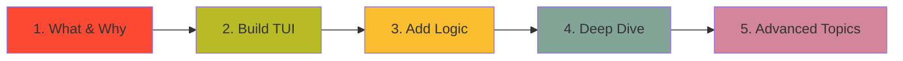

# Welcome to Hei-DataHub: Learn by Building

## 🎯 What You'll Build

By following this learning guide, you'll understand how to build **Hei-DataHub from scratch** — a sophisticated Terminal User Interface (TUI) application that manages dataset metadata with cloud synchronization.

Think of it as building your own **"GitHub for Datasets"** with:

- ✨ **A beautiful TUI** (like Vim, but for browsing datasets)
- 🔍 **Lightning-fast search** (sub-80ms using SQLite FTS5)
- ☁️ **Cloud sync** (WebDAV integration with HeiBox/Seafile)
- 🔐 **Secure authentication** (OS-level keyring storage)
- 📊 **Rich metadata** (JSON Schema validation, autocomplete, badges)
- ⚡ **Background updates** (async sync without blocking the UI)

---

## 🧠 What Makes This Guide Different?

This isn't just API documentation. This is a **step-by-step reconstruction** of how Hei-DataHub works.

### Traditional Docs Say:
> "The `SearchService` handles full-text search queries."

### This Guide Says:
> "Let's build the search feature. First, you'll create an SQLite database with FTS5. Then you'll connect it to the TUI so when a user types `/` and searches, the UI instantly displays filtered results. Here's exactly how each line works..."

---

## 🗺️ Your Learning Journey



### Phase 1: Understanding (30 min)
- What problem does Hei-DataHub solve?
- How does the architecture work conceptually?
- How do I run it locally?

**Output**: You can explain what Hei-DataHub does and run it on your machine.

---

### Phase 2: Building the TUI (2-3 hours)
- How does the Textual framework render UI?
- How do you create screens, widgets, and layouts?
- How do you style components (colors, borders, text)?
- How do keyboard shortcuts work (`j/k`, `/`, `enter`)?
- How do you add your own custom view?

**Output**: You can create a new TUI screen with custom styling and keyboard navigation.

---

### Phase 3: Adding Functionality (3-4 hours)
- How does the UI trigger backend actions?
- How does search work (SQLite FTS5 queries)?
- How does autocomplete generate suggestions?
- How does background sync work without freezing the UI?
- How does authentication and cloud storage work?

**Output**: You understand how user actions flow from UI → Services → Database → Cloud.

---

### Phase 4: Deep Dive (4-5 hours)
- What does each directory contain?
- What does each core script do?
- Line-by-line explanation of key modules
- How do services interact with each other?
- How do CLI commands work?

**Output**: You can navigate the entire codebase confidently and modify any component.

---

### Phase 5: Advanced Topics (2-3 hours)
- How do you add new features (filters, badges, views)?
- How do you optimize performance?
- How do you debug issues?
- How do you customize themes and branding?

**Output**: You can extend Hei-DataHub with new functionality and ship production-ready features.

---

## 📚 How to Use This Guide

### 1. **Follow in Order**
Each section builds on the previous one. Don't skip ahead.

### 2. **Read Code, Then Run It**
For every concept, we show:
- 📄 The actual file location (e.g., `src/mini_datahub/ui/views/home.py`)
- 🔍 Line-by-line explanation
- ▶️ A "Try It Yourself" snippet you can run

### 3. **Experiment**
After each section, modify the code:
- Change a color in the theme
- Add a new keybinding
- Create a debug view
- Tweak search behavior

### 4. **Connect the Dots**
We show how modules interact:
```
UI (home.py)
  → calls → SearchService (search.py)
  → queries → SQLite Index (index.py)
  → renders → Results in DataTable widget
```

---

## 🎓 Prerequisites

You should have:

- ✅ Basic Python knowledge (functions, classes, imports)
- ✅ Familiarity with terminal/command line
- ✅ Git installed (to clone the repo)
- ✅ Python 3.10+ installed

You **don't** need:
- ❌ Experience with TUI frameworks
- ❌ Knowledge of SQLite FTS5
- ❌ WebDAV expertise
- ❌ Async/await mastery

We'll teach you everything else!

---

## 🛠️ Quick Start (5 minutes)

Before diving into the guide, get Hei-DataHub running:

```bash
# Clone the repository
git clone https://github.com/0xpix/Hei-DataHub.git
cd Hei-DataHub

# Install dependencies (using uv for speed)
pip install uv
uv pip install -e .

# Run the TUI
hei-datahub
```

**First time?** The app will:
1. Create a workspace directory (`~/.local/share/hei-datahub/`)
2. Initialize an SQLite database
3. Show you the home screen with sample datasets

Press `?` to see all keyboard shortcuts.
Press `q` to quit.

---

## 🧩 What You'll Learn in Each Section

### [1. What is Hei-DataHub?](01-architecture.md)
- The problem it solves
- Conceptual architecture (TUI + WebDAV + SQLite)
- Key features and design decisions

### [2. How It Works (Architecture)](01-architecture.md)
- Layer breakdown (UI → Services → Infrastructure)
- Data flow diagrams
- Dependency injection pattern
- Why WebDAV? Why SQLite? Why Textual?

### [3. Installing & Running Locally](02-setup.md)
- Step-by-step local setup
- Workspace initialization
- Configuration files
- Running in debug mode

### [4-8. Build the TUI](tui/)
- Textual framework basics
- Creating views and widgets
- Styling with TCSS
- Handling keyboard input
- Adding custom screens

### [9-13. Add Functionality](logic/)
- Connecting UI to backend
- Database queries and search
- Autocomplete engine
- Background sync
- Authentication flow

### [14-18. Deep Dive](deep/)
- Directory structure explained
- Core scripts walkthrough
- Services and modules
- CLI commands
- Line-by-line code analysis

### [19-22. Advanced Topics](advanced/)
- Extending with new features
- Performance optimization
- Debugging techniques
- Theme customization

---

## 💡 Learning Tips

### 1. **Use the REPL**
Don't just read — try things in the Python REPL:
```python
from mini_datahub.services.search import search_datasets
results = search_datasets("climate")
print(results)
```

### 2. **Add Print Statements**
Modify the code to see what's happening:
```python
def search_datasets(query):
    print(f"🔍 Searching for: {query}")  # ← Add this!
    # ... rest of function
```

### 3. **Break Things**
The best way to learn is to break it and fix it:
- Comment out a line and see what breaks
- Change a color and rebuild the CSS
- Remove a keybinding and see what happens

### 4. **Draw Diagrams**
As you learn, sketch out:
- Module dependencies
- Data flow
- Class hierarchies

---

## 🎯 Learning Goals Checklist

After completing this guide, you should be able to:

- [ ] Explain what Hei-DataHub is and why it exists
- [ ] Describe the layered architecture (UI/Services/Infra)
- [ ] Create a new Textual TUI screen from scratch
- [ ] Style components using TCSS
- [ ] Add keyboard shortcuts and handle events
- [ ] Write a service that queries the SQLite database
- [ ] Implement autocomplete for a new field
- [ ] Add a background sync task
- [ ] Integrate a new cloud storage backend
- [ ] Debug TUI rendering issues
- [ ] Profile and optimize slow queries
- [ ] Create a custom theme
- [ ] Add a new metadata field to the schema
- [ ] Implement a new filter or badge type
- [ ] Contribute a feature to the project

---

## 🚀 Ready to Start?

Let's begin your journey!

**Next Step**: [1. What is Hei-DataHub?](01-what-is-hei-datahub.md)

---

## 📖 Alternative Paths

**If you're short on time:**
- Read sections 1-2 (overview + architecture) — 30 min
- Skim section 4 (TUI basics) — 15 min
- Jump to section 14 (directory structure) — 20 min

**If you just want to add a feature:**
- Read section 1 (overview) — 10 min
- Read section 19 (extending the app) — 30 min
- Reference section 14 (directory structure) as needed

**If you're debugging an issue:**
- Read section 21 (debugging) — 20 min
- Reference section 14 (code walkthrough) for specific files

---

## 🤝 Contributing to This Guide

Found something unclear? Want to add an example?

This documentation lives in `dev-docs/learn/`. Submit a PR!

---

**Let's build something amazing together!** 🚀
