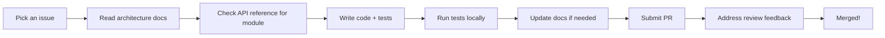
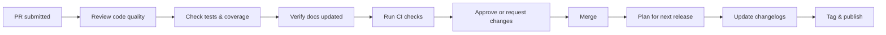
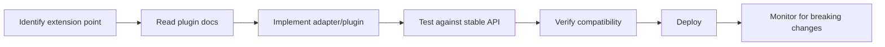

# Audience & Scope

## Who Is This Documentation For?

This developer documentation is designed for three primary audiences:

---

## 1. **Contributors** 🔧

**You are:** Writing code, fixing bugs, or adding features to Hei-DataHub.

**You need:**

- **Architecture context:** Where does my change fit in the system?
- **API reference:** What functions/classes can I use? What are their contracts?
- **Testing guidance:** How do I test my change? Where are the test fixtures?
- **Contribution workflow:** How do I submit a PR? What are the review standards?
- **Code style:** What conventions do we follow? How do I avoid common pitfalls?

**Start here:**

1. [System Overview](../architecture/overview.md) — Understand the big picture
2. [Module Map](../architecture/module-map.md) — Find the module you're working on
3. [API Reference](../api-reference/overview.md) — Lookup function signatures
4. [Contributor Workflow](../contributing/workflow.md) — Learn how to submit code
5. [Testing Strategy](../qa/testing-strategy.md) — Write effective tests

**Your workflow:**

---

## 2. **Maintainers** 🏗️

**You are:** Reviewing PRs, managing releases, maintaining code quality, and ensuring the project stays healthy.

**You need:**

- **Release process:** How do we cut a release? What's the checklist?
- **Code review standards:** What should I look for in a PR?
- **Definition of Done:** When is a feature truly complete?
- **CI/CD pipelines:** What jobs run? How do they fail?
- **Changelog enforcement:** How do we keep changelogs up to date?
- **Docs maintenance:** How do I ensure docs stay current?

**Start here:**

1. [Release Process](../build/releases.md) — Step-by-step release guide
2. [Code Review Guide](../contributing/code-review.md) — Review checklist
3. [Definition of Done](../contributing/definition-of-done.md) — Completion criteria
4. [CI/CD Jobs](../build/ci-cd.md) — Understand the pipeline
5. [Docs Health Checklist](../maintenance/health-checklist.md) — Keep docs fresh

**Your workflow:**

---

## 3. **Integrators** 🔌

**You are:** Building plugins, adapters, or extensions on top of Hei-DataHub. You're using it as a library or extending its functionality.

**You need:**

- **Extension points:** What APIs are stable? What can I hook into?
- **Plugin architecture:** How do I write a plugin? How is it discovered?
- **Adapters & strategies:** How do I swap out components (e.g., different storage backends)?
- **Stability guarantees:** What will break in future versions? What won't?
- **Performance considerations:** What's the expected throughput? Where are bottlenecks?

**Start here:**

1. [Extensibility Overview](../extensibility/extension-points.md) — Official extension points
2. [Plugin Architecture](../extensibility/plugins.md) — How plugins work
3. [Creating Adapters](../extensibility/adapters.md) — Swap components
4. [API Reference](../api-reference/overview.md) — Stable APIs with contracts
5. [Performance SLAs](../performance/slas.md) — Expected performance

**Your workflow:**

---

## Secondary Audiences

### 4. **Security Researchers** 🔒

**You care about:**

- [Secrets Management](../security/secrets.md)
- [Data Privacy](../security/privacy.md)
- [Supply Chain Security](../security/supply-chain.md)

### 5. **Performance Engineers** ⚡

**You care about:**

- [Profiling Guide](../performance/profiling.md)
- [Common Hotspots](../performance/hotspots.md)
- [Optimization Playbooks](../performance/playbooks.md)

### 6. **Documentation Maintainers** 📚

**You care about:**

- [Contributing to Docs](contributing-docs.md)
- [Docs Health Checklist](../maintenance/health-checklist.md)
- [Coverage Tracker](../maintenance/coverage-tracker.md)

---

## Out of Scope (Not for You)

This documentation is **NOT** for:

- ❌ **End users** wanting to learn how to use Hei-DataHub  
  → See [User Manual](https://0xpix.github.io/Hei-DataHub) instead

- ❌ **Data analysts** looking for dataset tutorials  
  → See [User Tutorials](https://0xpix.github.io/Hei-DataHub/tutorials)

- ❌ **System admins** deploying Hei-DataHub  
  → See [Installation Guide](https://0xpix.github.io/Hei-DataHub/installation)

---

## Scope Boundaries

### ✅ What We Document Here

| **Topic** | **Why It's Here** |
|-----------|-------------------|
| Internal architecture | Helps contributors understand the system |
| API signatures & contracts | Ensures correct usage and extension |
| Data flow & state management | Critical for debugging and performance |
| Testing strategies | Ensures code quality |
| Release process | Maintains project health |
| Extension points | Enables third-party integrations |

### ❌ What We Don't Document Here

| **Topic** | **Where It Belongs** |
|-----------|----------------------|
| How to search datasets | User manual |
| Keyboard shortcuts (user-facing) | User manual → Navigation |
| "Getting Started" tutorial | User manual → Tutorials |
| Feature announcements | User manual → Changelog |
| Installation instructions (end-user) | User manual → Installation |

---

## Cross-References with User Docs

Sometimes you need to reference user-facing concepts. Here's how:

**Example:**

> The search service implements the query DSL described in the [User Manual: Search & Filters](https://0xpix.github.io/Hei-DataHub/tutorials/search-and-filters). Internally, it uses FTS5 full-text search as documented in [Data Layer: Indexing Strategy](../data/indexing.md).

---

## Skill Level Assumptions

We assume you have:

- ✅ **Basic Python knowledge** (classes, functions, decorators)
- ✅ **Familiarity with Git** (branching, PRs, merging)
- ✅ **Command-line comfort** (running scripts, managing environments)
- ✅ **Understanding of TUIs** (terminal user interfaces) if working on UI

We **don't** assume:

- ❌ Deep knowledge of Textual framework (we explain it)
- ❌ SQLite internals (we provide context)
- ❌ GitHub Actions syntax (we document our workflows)

---

## How to Know You're in the Right Place

**Ask yourself:**

1. **Am I trying to *use* Hei-DataHub?**  
   → No? Good, you're in the right place.  
   → Yes? Go to [User Manual](https://0xpix.github.io/Hei-DataHub)

2. **Am I trying to *change* or *understand* the code?**  
   → Yes? Perfect, stay here.

3. **Am I looking for user-facing features?**  
   → You're in the wrong place. Switch to user docs.

---

## Feedback on Scope

If you think something is **missing** or **misplaced**:

- **Docs too technical?** → Let us know if we're assuming too much
- **Docs too basic?** → Tell us where we're over-explaining
- **Wrong audience?** → Flag it in [Known Issues](../known-issues.md)

---

## Summary Table

| Audience | Primary Needs | Start Here |
|----------|---------------|------------|
| **Contributors** | Architecture, APIs, testing | [System Overview](../architecture/overview.md) |
| **Maintainers** | Releases, reviews, CI/CD | [Release Process](../build/releases.md) |
| **Integrators** | Extension points, plugins | [Extensibility](../extensibility/extension-points.md) |
| **Security Researchers** | Secrets, privacy, supply chain | [Security](../security/secrets.md) |
| **Performance Engineers** | Profiling, optimization | [Performance](../performance/overview.md) |
| **Docs Maintainers** | Keeping docs current | [Docs Health](../maintenance/health-checklist.md) |

---

**Next:** [Version Compatibility](compatibility.md) →
