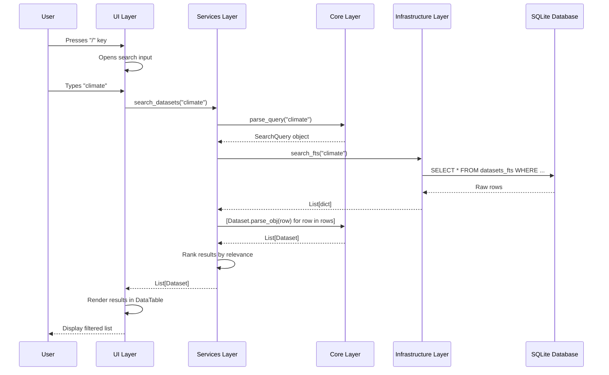
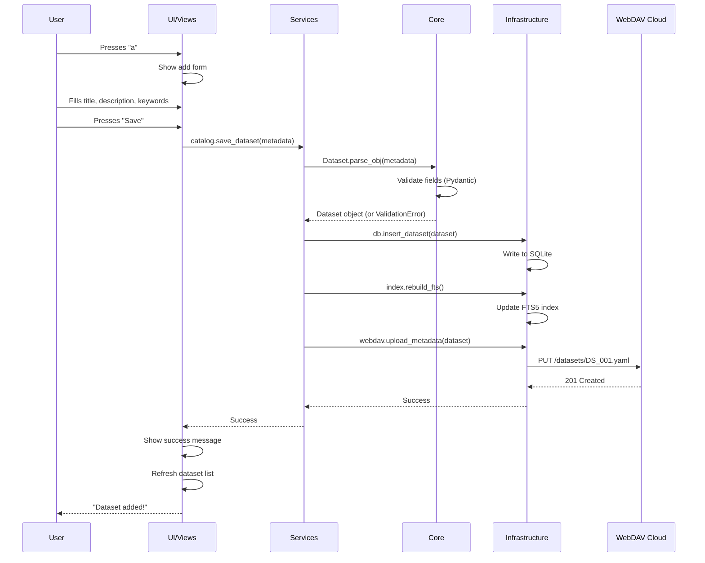
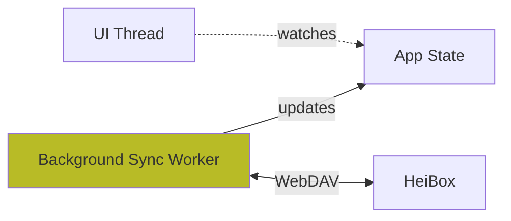

# How It Works: System Architecture

!!! info "Version 0.60-beta Updates"
    **Recent architectural changes:**

    - ✅ Removed legacy GitHub PR workflow (simplified cloud-only architecture)
    - ✅ Removed Outbox feature (direct WebDAV sync only)
    - ✅ Added About screen component
    - ✅ Enhanced search with new filter types
    - ✅ Improved UI navigation system

**Learning Goal**: Understand the **conceptual architecture** of Hei-DataHub — how the pieces fit together and why they're designed this way.

By the end of this page, you'll be able to:
- Draw the architecture diagram from memory
- Explain why we use a layered design
- Describe how data flows from user input to cloud storage

---

## The Big Picture

Hei-DataHub is built using **Clean Architecture** (also known as **Hexagonal Architecture** or **Ports and Adapters**).

### What Does That Mean?

Instead of one big tangle of code, we separate concerns into **layers**:

```
┌──────────────────────────────────────────────┐
│   UI Layer (TUI)                             │  ← User sees this
├──────────────────────────────────────────────┤
│   Services Layer (Business Logic)            │  ← Coordinates actions
├──────────────────────────────────────────────┤
│   Core Layer (Domain Models & Rules)         │  ← Pure business logic
├──────────────────────────────────────────────┤
│   Infrastructure Layer (DB, WebDAV, Storage) │  ← Talks to external systems
└──────────────────────────────────────────────┘
```

**Key Rule**: Higher layers can call lower layers, but lower layers **never** call higher layers.

---

## Layer-by-Layer Breakdown

### 🎨 Layer 1: UI (Textual TUI)

**Location**: `src/hei_datahub/ui/`

**Purpose**: Render the interface and handle user input.

**What lives here:**
- `views/home.py` — Main screen with dataset list
- `views/about.py` — About screen with project info (new in 0.60)
- `views/settings.py` — Settings configuration screen
- `widgets/autocomplete.py` — Autocomplete dropdown
- `widgets/help.py` — Help screen with keybindings
- `styles/` — TCSS styling files
- `utils/keybindings.py` — Keyboard shortcut mapping

**Responsibilities:**
- Display data in tables, lists, forms
- Capture keyboard events (`j`, `k`, `/`, `enter`)
- Call **Services** to perform actions
- Update UI when data changes

**What it DOESN'T do:**
- ❌ No database queries
- ❌ No file I/O
- ❌ No business logic

**Example:**
```python
# ui/views/home.py (simplified)
class HomeScreen(Screen):
    def action_search(self):
        query = self.search_input.value
        # Call the Service layer (not DB directly!)
        results = search_datasets(query)
        self.update_table(results)
```

---

### ⚙️ Layer 2: Services (Orchestration)

**Location**: `src/hei_datahub/services/`

**Purpose**: Implement **use cases** by coordinating Core + Infrastructure.

**What lives here:**
- `search.py` — Search datasets (calls DB, ranks results)
- `catalog.py` — Add/edit/delete datasets (validates, saves)
- `sync.py` — Background cloud sync (downloads/uploads)
- `autocomplete.py` — Generate suggestions (analyzes existing data)
- `webdav_storage.py` — WebDAV backend implementation
- `config.py` — Load configuration files

**Responsibilities:**
- Orchestrate multi-step operations
- Call Infrastructure for I/O (DB, WebDAV, filesystem)
- Apply business rules from Core
- Handle errors and retries

**What it DOESN'T do:**
- ❌ No UI rendering
- ❌ No direct SQL (uses Infrastructure)
- ❌ No credential storage (uses Infrastructure)

**Example:**
```python
# services/catalog.py (simplified)
def save_dataset(metadata: Dataset):
    # 1. Validate using Core
    validate_dataset(metadata)

    # 2. Save to local DB (Infrastructure)
    db_save(metadata)

    # 3. Upload to cloud (Infrastructure)
    webdav_upload(metadata)

    # 4. Reindex for search (Infrastructure)
    rebuild_fts_index()
```

---

### 🧠 Layer 3: Core (Domain Logic)

**Location**: `src/hei_datahub/core/`

**Purpose**: Define **what** the system does (business rules), not **how**.

**What lives here:**
- `models.py` — Data structures (`Dataset`, `SearchQuery`)
- `rules.py` — Business rules (e.g., "title must be unique")
- `errors.py` — Domain exceptions (`ValidationError`)
- `queries.py` — Query parsing logic

**Characteristics:**
- ✅ **Pure Python** (no I/O, no external dependencies)
- ✅ **Fully testable** without mocks
- ✅ Uses **Pydantic** for validation

**What it DOESN'T do:**
- ❌ No database access
- ❌ No file I/O
- ❌ No network calls

**Example:**
```python
# core/models.py (simplified)
from pydantic import BaseModel, validator

class Dataset(BaseModel):
    """Domain model for a dataset."""
    id: str
    title: str
    description: str
    author: str
    keywords: list[str] = []

    @validator('title')
    def title_must_not_be_empty(cls, v):
        if not v.strip():
            raise ValueError('Title cannot be empty')
        return v
```

---

### 🔧 Layer 4: Infrastructure (I/O)

**Location**: `src/hei_datahub/infra/`

**Purpose**: Handle **all external interactions** (filesystem, database, network).

**What lives here:**
- `db.py` — SQLite connection management
- `index.py` — FTS5 search index operations
- `store.py` — YAML/JSON file I/O
- `paths.py` — File path resolution
- `config_paths.py` — XDG Base Directory support

**Responsibilities:**
- Execute SQL queries
- Read/write files
- Manage database connections
- Handle path resolution

**What it DOESN'T do:**
- ❌ No business logic
- ❌ No UI rendering

**Example:**
```python
# infra/index.py (simplified)
def search_fts(query: str) -> list[dict]:
    """Execute FTS5 full-text search."""
    conn = get_db_connection()
    cursor = conn.execute(
        "SELECT * FROM datasets_fts WHERE datasets_fts MATCH ?",
        (query,)
    )
    return cursor.fetchall()
```

---

## Why Layers Matter

### ✅ Benefits

1. **Testability**
   - Core logic has **zero dependencies** → easy unit tests
   - Services can use **mocks** for Infrastructure
   - UI can be tested with fake Services

2. **Maintainability**
   - Change UI framework? Only rewrite UI layer
   - Switch from SQLite to PostgreSQL? Only change Infrastructure
   - Change business rules? Only modify Core

3. **Clarity**
   - Each layer has a single responsibility
   - Dependencies flow in one direction (downward)
   - Easy to understand data flow

4. **Portability**
   - Core is pure Python → works anywhere
   - Infrastructure adapts to different platforms
   - UI could be swapped for web, desktop, or mobile

---

## Data Flow Example: Searching for a Dataset

Let's trace what happens when you press `/` and search for "climate":



### Step-by-Step Explanation

**1. User presses `/`**
- `ui/views/home.py` binds `/` to `action_focus_search()`
- This method focuses the search input field

**2. User types "climate"**
- Input widget captures text
- Debounced to avoid searching on every keystroke

**3. UI calls Service**
```python
# ui/views/home.py
results = search_datasets(self.search_input.value)
```

**4. Service parses query**
```python
# services/search.py
from hei_datahub.core.queries import parse_query

def search_datasets(raw_query: str):
    query = parse_query(raw_query)  # Core layer validates
    # ...
```

**5. Service calls Infrastructure**
```python
# services/search.py
from hei_datahub.infra.index import search_fts

rows = search_fts(query.text)
```

**6. Infrastructure queries SQLite**
```python
# infra/index.py
def search_fts(query: str):
    conn = get_db_connection()
    cursor = conn.execute(
        "SELECT * FROM datasets_fts WHERE datasets_fts MATCH ?",
        (query,)
    )
    return cursor.fetchall()
```

**7. Results flow back up**
- Infrastructure → raw rows
- Services → convert to `Dataset` objects, rank by score
- UI → render in DataTable widget

**8. User sees results** in <80ms!

---

## Another Example: Adding a Dataset

When you press `a` to add a dataset:



---

## Design Patterns Used

### 1. **Dependency Inversion**

Services depend on **abstractions**, not concrete implementations.

```python
# services/storage_backend.py
from typing import Protocol

class StorageBackend(Protocol):
    """Abstract interface for storage."""
    def read_file(self, path: str) -> bytes: ...
    def write_file(self, path: str, data: bytes): ...

# services/webdav_storage.py
class WebDAVStorage:
    """Concrete implementation."""
    def read_file(self, path: str) -> bytes:
        # WebDAV-specific logic
        ...

# services/filesystem_storage.py
class FilesystemStorage:
    """Another concrete implementation."""
    def read_file(self, path: str) -> bytes:
        # Filesystem-specific logic
        ...
```

**Why?** We can swap storage backends without changing Services!

---

### 2. **Repository Pattern**

Separate **data access logic** from **business logic**.

```python
# infra/index.py (Repository)
def get_dataset_by_id(dataset_id: str) -> Optional[dict]:
    """Low-level DB access."""
    conn = get_db_connection()
    cursor = conn.execute("SELECT * FROM datasets WHERE id = ?", (dataset_id,))
    return cursor.fetchone()

# services/catalog.py (Service)
def load_dataset(dataset_id: str) -> Dataset:
    """High-level use case."""
    row = get_dataset_by_id(dataset_id)  # Repository
    if not row:
        raise DatasetNotFoundError(dataset_id)
    return Dataset.parse_obj(row)  # Core model
```

---

### 3. **Service Locator (Config)**

Configuration is loaded once and shared.

```python
# services/config.py
_config = None

def get_config() -> Config:
    global _config
    if _config is None:
        _config = load_config_from_file()
    return _config
```

---

## Key Technologies by Layer

| Layer | Technologies |
|-------|-------------|
| **UI** | Textual, Rich, TCSS (styling) |
| **Services** | Pure Python, async/await |
| **Core** | Pydantic, Python dataclasses |
| **Infrastructure** | SQLite3, aiosqlite, HTTPX (WebDAV), keyring |

---

## Where Does Cloud Sync Fit?

**Background sync** runs in parallel:



- `services/sync.py` runs in a background thread/task
- Polls cloud every 5 minutes for changes
- Downloads new datasets → updates local SQLite
- Uploads local changes → pushes to cloud
- Uses **async/await** to avoid blocking UI

---

## Security Design

### Authentication Flow

```
User runs `hei-datahub auth setup`
  ↓
auth/setup.py prompts for credentials
  ↓
auth/credentials.py stores in OS keyring
  ↓
Keyring encrypts with OS master password
  ↓
config.toml stores non-sensitive metadata (URL, username)
```

**Credentials never touch disk in plain text.**

### WebDAV Communication

All WebDAV requests use **HTTPS**:
```python
# services/webdav_storage.py
client = httpx.Client(
    base_url="https://heibox.uni-heidelberg.de",
    auth=httpx.BasicAuth(username, password),
    verify=True  # Verify SSL certificates
)
```

---

## What You've Learned

✅ Hei-DataHub uses a **layered architecture** with 4 layers
✅ **UI** renders and captures input (no business logic)
✅ **Services** orchestrate use cases (calls Core + Infrastructure)
✅ **Core** defines domain models and rules (pure Python)
✅ **Infrastructure** handles I/O (DB, files, network)
✅ Data flows **downward** through layers, never upward
✅ Design patterns: Dependency Inversion, Repository, Service Locator
✅ Background sync runs in parallel without blocking UI
✅ Security: credentials in keyring, HTTPS for WebDAV

---

## Try It Yourself

### 1. Find the Layers

Open these files and identify which layer they belong to:
```bash
src/hei_datahub/ui/views/home.py         # Layer?
src/hei_datahub/services/search.py       # Layer?
src/hei_datahub/core/models.py           # Layer?
src/hei_datahub/infra/db.py              # Layer?
```

<details>
<summary>Answers</summary>

- `home.py` → UI Layer
- `search.py` → Services Layer
- `models.py` → Core Layer
- `db.py` → Infrastructure Layer
</details>

### 2. Trace a Feature

Pick a feature (e.g., "delete dataset") and trace:
1. Which UI method handles it?
2. Which Service orchestrates it?
3. Which Infrastructure layer executes it?

---

## Next Steps

Now that you understand the **architecture**, let's get it running on your machine!

**Next**: [3. Installing & Running Locally](02-setup.md)
