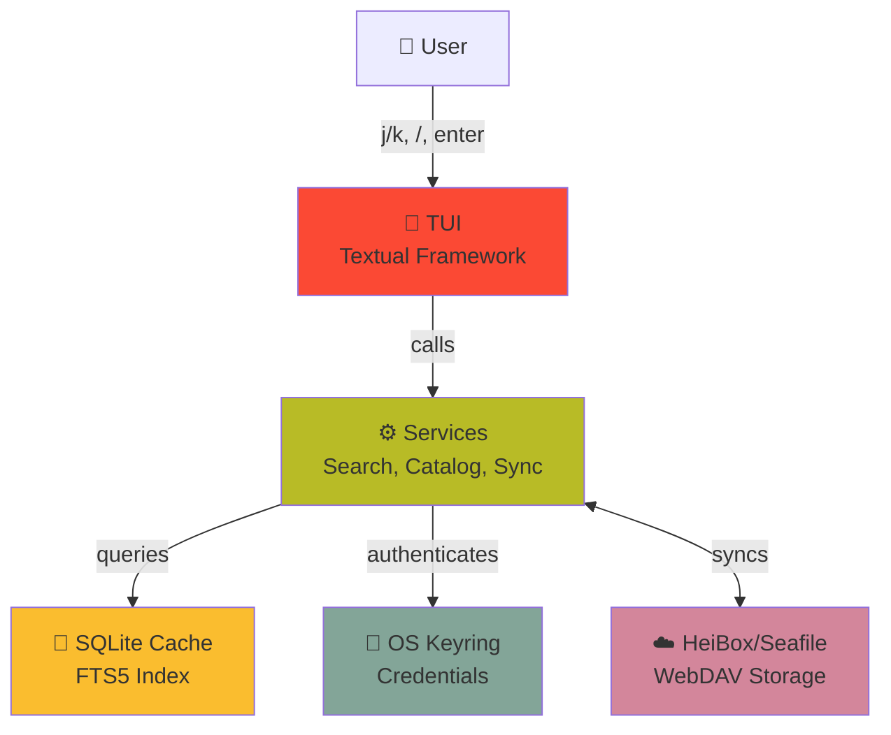

# What is Hei-DataHub?

!!! info "Version 0.60-beta "Clean-up""
    This tutorial reflects the latest release (October 2025) with:

    - ✨ New About screen with project information
    - 🔍 Enhanced search filters (source, format, tags)
    - ⌨️ Vim-style navigation (`gg`, `G`, `Ctrl+A`)
    - 🎨 Refined UI with stable scrollbars
    - 🧹 Streamlined codebase (removed legacy GitHub PR workflow)

---

## The Problem It Solves

Imagine you're a researcher working with datasets. You face these challenges:

❌ **Scattered datasets**: Files on your laptop, cloud storage, external drives
❌ **No metadata**: What does `experiment_042.csv` even contain?
❌ **No search**: You can't find datasets by topic, author, or keywords
❌ **No collaboration**: Sharing requires email, Dropbox, or manual Git commits
❌ **No consistency**: Every team uses different naming conventions

### The Traditional Approach

Most people use:
- **File browsers**: Can't search by content or metadata
- **Excel spreadsheets**: Manual catalog maintenance
- **Git repos**: Slow, complex, not designed for data
- **Cloud folders**: No structure, no search, no validation

---

## The Hei-DataHub Solution

**Hei-DataHub is a Terminal User Interface (TUI) application** that gives you:

✅ **Instant search** — Find datasets in <80ms using full-text search
✅ **Cloud-first** — Store metadata on HeiBox/Seafile, auto-sync across team
✅ **Rich metadata** — JSON Schema validation ensures data quality
✅ **No Git needed** — Direct WebDAV sync, no branches or merge conflicts
✅ **Autocomplete** — Smart suggestions for authors, keywords, tags
✅ **Badges & filters** — Visual indicators for dataset properties
✅ **Keyboard-driven** — Vim-style navigation (`j/k`, `/`, `enter`)

---

## What Does It Look Like?

```
┌─ Hei-DataHub ──────────────────────────────────────────────────────┐
│                                                                     │
│  🔍 Search: climate                                                │
│                                                                     │
│  📊 Climate Data 2023               🏷 climate 🏷 temperature       │
│     NOAA global temperature anomalies, monthly averages            │
│     Author: Dr. Jane Smith  |  Updated: 2024-10-15                │
│                                                                     │
│  📊 Climate Models Comparison       🏷 climate 🏷 modeling         │
│     CMIP6 model outputs for RCP scenarios                          │
│     Author: Climate Lab  |  Updated: 2024-09-20                   │
│                                                                     │
│  📊 Sea Level Rise Projections      🏷 climate 🏷 ocean            │
│     Satellite altimetry data 1993-2024                             │
│     Author: Ocean Research  |  Updated: 2024-08-10                │
│                                                                     │
│  [a] Add  [/] Search  [u] Update  [s] Settings  [?] Help  [^q] Quit│
└────────────────────────────────────────────────────────────────────┘
```

Press `j/k` to navigate, `/` to search, `Enter` to view details, `a` to add a dataset.

---

## How It Works (High-Level)

### 1. **Metadata Lives in the Cloud**
- Dataset metadata is stored as YAML files on HeiBox/Seafile
- Each dataset has a unique ID (e.g., `DS_2024_001`)
- Metadata includes: title, description, author, keywords, tags, dates, etc.

### 2. **Local Cache for Speed**
- Hei-DataHub downloads metadata to a local SQLite database
- Search queries hit the local cache (fast!)
- Background sync keeps cache fresh

### 3. **TUI for Interaction**
- Built with [Textual](https://textual.textualize.io/) (Python TUI framework)
- Keyboard-driven interface (like Vim or `htop`)
- Real-time search, autocomplete, and updates

### 4. **Secure Authentication**
- Credentials stored in OS keyring (not plain text!)
- Linux: Secret Service API
- macOS: Keychain
- Windows: Credential Manager

---

## Architecture at a Glance



### The Flow

**When you search:**
1. User types `/` in TUI → Opens search input
2. User types "climate" → TUI calls `SearchService`
3. `SearchService` queries SQLite FTS5 index
4. Results rendered in DataTable widget
5. User sees filtered list in <80ms

**When you add a dataset:**
1. User presses `a` → Opens add form
2. User fills metadata (title, description, keywords)
3. TUI calls `CatalogService.save_dataset()`
4. Service validates with JSON Schema
5. Service saves to local cache
6. Background sync uploads to cloud via WebDAV
7. Other team members' apps auto-pull the update

---

## Key Concepts

### 1. TUI (Terminal User Interface)
- Runs in your terminal (like `vim`, `htop`, `lazygit`)
- Keyboard-driven (no mouse needed)
- Fast, lightweight, no web browser required
- Built with **Textual** framework (think: React for terminals)

### 2. WebDAV (Cloud Sync)
- **WebDAV** = Web Distributed Authoring and Versioning
- Standard protocol for cloud file access (HTTP-based)
- HeiBox/Seafile both support WebDAV
- Direct file read/write (no Git complexity)

### 3. SQLite FTS5 (Search)
- **FTS5** = Full-Text Search extension for SQLite
- Creates inverted index of all text fields
- Supports phrase search, prefix matching, ranking
- Query speed: <80ms for 1000+ datasets

### 4. JSON Schema (Validation)
- Defines required fields, types, formats
- Ensures all datasets have consistent metadata
- Example: `author` must be a string, `date_created` must be ISO 8601

### 5. Clean Architecture (Layered Design)
- **UI Layer**: Textual widgets and views
- **Services Layer**: Business logic (search, sync, catalog)
- **Infrastructure Layer**: Database, WebDAV, filesystem
- **Core Layer**: Data models, validation rules

---

## Why These Technologies?

### Why Textual (TUI)?
- ✅ **Fast**: No web browser overhead
- ✅ **Accessible**: Works over SSH, on remote servers
- ✅ **Keyboard-driven**: Power users love it
- ✅ **Lightweight**: Minimal dependencies

### Why SQLite FTS5?
- ✅ **Embedded**: No separate database server
- ✅ **Fast**: Optimized for full-text search
- ✅ **Portable**: Single file, easy to backup
- ✅ **Reliable**: Used by millions of apps

### Why WebDAV (not Git)?
- ✅ **Simple**: No branches, commits, merges
- ✅ **Direct**: Read/write files like a filesystem
- ✅ **Team-friendly**: Instant sync, no pull requests
- ✅ **Standard**: Works with many cloud providers

### Why OS Keyring (not env vars)?
- ✅ **Secure**: Encrypted by OS
- ✅ **User-friendly**: No manual file editing
- ✅ **Standard**: Same API across platforms

---

## Who Is This For?

**Perfect for:**
- 🎓 Researchers managing datasets
- 👥 Teams sharing data catalogs
- 🏢 Organizations standardizing metadata
- 🔬 Labs tracking experiments
- 📊 Data engineers organizing pipelines

**Not ideal for:**
- Large binary files (store those elsewhere, catalog them here)
- Real-time data streaming (this is a catalog, not a database)
- Non-technical users who prefer GUIs (this is terminal-based)

---

## What You'll Build in This Guide

By the end of this learning path, you'll understand how to build:

1. **A Textual TUI** with multiple screens, widgets, and keyboard navigation
2. **SQLite FTS5 search** with indexing, querying, and ranking
3. **WebDAV integration** for cloud storage and authentication
4. **Background sync** using async/await without blocking the UI
5. **JSON Schema validation** for data quality
6. **Theme system** with customizable colors and styles
7. **Plugin architecture** for extensibility

---

## Real-World Example

Let's say you're a climate scientist:

**Before Hei-DataHub:**
```
🗂️ My Documents/
  ├── climate_data_v1.csv
  ├── climate_data_final.csv
  ├── climate_data_FINAL_v2.csv
  └── experiment_042_dont_delete.csv
```
- No metadata (what's in experiment_042?)
- No search (grep filenames?)
- No collaboration (email CSV files?)

**After Hei-DataHub:**
```bash
$ hei-datahub
```

Press `/`, type "climate", see all climate datasets with:
- Titles, descriptions, keywords
- Author names, creation dates
- Tags, badges, status indicators
- Direct links to actual data files

Press `a`, add new dataset:
- Auto-complete author from existing datasets
- Suggest keywords based on description
- Validate required fields
- Instantly sync to team's cloud

---

## The Learning Path Ahead

Now that you know **what** Hei-DataHub is, let's understand **how** it works.

**Next Step**: [2. How It Works (Architecture)](01-architecture.md)

---

## Quick Reference

| Feature | Technology | Why |
|---------|-----------|-----|
| UI | Textual | Fast TUI framework |
| Search | SQLite FTS5 | <80ms queries |
| Cloud | WebDAV | Simple sync protocol |
| Auth | OS Keyring | Secure credential storage |
| Validation | JSON Schema | Data quality |
| Language | Python 3.10+ | Readability, ecosystem |

---

## Questions to Ponder

As you continue:

- How does Textual render UI in the terminal?
- How does FTS5 index text for fast search?
- How does WebDAV compare to Git?
- How does background sync work without freezing the UI?
- How does the app handle conflicts (two users edit the same dataset)?

We'll answer all of these! 🚀
