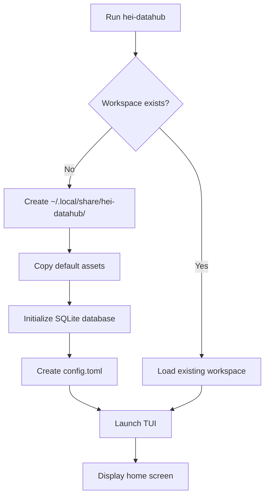

# Installing & Running Locally

!!! info "Version 0.60-beta "Clean-up""
    **Current stable release:** October 2025

    This guide reflects version 0.60.0-beta with the latest features and improvements.

**Learning Goal**: Get Hei-DataHub running on your machine and understand what happens during initialization.

By the end of this page, you'll:
- Have Hei-DataHub installed and running
- Understand workspace initialization
- Know how to run in debug mode
- Be able to explore configuration files

---

## Prerequisites

### Required

- ✅ **Python 3.10+** (check with `python3 --version`)
- ✅ **Git** (check with `git --version`)
- ✅ **Terminal** (any: bash, zsh, PowerShell)

### Optional (for full features)

- ☁️ **HeiBox account** (for cloud sync, but not required for local use)
- 🔑 **Keyring support** (Linux: `gnome-keyring`, macOS/Windows: built-in)

---

## Installation Steps

### Step 1: Clone the Repository

```bash
cd ~/Github  # or wherever you keep projects
git clone https://github.com/0xpix/Hei-DataHub.git
cd Hei-DataHub
```

**What this does:**
- Downloads the entire codebase
- Sets up a git repository (you can track your own changes)

---

### Step 2: Install Python Dependencies

We use **`uv`** for fast dependency installation (optional but recommended):

```bash
# Install uv (if not already installed)
pip install uv

# Install Hei-DataHub in editable mode
uv pip install -e .
```

**Alternative (without uv):**
```bash
pip install -e .
```

**What `-e` means:**
- "Editable mode" — changes to the source code take effect immediately
- No need to reinstall after modifying files
- Perfect for development and learning

**What gets installed:**
- `textual` — TUI framework
- `pydantic` — Data validation
- `httpx` — HTTP client for WebDAV
- `pyperclip` — Clipboard support
- `keyring` — Secure credential storage
- `pyyaml` — YAML parsing
- See `pyproject.toml` for full list

---

### Step 3: Verify Installation

```bash
hei-datahub --version
```

**Expected output:**
```
Hei-DataHub v0.56.0 (beta)
```

If you see this, you're ready to go! 🎉

**Troubleshooting:**

| Error | Solution |
|-------|----------|
| `hei-datahub: command not found` | Run `pip install -e .` again, or use `python -m hei_datahub` |
| `ImportError: No module named 'textual'` | Run `uv pip install -e .` or `pip install -e .` |
| `ModuleNotFoundError: hei_datahub` | Make sure you're in the `Hei-DataHub/` directory |

---

## First Run: Workspace Initialization

### Launch the TUI

```bash
hei-datahub
```

**What happens behind the scenes:**



---

### What Gets Created?

**On Linux/macOS:**

```
~/.local/share/hei-datahub/           # Data directory
├── datasets/                          # Dataset metadata (YAML files)
├── hei-datahub.db                     # SQLite database
└── assets/                            # Logos, icons

~/.config/hei-datahub/                 # Config directory
└── config.toml                        # User configuration

~/.cache/hei-datahub/                  # Cache directory
└── logs/                              # Application logs
```

**On Windows:**

```
%LOCALAPPDATA%\hei-datahub\
├── datasets\
├── hei-datahub.db
└── assets\

%APPDATA%\hei-datahub\
└── config.toml
```

---

### Understanding Each Directory

#### 1. **Data Directory** (`~/.local/share/hei-datahub/`)

**Purpose:** Stores dataset metadata and the search index.

**Key files:**

- **`hei-datahub.db`**: SQLite database with FTS5 search index
  - Contains indexed metadata for fast searching
  - Tables: `datasets`, `datasets_fts`, `schema_version`

- **`datasets/`**: YAML metadata files
  - Each dataset has a unique ID (e.g., `DS_2024_001.yaml`)
  - Human-readable, version-controllable
  - Example:
    ```yaml
    id: DS_2024_001
    title: Climate Data 2023
    description: Global temperature anomalies
    author: Dr. Jane Smith
    keywords: [climate, temperature, NOAA]
    date_created: "2024-10-15"
    ```

- **`assets/`**: Logos and UI assets
  - `logo_H.txt` — ASCII art logo
  - Theme-specific icons

---

#### 2. **Config Directory** (`~/.config/hei-datahub/`)

**Purpose:** User settings and preferences.

**Key file: `config.toml`**

```toml
# Example config.toml
[app]
version = "0.56.0"
theme = "gruvbox"

[storage]
backend = "filesystem"  # or "webdav"
local_path = "~/.local/share/hei-datahub/datasets"

[webdav]
url = "https://heibox.uni-heidelberg.de/remote.php/dav/files/USERNAME/"
username = "your_username"
# Password stored in OS keyring, not here!

[search]
index_on_startup = true
debounce_ms = 300

[keybindings]
quit = "ctrl+q"
search = "/"
add_dataset = "a"
# ... more keybindings
```

**What's NOT in config.toml:**
- ❌ Passwords (stored in OS keyring)
- ❌ API keys
- ❌ Session tokens

---

#### 3. **Cache Directory** (`~/.cache/hei-datahub/`)

**Purpose:** Temporary files, logs, performance data.

**Key file: `logs/hei-datahub.log`**

```
2024-10-25 22:30:15 INFO  [app.runtime] Workspace initialized: /home/user/.local/share/hei-datahub
2024-10-25 22:30:15 INFO  [infra.db] Database connection established
2024-10-25 22:30:15 INFO  [services.search] FTS5 index loaded: 42 datasets
2024-10-25 22:30:16 INFO  [ui.views.home] TUI launched
```

**Log levels:**
- `DEBUG` — Verbose (method calls, variable values)
- `INFO` — Normal operations
- `WARNING` — Potential issues
- `ERROR` — Failures

---

## Running in Debug Mode

To see what's happening under the hood:

```bash
hei-datahub --debug
```

Or set an environment variable:

```bash
export HEI_DATAHUB_LOG_LEVEL=DEBUG
hei-datahub
```

**What you'll see:**

```
DEBUG [infra.db:45] Opening database: /home/user/.local/share/hei-datahub/hei-datahub.db
DEBUG [infra.index:123] Building FTS5 query: "climate"
DEBUG [services.search:78] Found 3 results in 67ms
DEBUG [ui.views.home:234] Rendering table with 3 rows
```

**Use debug mode when:**
- Learning how the app works
- Investigating bugs
- Understanding performance
- Tracing data flow

---

## Exploring the Database

### Using SQLite CLI

```bash
sqlite3 ~/.local/share/hei-datahub/hei-datahub.db
```

**Useful commands:**

```sql
-- List all tables
.tables

-- View schema
.schema datasets

-- Show all datasets
SELECT id, title FROM datasets;

-- Test FTS5 search
SELECT * FROM datasets_fts WHERE datasets_fts MATCH 'climate';

-- Exit
.quit
```

**What you'll see:**

```
datasets          # Main dataset table
datasets_fts      # FTS5 virtual table for search
schema_version    # Database migration tracking
```

---

### Understanding FTS5

**What is FTS5?**
- Full-Text Search extension for SQLite
- Creates an **inverted index** (like Google's search index)
- Supports phrase search, prefix matching, ranking

**How it works:**

```sql
-- Create FTS5 virtual table
CREATE VIRTUAL TABLE datasets_fts USING fts5(
    id,
    title,
    description,
    keywords,
    author
);

-- Query
SELECT * FROM datasets_fts WHERE datasets_fts MATCH 'climate';
```

**Why it's fast:**
- Pre-computed index (built once, queried many times)
- Binary search instead of full table scan
- Typical query: <80ms for 1000+ datasets

---

## Configuration Deep Dive

### Keybindings

Default keybindings live in `config.toml`:

```toml
[keybindings]
# Navigation
move_down = "j"
move_up = "k"
jump_top = "gg"
jump_bottom = "G"

# Actions
search = "/"
add_dataset = "a"
open_details = "enter"
quit = "ctrl+q"
settings = "s"
refresh = "r"
help = "?"

# Multi-key bindings
debug_console = ":"
```

**Customizing:**

Edit `~/.config/hei-datahub/config.toml`:

```toml
[keybindings]
quit = "q"  # Change from ctrl+q to just q
search = "ctrl+f"  # Use ctrl+f instead of /
```

Then restart the app.

---

### Theme Customization

Change the color scheme:

```toml
[app]
theme = "gruvbox"  # Options: gruvbox, dark, light, solarized, monokai
```

**Available themes:**

| Theme | Primary Color | Background |
|-------|---------------|------------|
| `gruvbox` | `#fb4934` (red) | `#282828` (dark gray) |
| `dark` | `#61afef` (blue) | `#282c34` (dark) |
| `light` | `#0184bc` (blue) | `#fafafa` (white) |
| `solarized` | `#268bd2` (blue) | `#002b36` (dark blue) |
| `monokai` | `#66d9ef` (cyan) | `#272822` (dark green) |

**Custom theme:**

```toml
[app]
theme = "custom"

[theme.custom]
primary = "#ff6b6b"
secondary = "#4ecdc4"
accent = "#ffe66d"
background = "#1a1a2e"
surface = "#16213e"
```

See [Styling & Themes](tui/03-styling.md) for details.

---

## WebDAV Setup (Optional)

To enable cloud sync with HeiBox/Seafile:

```bash
hei-datahub auth setup
```

**Interactive prompts:**

```
Welcome to Hei-DataHub WebDAV Setup
====================================

Enter WebDAV URL: https://heibox.uni-heidelberg.de/remote.php/dav/files/USERNAME/
Enter username: your_username
Enter password: ********

Testing connection... ✓
Credentials stored securely in OS keyring.

Setup complete! Run 'hei-datahub' to start syncing.
```

**What happens:**
1. Validates the URL (checks for HTTPS, proper format)
2. Tests authentication (makes a WebDAV PROPFIND request)
3. Stores credentials in OS keyring (encrypted)
4. Saves non-sensitive config to `config.toml`

**Verify:**

```bash
hei-datahub auth status
```

**Expected output:**

```
✓ WebDAV configured
  URL: https://heibox.uni-heidelberg.de/remote.php/dav/files/USERNAME/
  Username: your_username
  Credentials: Stored in OS keyring

✓ Connection test passed
```

---

## Testing Your Setup

### 1. Search for Datasets

Press `/` and type "test":

```
🔍 Search: test

No results found.
```

(No datasets yet — let's add one!)

---

### 2. Add a Test Dataset

Press `a` to open the add form:

```
Title: Test Dataset
Description: This is a test dataset for learning
Keywords: test, learning, tutorial
Author: Your Name
```

Press `Ctrl+S` to save.

**What happens:**
1. UI calls `catalog.save_dataset()`
2. Service validates with Pydantic
3. Infrastructure writes to `datasets/DS_2024_001.yaml`
4. Infrastructure inserts into SQLite
5. Infrastructure rebuilds FTS5 index
6. UI refreshes the list

---

### 3. Search Again

Press `/` and type "test":

```
🔍 Search: test

📊 Test Dataset                     🏷 test 🏷 learning
   This is a test dataset for learning
   Author: Your Name  |  Updated: 2024-10-25
```

**It works!** 🎉

---

## Common Tasks

### View Logs

```bash
tail -f ~/.cache/hei-datahub/logs/hei-datahub.log
```

### Rebuild Search Index

```bash
hei-datahub reindex
```

**When to use:**
- Search results are outdated
- Added datasets manually (not via TUI)
- Database corruption

---

### Reset Authentication

```bash
hei-datahub auth clear
```

**Warning:** This deletes:
- Stored credentials
- WebDAV configuration
- Local database (re-syncs from cloud on next launch)

---

### Export Keybindings

```bash
hei-datahub keymap export --output my-keybindings.yaml
```

**Output:**

```yaml
keybindings:
  quit: ctrl+q
  search: /
  add_dataset: a
  # ... full list
```

**Import:**

```bash
hei-datahub keymap import --input my-keybindings.yaml
```

---

## What You've Learned

✅ How to install Hei-DataHub with `uv pip install -e .`
✅ What gets created during first run (workspace, config, database)
✅ Where configuration files live (`~/.config`, `~/.local/share`)
✅ How to run in debug mode (`--debug`)
✅ How to explore the SQLite database
✅ How to customize keybindings and themes
✅ How to set up WebDAV authentication
✅ How to add a test dataset and search for it

---

## Try It Yourself

### Exercise 1: Customize Your Theme

1. Edit `~/.config/hei-datahub/config.toml`
2. Change `theme = "dark"`
3. Restart the app
4. See the new colors!

### Exercise 2: Add Your Own Dataset

1. Press `a`
2. Fill in metadata about a project you're working on
3. Search for it with `/`
4. Press `Enter` to view details

### Exercise 3: Inspect the Database

```bash
sqlite3 ~/.local/share/hei-datahub/hei-datahub.db
```

Run:
```sql
SELECT * FROM datasets WHERE id = 'DS_2024_001';
```

Compare the output to the YAML file in `datasets/DS_2024_001.yaml`.

---

## Next Steps

Now that you have Hei-DataHub running, let's learn how the **TUI actually works**!

**Next**: [Build the TUI: Layout Basics](tui/01-layout-basics.md)

---

## Troubleshooting

### App won't start

**Error:** `ModuleNotFoundError: No module named 'hei_datahub'`

**Solution:**
```bash
cd Hei-DataHub/
pip install -e .
```

---

### Keyring errors

**Error:** `keyring.errors.NoKeyringError`

**Linux solution:**
```bash
sudo apt install gnome-keyring
```

**Alternative:** Use filesystem storage instead:
```toml
[storage]
backend = "filesystem"
```

---

### Search doesn't work

**Error:** No results even though datasets exist

**Solution:**
```bash
hei-datahub reindex
```

This rebuilds the FTS5 index.

---

## Further Reading

- [Configuration Deep Dive](../config/overview.md)
- [WebDAV Setup Guide](../architecture/auth-and-sync.md)
- [Keybinding Customization](../ui/keybindings.md)
