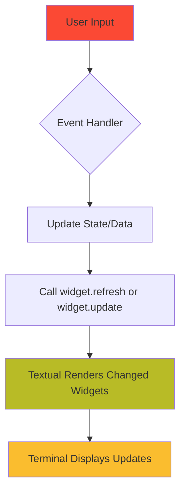

# TUI Basics: How Textual Works

**Learning Goal**: Understand how the Textual framework renders a Terminal User Interface and how Hei-DataHub uses it.

By the end of this page, you'll:
- Understand what a TUI is and how it differs from a GUI
- Know the core concepts of Textual (App, Screen, Widget, Container)
- Be able to trace how `home.py` creates the main interface
- Understand the render cycle

---

## What is a TUI?

**TUI** = **Terminal User Interface**

Think of it as "a GUI that runs in your terminal."

### Examples You've Probably Seen

- **`vim`** / **`neovim`** — Text editor
- **`htop`** — System monitor
- **`lazygit`** — Git client
- **`ranger`** — File browser

### TUI vs. GUI vs. CLI

| Type | Example | How It Works |
|------|---------|--------------|
| **CLI** | `ls -la` | Print output, exit |
| **GUI** | Chrome, VS Code | Window with mouse clicks |
| **TUI** | vim, htop, Hei-DataHub | Interactive UI in terminal |

**Why TUI?**
- ✅ Works over SSH (remote servers)
- ✅ Fast (no web browser overhead)
- ✅ Keyboard-driven (power users love it)
- ✅ Lightweight (minimal dependencies)
- ✅ Universal (works in any terminal)

---

## Introducing Textual

**Textual** is a Python framework for building TUIs.

Think of it as: **"React for Terminals"**

### Official Example

```python
from textual.app import App
from textual.widgets import Button

class MyApp(App):
    def compose(self):
        yield Button("Click me!")

    def on_button_pressed(self):
        self.exit()

if __name__ == "__main__":
    MyApp().run()
```

**Run this** and you'll see a button in your terminal!

---

## Core Concepts

### 1. **App** — The Application

Every Textual app starts with an `App` class.

```python
from textual.app import App

class HeiDataHubApp(App):
    """The main application."""
    pass
```

**Key methods:**
- `compose()` — What widgets to render
- `on_mount()` — Setup after app starts
- `run()` — Start the event loop

---

### 2. **Screen** — A View/Page

Screens are like "pages" in a multi-page app.

```python
from textual.screen import Screen

class HomeScreen(Screen):
    """Main screen with dataset list."""
    pass

class SettingsScreen(Screen):
    """Settings configuration."""
    pass
```

**Switching screens:**
```python
self.app.push_screen(SettingsScreen())  # Open settings
self.app.pop_screen()                    # Go back
```

---

### 3. **Widget** — UI Component

Widgets are reusable UI elements.

**Built-in widgets:**
- `Label` — Static text
- `Button` — Clickable button
- `Input` — Text input field
- `DataTable` — Table with rows/columns
- `Header` — Top header bar
- `Footer` — Bottom footer bar

**Example:**
```python
from textual.widgets import Label, Button

class MyScreen(Screen):
    def compose(self):
        yield Label("Hello, World!")
        yield Button("Click Me")
```

---

### 4. **Container** — Layout Helper

Containers group widgets and control layout.

```python
from textual.containers import Vertical, Horizontal

class MyScreen(Screen):
    def compose(self):
        yield Vertical(
            Label("Title"),
            Horizontal(
                Button("Save"),
                Button("Cancel"),
            )
        )
```

**Result:**
```
┌─────────────┐
│ Title       │
│ [Save] [Cancel] │
└─────────────┘
```

---

## How Hei-DataHub Uses Textual

### File Structure

```
src/hei_datahub/ui/
├── views/
│   ├── home.py          # Main screen (dataset list)
│   ├── settings.py      # Settings screen
│   ├── cloud_files.py   # Cloud file browser
│   └── outbox.py        # Sync queue viewer
├── widgets/
│   ├── autocomplete.py  # Search suggestions
│   ├── command_palette.py
│   └── help_overlay.py
├── styles/
│   ├── home.tcss        # Styling for home screen
│   ├── base.tcss        # Global styles
│   └── autocomplete.tcss
└── theme.py             # Color schemes
```

---

## Building the Home Screen: Step-by-Step

Let's trace **how the main screen is built** in `home.py`.

### Location

**File:** `src/hei_datahub/ui/views/home.py`
**Lines:** 1–150 (we'll focus on key parts)

---

### Step 1: Imports

```python
# Line 1-30 (simplified)
from textual.app import App
from textual.screen import Screen
from textual.widgets import Header, Footer, Input, DataTable, Static, Label
from textual.containers import Container, Horizontal
from textual.binding import Binding
```

**What's imported:**
- `Screen` — Base class for HomeScreen
- `Header`, `Footer` — Top and bottom bars
- `Input` — Search box
- `DataTable` — Dataset list
- `Container` — Layout grouping

---

### Step 2: Define Keybindings

```python
# Line 48-79 (simplified)
class HomeScreen(Screen):
    BINDINGS = [
        Binding("a", "add_dataset", "Add Dataset", key_display="a"),
        Binding("j", "move_down", "Down", show=False),
        Binding("k", "move_up", "Up", show=False),
        Binding("/", "focus_search", "Search", key_display="/"),
        Binding("q", "quit", "Quit", key_display="^q"),
    ]
```

**What this does:**
- Pressing `a` → calls `action_add_dataset()`
- Pressing `j` → calls `action_move_down()`
- Pressing `/` → calls `action_focus_search()`

**How it works:**
- Textual automatically connects `Binding("a", "add_dataset", ...)` to a method named `action_add_dataset(self)`
- If you define `def action_add_dataset(self):`, it gets called when `a` is pressed

---

### Step 3: Define Layout (compose)

```python
# Line 90-112 (simplified)
class HomeScreen(Screen):
    def compose(self):
        """Build the UI layout."""
        yield Header()  # Top bar with app name

        yield Container(
            Static("🔍 Search Datasets", id="mode-indicator"),
            Input(placeholder="Type / to search", id="search-input"),
            Label("All Datasets", id="results-label"),
            DataTable(id="results-table"),
            id="search-container",
        )

        yield Footer()  # Bottom bar with keybindings
```

**What this creates:**

```
┌─ Hei-DataHub ──────────────────────────────────┐  ← Header()
│ 🔍 Search Datasets                             │  ← Static
│ [Type / to search                           ]  │  ← Input
│ All Datasets                                   │  ← Label
│ ┌───────────────────────────────────────────┐ │
│ │ ID    Name               Description       │ │  ← DataTable
│ │ DS001 Climate Data       Temperature data  │ │
│ │ DS002 Ocean Levels       Sea level rise    │ │
│ └───────────────────────────────────────────┘ │
│ [a] Add  [/] Search  [q] Quit                  │  ← Footer()
└────────────────────────────────────────────────┘
```

---

### Step 4: Setup After Mount (on_mount)

```python
# Line 114-130 (simplified)
class HomeScreen(Screen):
    def on_mount(self):
        """Called when screen is first displayed."""
        # 1. Set up the DataTable
        table = self.query_one("#results-table", DataTable)
        table.add_columns("ID", "Name", "Description")
        table.focus()

        # 2. Load datasets
        self.load_all_datasets()

        # 3. Setup autocomplete
        self._setup_search_autocomplete()
```

**What this does:**
1. **Finds the DataTable** using `query_one("#results-table")`
   - The `#` prefix means "find by ID"
   - Similar to CSS: `document.querySelector("#results-table")`

2. **Adds columns** to the table

3. **Focuses the table** (so you can navigate with `j/k`)

4. **Loads data** by calling `load_all_datasets()`

---

### Step 5: Loading Data

```python
# Line 250-280 (simplified)
def load_all_datasets(self):
    """Load datasets into the table."""
    table = self.query_one("#results-table", DataTable)
    table.clear()

    # Get datasets from search service
    from hei_datahub.services.fast_search import get_all_indexed
    results = get_all_indexed()

    # Add each dataset as a row
    for dataset in results:
        table.add_row(
            dataset["id"],
            dataset["name"],
            dataset["snippet"],
            key=dataset["id"]
        )
```

**Flow:**
1. Get the table widget
2. Clear existing rows
3. Call **Services** layer to get data
4. Loop through results
5. Add each dataset as a table row

---

## The Render Cycle

### How Textual Updates the Screen



**Example: Searching**

1. **User types in search box** → `on_input_changed` event fires
2. **Event handler** calls `search_datasets(query)`
3. **Results returned** from Services layer
4. **Table updated** with `table.clear()` + `table.add_row()`
5. **Textual re-renders** only the changed table widget
6. **Terminal shows** updated results

---

## Querying Widgets

**Problem:** How do you find widgets after `compose()`?

**Solution:** Use `query_one()` with CSS selectors!

### By ID

```python
# In compose()
yield Input(id="search-input")

# Later in methods
search_input = self.query_one("#search-input", Input)
```

### By Class

```python
# In compose()
yield Button("Save", classes="primary-button")

# Later
button = self.query_one(".primary-button", Button)
```

### By Type

```python
# Find first DataTable
table = self.query_one(DataTable)
```

---

## Event Handling

### Built-in Events

Textual widgets emit events automatically:

```python
class HomeScreen(Screen):
    def on_input_changed(self, event: Input.Changed):
        """Called when Input widget text changes."""
        query = event.value
        self.search(query)

    def on_data_table_row_selected(self, event: DataTable.RowSelected):
        """Called when user selects a table row."""
        dataset_id = event.row_key.value
        self.view_details(dataset_id)
```

### Custom Actions (from Keybindings)

```python
class HomeScreen(Screen):
    BINDINGS = [
        Binding("a", "add_dataset", "Add"),
    ]

    def action_add_dataset(self):
        """Called when 'a' is pressed."""
        self.app.push_screen(AddDatasetScreen())
```

---

## Styling with TCSS

**TCSS** = Textual CSS (like CSS, but for terminals)

### Where Styles Live

**File:** `src/hei_datahub/ui/styles/home.tcss`

```css
/* CSS-like syntax for terminal widgets */
#banner {
    text-align: center;
    padding: 1 0;
    background: $panel;
}

#search-input {
    border: solid $accent;
    background: $surface;
}

DataTable {
    height: 100%;
}
```

### How to Apply Styles

```python
class HomeScreen(Screen):
    CSS_PATH = "../styles/home.tcss"  # Load TCSS file
```

**Textual automatically:**
1. Reads the TCSS file
2. Applies styles to matching widgets
3. Uses theme variables (like `$panel`, `$accent`)

---

## Theme Variables

**File:** `src/hei_datahub/ui/theme.py`

```python
THEMES = {
    "gruvbox": {
        "primary": "#fb4934",
        "secondary": "#b8bb26",
        "accent": "#fabd2f",
        "background": "#282828",
        "surface": "#3c3836",
        "panel": "#1d2021",
    },
}
```

**In TCSS:**
```css
#search-input {
    background: $surface;    /* Uses theme.surface */
    border: solid $accent;   /* Uses theme.accent */
}
```

**Change theme** in `config.toml`:
```toml
[app]
theme = "gruvbox"  # or "dark", "light", "solarized", "monokai"
```

---

## Putting It All Together: Life of a Search

### User Story

> "User opens app, presses `/`, types 'climate', sees filtered results"

### Code Flow

**1. App launches** (`cli/main.py`)
```python
from hei_datahub.ui.views.home import HomeScreen

app = TextualApp()
app.push_screen(HomeScreen())
app.run()
```

**2. HomeScreen renders** (`on_mount`)
```python
def on_mount(self):
    table = self.query_one("#results-table", DataTable)
    table.add_columns("ID", "Name", "Description")
    self.load_all_datasets()  # Show all datasets initially
```

**3. User presses `/`** (keybinding fires)
```python
def action_focus_search(self):
    search_input = self.query_one("#search-input", Input)
    search_input.focus()  # Cursor moves to search box
```

**4. User types "climate"** (input event fires)
```python
def on_input_changed(self, event: Input.Changed):
    query = event.value  # "climate"
    self.perform_search(query)
```

**5. Search executes** (calls Services)
```python
def perform_search(self, query):
    from hei_datahub.services.search import search_datasets

    results = search_datasets(query)  # Calls SQLite FTS5
    self.update_table(results)
```

**6. Table updates** (UI refreshes)
```python
def update_table(self, results):
    table = self.query_one("#results-table", DataTable)
    table.clear()

    for dataset in results:
        table.add_row(dataset["id"], dataset["name"], dataset["snippet"])
```

**7. Textual re-renders** → User sees filtered list!

---

## What You've Learned

✅ **TUI** = Terminal User Interface (interactive UI in terminal)
✅ **Textual** is a Python framework for building TUIs (like React for terminals)
✅ Core concepts: **App**, **Screen**, **Widget**, **Container**
✅ **`compose()`** defines layout (what widgets to render)
✅ **`on_mount()`** runs setup after screen loads
✅ **Keybindings** connect key presses to `action_*` methods
✅ **Query widgets** with `query_one("#id")` (CSS-like selectors)
✅ **Events** automatically fire (e.g., `on_input_changed`)
✅ **TCSS** styles widgets (CSS for terminals)
✅ **Themes** provide color schemes

---

## Try It Yourself

### Exercise 1: Add a Debug Label

**Goal:** Add a label that shows the current query.

**Steps:**

1. Open `src/hei_datahub/ui/views/home.py`

2. In `compose()`, add a new Static widget:
```python
yield Container(
    Static("🔍 Search Datasets", id="mode-indicator"),
    Static("Query: ", id="debug-query"),  # ← Add this
    Input(placeholder="Type / to search", id="search-input"),
    # ... rest of widgets
)
```

3. In `on_input_changed()`, update the label:
```python
def on_input_changed(self, event):
    debug_label = self.query_one("#debug-query", Static)
    debug_label.update(f"Query: {event.value}")
    # ... rest of method
```

4. Restart the app and type in the search box — you'll see the query update live!

---

### Exercise 2: Change a Keybinding

**Goal:** Use `Ctrl+A` instead of `a` for "Add Dataset".

**Steps:**

1. Find the `BINDINGS` list in `home.py`:
```python
BINDINGS = [
    Binding("a", "add_dataset", "Add Dataset"),  # ← Change this
    # ...
]
```

2. Change to:
```python
Binding("ctrl+a", "add_dataset", "Add Dataset", key_display="^A"),
```

3. Restart the app. Now press `Ctrl+A` to add a dataset!

---

### Exercise 3: Explore Textual's Built-in Demo

```bash
pip install textual[dev]
textual --help
textual run textual.examples.calculator
```

This launches a calculator app built with Textual. Study the code to see patterns!

---

## Next Steps

Now that you understand the basics, let's dive into **how to build your own widgets**!

**Next:** [Creating Views & Widgets](02-widgets.md)

---

## Further Reading

- [Textual Official Docs](https://textual.textualize.io/)
- [Textual Tutorial](https://textual.textualize.io/tutorial/)
