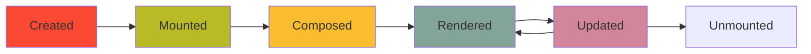

# Creating Views & Widgets

**Learning Goal**: Build your own Textual widgets and screens from scratch.

By the end of this page, you'll be able to:
- Create a custom Screen
- Build reusable Widget components
- Understand the widget lifecycle
- Compose complex layouts

---

## Widget Basics

### What is a Widget?

A **Widget** is a reusable UI component. Think of it like a React component or HTML element.

**Built-in widgets:**
- `Label`, `Button`, `Input` — Basic UI elements
- `DataTable`, `Tree`, `ListView` — Complex data views
- `Header`, `Footer` — Layout helpers

**Custom widgets** let you build your own!

---

## Building a Custom Widget: Example

Let's create a **Dataset Card** widget that shows dataset info in a nice box.

### Step 1: Create the Widget File

**File:** `src/hei_datahub/ui/widgets/dataset_card.py`

```python
"""
Custom widget for displaying a dataset summary.
"""
from textual.widget import Widget
from textual.widgets import Static, Label
from textual.containers import Vertical
from rich.text import Text

class DatasetCard(Widget):
    """
    A card widget displaying dataset metadata.

    Example:
        ┌─ Climate Data 2023 ────────────────┐
        │ 📊 NOAA temperature anomalies      │
        │ Author: Dr. Jane Smith             │
        │ Tags: climate, temperature         │
        └────────────────────────────────────┘
    """

    def __init__(self, dataset: dict, **kwargs):
        """
        Initialize the card.

        Args:
            dataset: Dictionary with 'title', 'description', 'author', 'tags'
        """
        super().__init__(**kwargs)
        self.dataset = dataset

    def compose(self):
        """Build the card layout."""
        # Title (bold)
        title = Text(self.dataset["title"], style="bold cyan")

        # Description
        desc = self.dataset.get("description", "No description")

        # Author
        author = self.dataset.get("author", "Unknown")

        # Tags
        tags = ", ".join(self.dataset.get("tags", []))

        yield Vertical(
            Static(f"📊 {title}", id="card-title"),
            Static(f"   {desc}", id="card-description"),
            Static(f"   Author: {author}", id="card-author"),
            Static(f"   Tags: {tags}", id="card-tags"),
        )
```

---

### Step 2: Style the Widget

**File:** `src/hei_datahub/ui/styles/dataset_card.tcss`

```css
DatasetCard {
    border: solid $accent;
    background: $surface;
    padding: 1 2;
    margin: 1 0;
}

#card-title {
    text-style: bold;
    color: $primary;
}

#card-description {
    color: $secondary;
}

#card-author, #card-tags {
    color: $accent;
}
```

---

### Step 3: Use the Widget

**File:** `src/hei_datahub/ui/views/home.py`

```python
from hei_datahub.ui.widgets.dataset_card import DatasetCard

class HomeScreen(Screen):
    CSS_PATH = "../styles/home.tcss"

    def compose(self):
        yield Header()

        # Use our custom widget!
        yield DatasetCard({
            "title": "Climate Data 2023",
            "description": "NOAA temperature anomalies",
            "author": "Dr. Jane Smith",
            "tags": ["climate", "temperature"]
        })

        yield Footer()
```

**Result:**

```
┌─ Climate Data 2023 ────────────────┐
│ 📊 NOAA temperature anomalies      │
│ Author: Dr. Jane Smith             │
│ Tags: climate, temperature         │
└────────────────────────────────────┘
```

---

## Widget Lifecycle

Widgets go through several lifecycle stages:



### Lifecycle Methods

```python
class MyWidget(Widget):
    def __init__(self, **kwargs):
        """1. Widget is created."""
        super().__init__(**kwargs)
        print("Widget created")

    def compose(self):
        """2. Define child widgets."""
        print("Widget composed")
        yield Label("Hello")

    def on_mount(self):
        """3. Widget is added to the screen."""
        print("Widget mounted")
        # Setup code here (load data, setup timers, etc.)

    def on_unmount(self):
        """4. Widget is removed from the screen."""
        print("Widget unmounted")
        # Cleanup code here
```

---

## Building a Complex Widget: Autocomplete

Let's study how **Autocomplete** works in Hei-DataHub.

**File:** `src/hei_datahub/ui/widgets/autocomplete.py`

### The Goal

When typing in the search box:
1. Show suggestions below the input
2. Use `Tab` or `→` to accept
3. Rank suggestions by usage frequency

---

### Step 1: Define the Suggester

```python
from textual.suggester import Suggester

class SmartSearchSuggester(Suggester):
    """
    Provides autocomplete suggestions for search queries.
    """

    async def get_suggestion(self, value: str):
        """
        Called every time the input changes.

        Args:
            value: Current input text (e.g., "auth:")

        Returns:
            Suggested completion (e.g., "author:Smith")
        """
        if not value:
            return None

        # Get suggestions from suggestion service
        from hei_datahub.services.suggestion_service import get_suggestion_service

        service = get_suggestion_service()
        suggestions = await service.get_suggestions(value)

        if suggestions:
            # Return the top suggestion
            return suggestions[0]

        return None
```

---

### Step 2: Attach to Input Widget

```python
from hei_datahub.ui.widgets.autocomplete import SmartSearchSuggester

class HomeScreen(Screen):
    def on_mount(self):
        search_input = self.query_one("#search-input", Input)
        search_input.suggester = SmartSearchSuggester()
```

**Now:**
- Type `auth:` → suggests `author:Smith`
- Type `tag:` → suggests `tag:climate`

---

## Creating a New Screen

Screens are full-page views. Let's create a **Details Screen** for viewing a single dataset.

### Step 1: Define the Screen

**File:** `src/hei_datahub/ui/views/details.py`

```python
from textual.screen import Screen
from textual.widgets import Header, Footer, Static, Button
from textual.containers import Vertical, Horizontal
from textual.binding import Binding

class DatasetDetailsScreen(Screen):
    """
    Display full details of a dataset.
    """

    BINDINGS = [
        Binding("escape", "close", "Back"),
        Binding("e", "edit", "Edit"),
        Binding("d", "delete", "Delete"),
    ]

    CSS_PATH = "../styles/details.tcss"

    def __init__(self, dataset_id: str, **kwargs):
        super().__init__(**kwargs)
        self.dataset_id = dataset_id
        self.dataset = None

    def compose(self):
        yield Header()

        yield Vertical(
            Static("Loading...", id="details-container"),
            Horizontal(
                Button("Edit", id="btn-edit"),
                Button("Delete", id="btn-delete"),
                Button("Close", id="btn-close"),
            ),
        )

        yield Footer()

    def on_mount(self):
        """Load dataset when screen opens."""
        self.load_dataset()

    def load_dataset(self):
        """Fetch dataset from catalog service."""
        from hei_datahub.infra.index import get_dataset_from_store

        self.dataset = get_dataset_from_store(self.dataset_id)
        self.render_details()

    def render_details(self):
        """Render dataset metadata."""
        container = self.query_one("#details-container", Static)

        content = f"""
        📊 {self.dataset['title']}

        ID: {self.dataset['id']}
        Description: {self.dataset['description']}
        Author: {self.dataset.get('author', 'Unknown')}
        Created: {self.dataset.get('date_created', 'N/A')}

        Keywords: {', '.join(self.dataset.get('keywords', []))}
        Tags: {', '.join(self.dataset.get('tags', []))}
        """

        container.update(content)

    def action_close(self):
        """Close the screen (go back)."""
        self.app.pop_screen()

    def action_edit(self):
        """Open edit screen."""
        from hei_datahub.ui.views.edit import EditDatasetScreen
        self.app.push_screen(EditDatasetScreen(self.dataset_id))

    def action_delete(self):
        """Delete the dataset."""
        # Show confirmation dialog
        self.app.push_screen(ConfirmDeleteScreen(self.dataset_id))
```

---

### Step 2: Open the Screen

**File:** `src/hei_datahub/ui/views/home.py`

```python
class HomeScreen(Screen):
    def on_data_table_row_selected(self, event: DataTable.RowSelected):
        """User pressed Enter on a row."""
        dataset_id = event.row_key.value

        # Open details screen
        from hei_datahub.ui.views.details import DatasetDetailsScreen
        self.app.push_screen(DatasetDetailsScreen(dataset_id))
```

---

## Layout Containers

### Vertical (Stack)

```python
yield Vertical(
    Label("Line 1"),
    Label("Line 2"),
    Label("Line 3"),
)
```

**Result:**
```
Line 1
Line 2
Line 3
```

---

### Horizontal (Row)

```python
yield Horizontal(
    Button("Save"),
    Button("Cancel"),
)
```

**Result:**
```
[Save] [Cancel]
```

---

### Grid

```python
from textual.containers import Grid

yield Grid(
    Label("Name:"),
    Input(id="name"),
    Label("Email:"),
    Input(id="email"),
)
```

**Result:**
```
Name:  [          ]
Email: [          ]
```

---

## Reactive Attributes

**Reactive** attributes automatically trigger re-renders when changed.

```python
from textual.reactive import reactive

class CounterWidget(Widget):
    count = reactive(0)  # Reactive attribute

    def compose(self):
        yield Label(f"Count: {self.count}")

    def on_button_pressed(self):
        self.count += 1  # Automatically re-renders!
```

**How it works:**
- `count` is a **reactive** variable
- When `self.count` changes, Textual re-renders the widget
- No manual `refresh()` needed!

---

## Real Example: Filter Badges

**File:** `src/hei_datahub/ui/views/home.py` (Lines 600-650)

**Goal:** Show active search filters as removable badges.

```python
def render_filter_badges(self, query: str):
    """
    Display active filters as colored badges.

    Example:
        [author:Smith ×] [tag:climate ×] [year:2024 ×]
    """
    from hei_datahub.core.queries import QueryParser

    parser = QueryParser()
    parsed = parser.parse(query)

    container = self.query_one("#filter-badges-container", Horizontal)
    container.remove_children()  # Clear old badges

    for term in parsed.terms:
        if not term.is_free_text:
            # Create badge widget
            badge = FilterBadge(
                field=term.field,
                value=term.value,
                on_remove=self.remove_filter
            )
            container.mount(badge)
```

**Custom FilterBadge widget:**

```python
class FilterBadge(Widget):
    def __init__(self, field: str, value: str, on_remove, **kwargs):
        super().__init__(**kwargs)
        self.field = field
        self.value = value
        self.on_remove = on_remove

    def compose(self):
        yield Horizontal(
            Static(f"{self.field}:{self.value}"),
            Button("×", id="btn-remove"),
        )

    def on_button_pressed(self):
        self.on_remove(self.field, self.value)
```

---

## What You've Learned

✅ **Widgets** are reusable UI components
✅ **`compose()`** defines child widgets
✅ **Lifecycle:** `__init__` → `compose` → `on_mount` → `on_unmount`
✅ **Screens** are full-page views (can be pushed/popped)
✅ **Containers** control layout (Vertical, Horizontal, Grid)
✅ **Reactive attributes** automatically trigger re-renders
✅ **Custom widgets** encapsulate logic and styling

---

## Try It Yourself

### Exercise 1: Create a StatusBar Widget

**Goal:** Show app status at the bottom.

**File:** `src/hei_datahub/ui/widgets/status_bar.py`

```python
from textual.widget import Widget
from textual.widgets import Static
from textual.reactive import reactive

class StatusBar(Widget):
    message = reactive("Ready")

    def compose(self):
        yield Static(self.message, id="status")

    def watch_message(self, old_value, new_value):
        """Called when message changes."""
        status = self.query_one("#status", Static)
        status.update(new_value)
```

**Use it:**

```python
class HomeScreen(Screen):
    def compose(self):
        yield Header()
        # ... other widgets
        yield StatusBar()
        yield Footer()

    def on_mount(self):
        status_bar = self.query_one(StatusBar)
        status_bar.message = "Loading datasets..."
```

---

## Next Steps

Now that you can build widgets, let's make them **look good**!

**Next:** [Styling & Themes](03-styling.md)

---

## Further Reading

- [Textual Widgets Guide](https://textual.textualize.io/guide/widgets/)
- [Widget API Reference](https://textual.textualize.io/api/widget/)
- [Hei-DataHub Widget Module](../../ui/widgets.md)
